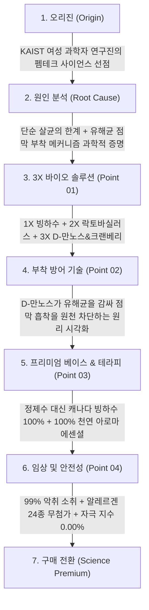
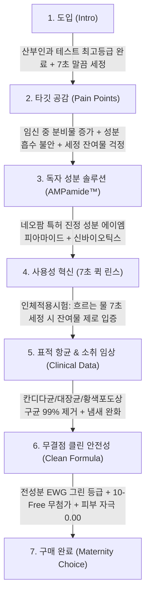
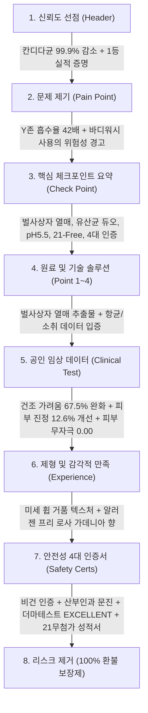
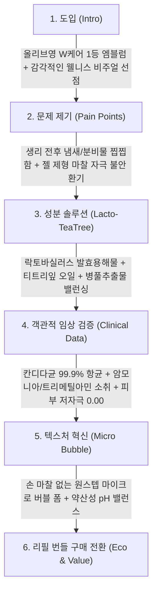
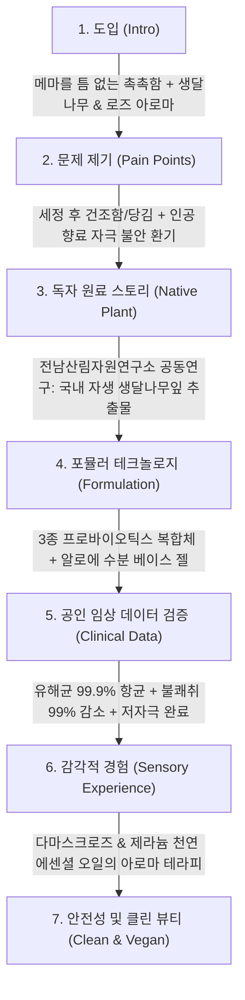
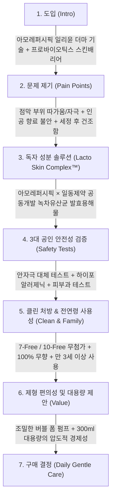
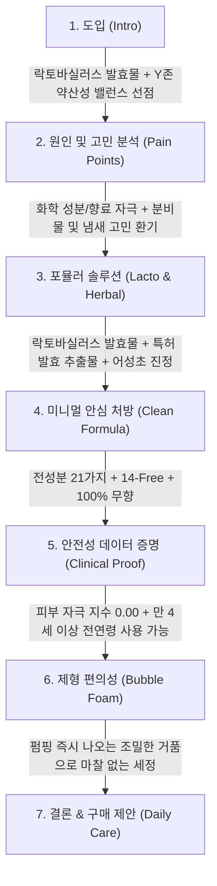
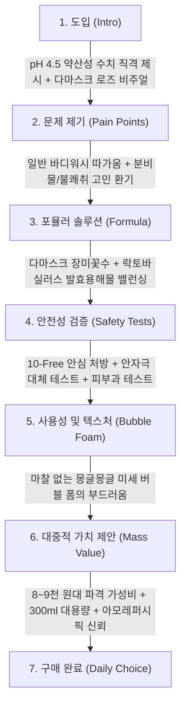

# [여성청결제 카테고리 전체 제품별 상세페이지 분석 통합 보고서]
> **(기준 제품(라엘) 포함 총 18개 주요 브랜드 전수 상세 분석 단일 통합본)**

- **분석 대상 브랜드 수**: 기준 제품 1개 + 주요 경쟁사 17개 제품 (총 18개 제품)
- **분석 일자**: 2026-08-30
- **연계 리포트**: [시장 포지셔닝 맵](market_positioning_map.md) | [종합 비교 매트릭스](competitive_matrix_analysis.md) | [결핍 분석 및 카피 전략](gap_analysis_and_copy_strategy.md) | [최종 종합 마스터 전략](comprehensive_market_comparison.md)

---

## 📑 전체 수록 제품 목차 (Table of Contents)

| 번호 | 브랜드 및 제품명 | 핵심 소구 카테고리 | 바로가기 |
| :---: | :--- | :--- | :---: |
| 0 | **★ [기준 타깃] 라엘(Rael) 천연 여성청결제** | 기준 제품 (클린뷰티) | [보고서 보기](#product-0) |
| 1 | **01. 이너시아(INERTIA) 더 퓨어 3X 마이크로바이옴** | 고기능 메디컬/임상 | [보고서 보기](#product-1) |
| 2 | **02. 질경이(Jilgyungyi) 데일리 에코아 워시 골드** | 고기능 메디컬/임상 | [보고서 보기](#product-2) |
| 3 | **03. 클리티(Cleety) 락토 리쥬브네이팅 젤링워시** | 고기능 메디컬/임상 | [보고서 보기](#product-3) |
| 4 | **04. 뷰티레시피(B.RECIPE) 리틀머메이드 프로바이오틱스 젤** | 고기능 메디컬/임상 | [보고서 보기](#product-4) |
| 5 | **05. 아토팜(ATOPALM) 매터니티 케어 마일드 앤 수딩** | 더마/장벽/임산부 | [보고서 보기](#product-5) |
| 6 | **06. 유리아쥬(Uriage) 진피 마일드 젤** | 더마/장벽/임산부 | [보고서 보기](#product-6) |
| 7 | **07. 메디온(MEDION) 락토리메디 포밍워시** | 고기능 메디컬/임상 | [보고서 보기](#product-7) |
| 8 | **08. 이너생각(Saengak) 밸런싱 휩드워시** | 고기능 메디컬/임상 | [보고서 보기](#product-8) |
| 9 | **09. 바솔(BASOL) 이너 밸런싱 포밍 워시** | 클린/비건/웰니스 | [보고서 보기](#product-9) |
| 10 | **10. 아로마티카(AROMATICA) 퓨어 앤 소프트** | 클린/비건/웰니스 | [보고서 보기](#product-10) |
| 11 | **11. 아로마티카(AROMATICA) 컴포트 모이스처 로즈** | 클린/비건/웰니스 | [보고서 보기](#product-11) |
| 12 | **12. 일리윤(Illiyoon) 세라마이드 더마 페미닌 워시** | 더마/장벽/임산부 | [보고서 보기](#product-12) |
| 13 | **13. 쏘피(SOFY) 쿨링프레쉬 여성청결제** | 클린/비건/웰니스 | [보고서 보기](#product-13) |
| 14 | **14. 디어스킨(Dearskin) 락토 여성청결제** | 클린/비건/웰니스 | [보고서 보기](#product-14) |
| 15 | **15. 해피바스(Happy Bath) 정말 순한 여성청결제 로즈** | 매스 가성비 | [보고서 보기](#product-15) |
| 16 | **16. 해피바스(Happy Bath) 쑥 여성청결제 버블 폼** | 매스 가성비 | [보고서 보기](#product-16) |
| 17 | **17. 좋은느낌(Good Feel) 더밸런스 바이옴** | 매스 가성비 | [보고서 보기](#product-17) |

---

<div id="product-0"></div>

# [제품 00] ★ [기준 타깃] 라엘(Rael) 천연 여성청결제

> *원본 분석 파일: [`intimate/report/target_rael_analysis.md`](target_rael_analysis.md)* | [▲ 목차로 돌아가기](#📑-전체-수록-제품-목차-table-of-contents)

# [1단계: 기준 제품 프로파일링] 라엘(Rael) 천연 여성청결제 상세페이지 분석 보고서
> **(여성청결제 본품 중심 · 8가지 최소 전성분 · COSMOS 천연 인증 · 유기농 클린뷰티 카피라이팅 분석)**

> **분석 대상 URL**: [올리브영 라엘 여성청결제 상품 페이지](https://www.oliveyoung.co.kr/store/goods/getGoodsDetail.do?goodsNo=A000000138252)  
> **올리브영 상품 번호**: `A000000138252`  
> **분석 일자**: 2026-08-30  
> **데이터 파일**: [`intimate/data/target_rael.json`](file:///c:/Users/이봄이/Downloads/icb10proj2/intimate/data/target_rael.json)  
> **이미지 디렉토리**: [`intimate/images/target_rael/`](file:///c:/Users/이봄이/Downloads/icb10proj2/intimate/images/target_rael/)  
> **분석 기준**: 인플루언서 협업 요소를 전면 배제하고, **오직 '여성청결제 본품(150ml 폼 워시)'의 COSMOS 천연 유기농 인증, 8가지 최소 전성분, 약산성 pH 밸런스, 클린뷰티 카피라이팅 및 자체 강점/취약점 진단**에 집중하여 분석

---

## 1. 기본 정보

| 항목 | 상세 내용 |
| :--- | :--- |
| **제품명** | 라엘 천연 여성청결제 (Rael Natural Foaming Feminine Wash) |
| **브랜드** | 라엘 (Rael) |
| **정상가 (소비자가)** | 18,000원 ~ 20,000원 |
| **할인가 (판매가)** | **11,900원 ~ 13,900원 (약 30~35% 할인)** |
| **본품 용량** | **150ml (소프트 마일드 버블 폼 본품)** |
| **제형 특성** | 펌핑 즉시 분사되는 부드럽고 촘촘한 **약산성 마이크로 버블 폼(Bubble Foam)** 제형 |
| **향료 유무** | **100% 무향 (Fragrance-Free)** — 인공 향료 및 알러젠 유발 성분 0% |
| **글로벌 인증** | **국제 유기농·천연 인증기관 COSMOS NATURAL 인증 획득 (98% 이상 천연 유래)** |
| **핵심 포지셔닝** | 단 8가지 성분으로 완성한 **"COSMOS 천연 인증 유기농 미니멀 여성청결제"** |

---

## 2. 최상단 메인 키메시지 (여성청결제 본품 기준)

> ### **"단 8가지 전성분과 COSMOS 천연 인증! 불필요한 성분 없이 Y존을 가장 순하게 비우는 라엘 천연 여성청결제"**
>
> *(서브 카피: **"98% 이상 천연 유래 원료와 약산성 폼으로 매일 자극 없이 깨끗한 안심 클렌징"**)*

### 🔍 메인 카피의 기능적 구조 분석
1. **'최소 전성분(단 8가지)'의 극단적 미니멀리즘 소구**: 수십 가지 추출물을 나열하는 경쟁사들과 정반대로, **"꼭 필요한 8가지 원료 외에는 단 하나도 넣지 않았다"**는 극강의 무첨가 안심 전달.
2. **글로벌 국제 인증('COSMOS NATURAL') 선점**: 유럽 및 글로벌 공인 천연 인증 마크를 최상단에 노출하여 원료 신뢰도 확립.
3. **미국 아마존 1위 유기농 펨테크 브랜드 파워**: 미국과 한국에서 검증된 라엘의 클린뷰티 철학을 여성청결제에 그대로 이식.

---

## 3. 도입부 후킹 포인트 (화학 성분 경피 흡수 공포 및 과도한 세정 자극 타깃)

라엘은 **"민감하고 흡수율이 높은 Y존에 복잡하고 많은 화학 성분을 매일 발라도 괜찮을까?"라는 성분 불안감**을 정밀하게 타격합니다.

| 후킹 단계 | 자극하는 고객의 결핍 및 불안 포인트 | 상세페이지 내 메시지 소구 방식 |
| :--- | :--- | :--- |
| **1. 외음부의 높은 경피 흡수율 공포** | **"일반 피부보다 화학 성분을 수십 배 빠르게 흡수하는 Y존 점막"** | 얼굴 피부보다 훨씬 민감한 부위이므로 성분이 복잡할수록 자극 위험이 높다는 점을 경고. |
| **2. 알레르기 유발 인공 향료 불안** | **"냄새를 가리기 위한 인공 향료가 오히려 가려움을 유발할 때"** | 인공 향료와 색소를 전면 배제한 **100% 무향 클린 포뮬러**의 필요성 환기. |
| **3. 무너진 산도 밸런스와 세정 마찰** | **"알칼리성 세정제로 인한 건조함과 손 문지름 마찰"** | **pH 4.5~5.5 약산성 산도와 원스텝 버블 폼**으로 마찰 없는 부드러운 케어 제시. |

---

## 4. 메시지 전개 순서 (논리적 스토리라인 흐름)

상세페이지는 **[COSMOS 천연 인증 선언] → [성분 복잡성 경고] → [8가지 전성분 투명 공개] → [식물 유래 계면활성제 & 약산성 pH] → [피부 저자극 테스트] → [1만 원대 실속 가격 제안]** 순서로 전개됩니다.

```mermaid
flowchart TD
    A["1. 도입 (Intro)"] -->|COSMOS NATURAL 국제 천연 인증 마크 + 미니멀 비주얼 선점| B["2. 문제 제기 (Pain Points)"]
    B -->|복잡한 성분의 경피 흡수 불안 + 인공 향료 알레르기 위험 지적| C["3. 미니멀 포뮬러 (Point 01)"]
    C -->|단 8가지 전성분 전면 공개 (정제수, 코코베타인, 글리세린, 락틱애씨드 등)| D["4. 식물 세정 & 약산성 (Point 02)"]
    D -->|코코넛 유래 계면활성제 + 외음부 맞춤 약산성 pH 4.5~5.5| E["5. 안전성 검증 (Point 03)"]
    E -->|피부 저자극 테스트 완료 (0.00 비자극) + 100% 무향 처방| F["6. 구매 전환 (Clean Value)"]
```

### 단계별 상세 전개 내용
1. **1단계: 글로벌 천연 인증 아이덴티티 제시**
   - 깨끗하고 순수한 화이트·그린 톤앤매너로 "COSMOS NATURAL 인증 천연 여성청결제" 정의.
2. **2단계: '성분의 개수'에 대한 질문 던지기**
   - 수십 가지 전성분표의 위험성을 짚으며 "Y존에 정말 이 많은 성분이 필요할까요?"라는 의문 제기.
3. **3단계: 단 8가지 전성분 전면 공개 및 역할 설명**
   - 정제수, 글리세린(보습), 코코-베타인/데실글루코사이드(식물세정), 락틱애씨드(pH조절) 등 8가지 원료의 명확한 역할 투명 공개.
4. **4단계: 코코넛 유래 식물성 세정과 락틱애씨드 산도 유지**
   - 화학 설페이트 대신 순한 코코넛 유래 세정 성분과 건강한 약산성 환경 유지 원리 소개.
5. **5단계: 피부 저자극 테스트 및 100% 무향 확약**
   - 피부 자극 지수 0.00 비자극 판정 및 인공 향료·색소 0% 안심 검증.
6. **6단계: 1만 원대 초반의 합리적 가격 제안**
   - 올리브영 세일가 11,900원~13,900원으로 매일 부담 없이 쓸 수 있는 데일리 클린뷰티 가치 제시.

---

## 5. 핵심 성분 및 기술 소구 방식

라엘은 **"COSMOS 천연 인증 + 8가지 최소 전성분 + 코코넛 유래 식물 세정"**이라는 심플하지만 강력한 무첨가 클린뷰티 철학을 소구합니다.

```
┌────────────────────────────────────────────────────────────────────────┐
│               라엘 천연 여성청결제 3대 핵심 포뮬러 축                    │
├───────────────────┬───────────────────┬────────────────────────────────┤
│ 1. COSMOS NATURAL │ 2. 단 8가지 최소 전성분│ 3. 식물 유래 약산성 폼         │
│   · 국제 천연 인증 획득│   · 정제수, 글리세린  │   · 코코넛 유래 저자극 세정    │
│   · 98% 이상 천연 유래│   · 코코베타인, 락틱산│   · 외음부 약산성 pH 4.5~5.5   │
│   · 글로벌 클린 스탠다드│  · 불필요한 성분 0%  │   · 100% 무향 & 무자극 0.00    │
└───────────────────┴───────────────────┴────────────────────────────────┘
```

| 구분 | 핵심 원료 및 배합 기술 | 소구 포인트 및 공인 시험 데이터 |
| :--- | :--- | :--- |
| **글로벌 천연 인증** | **COSMOS NATURAL 인증** | - 국제 유기농·천연 화장품 인증기관(AISBL)의 엄격한 심사를 통과.<br>- 전성분의 **98% 이상이 천연 유래 성분**임을 공인받음. |
| **극단적 미니멀리즘** | **단 8가지 전성분** | - 정제수, 글리세린, 코코-베타인, 데실글루코사이드, 소듐코코일글루타메이트, 락틱애씨드, 소듐레불리네이트, 글리세릴카프릴레이트 **8종만 처방**. |
| **식물 유래 세정제** | **코코넛 유래 계면활성제** | - 설페이트계 화학 합성 계면활성제를 배제하고 코코넛 유래 식물성 거품으로 점막 손상 방지. |
| **생리적 산도 조절** | **락틱애씨드 (Lactic Acid)** | - 피부 본연의 약산성 pH 4.5~5.5를 유지하여 외부 유해 자극으로부터 방어막 형성. |
| **무결점 안전성** | **피부 저자극 0.00 & 무향** | - 인체 첩포 피부 저자극 시험 완료 및 인공 향료·색소 일체 무첨가. |

---

## 6. 이탈 방지 장치 (브랜드 관점의 가치 제안)

| 이탈 방지 장치 | 상세 내용 | 소비자 심리적 효과 |
| :--- | :--- | :--- |
| **1. 11,900원~13,900원의 실속 가격** | - 천연 유기농 인증 제품임에도 1만 원대 초반의 뛰어난 가격 접근성. | "유기농 인증 제품인데 가격도 착하다"는 구매 결정 유도. |
| **2. 미국 1위 유기농 생리대 '라엘' 신뢰도** | - 아마존 1위 및 올리브영 생리대 베스트셀러 브랜드 파워. | 페미닌 케어 전문 브랜드에 대한 절대적 신뢰. |
| **3. '단 8가지' 투명한 전성분 전면 배치** | - 상세페이지 상단에 8개 성분의 한글명과 기능을 투명하게 공개. | 의심 많은 극민감성 소비자의 성분 검증 완결. |
| **4. 청결티슈 기획 세트 구성** | - 폼 워시 본품과 함께 휴대용 천연 청결티슈를 묶어주는 실용적 옵션. | 외출/여행 시 TPO 확장 구매 유도. |

---

## 7. 기준 제품(라엘) 자체의 강점(Strength)과 취약점(Weakness) 1차 진단 요약

앞서 분석한 10대 경쟁사(아로마티카, 메디온, 생각, 디어스킨, 해피바스, 일리윤, 아토팜, 비레시피, 클리티, 질경이, 쏘피, 이너시아) 데이터와 대조한 **라엘의 1차 진단 결과**는 다음과 같습니다.

```
┌────────────────────────────────────────────────────────────────────────┐
│             기준 제품 [라엘 천연 여성청결제] SWOT 1차 진단 요약           │
├───────────────────────────────────┬────────────────────────────────────┤
│           강점 (Strength)         │           취약점 (Weakness)        │
├───────────────────────────────────┼────────────────────────────────────┤
│ 1. 'COSMOS NATURAL' 국제 천연 인증│ 1. 구체적 항균/탈취 정량 수치 부재 │
│ 2. '단 8가지 전성분'의 극강 미니멀 │ 2. 독자 특허 성분 및 바이오 기술 부재│
│ 3. 1만 원대 초반의 뛰어난 가성비   │ 3. 질염/가려움 등 즉각적 고민 해결 약함│
│ 4. 미국 1위 생리대 브랜드 파워    │ 4. 무향 폼 일색의 단조로운 감각 경험 │
└───────────────────────────────────┴────────────────────────────────────┘
```

### 🟢 라엘의 핵심 강점 (Strength)
1. **압도적인 클린뷰티 포지셔닝 ('COSMOS 천연 인증' & '8가지 전성분')**:
   - 국내 대부분의 제품이 "자연 유래 추출물"을 단순히 배합한 수준인 반면, 라엘은 **국제 공인 COSMOS NATURAL 인증**과 **단 8가지 최소 성분**이라는 명확하고 차별화된 클린 철학을 확립함.
2. **미국 아마존 1위 & 국내 올리브영 유기농 생리대 팬덤**:
   - 라엘 유기농 생리대를 사용하는 탄탄한 충성 고객들이 자연스럽게 청결제까지 세트로 구매하는 크로스셀링 파워 보유.
3. **1만 원대 초반의 뛰어난 가격 경쟁력**:
   - 이너시아(22,900원), 질경이(19,800원), 아토팜(18,900원) 대비 **11,900원~13,900원**으로 데일리 사용에 부담 없는 가성비 확립.

---

### 🔴 라엘의 치명적 취약점 (Weakness)
1. **구체적인 공인 시험 정량 데이터(항균율·탈취율·보습률)의 부재**:
   - 경쟁사들이 **"칸디다균 99.9% 항균, 가드넬라균 99.8% 항균, 트리메틸아민 99% 탈취, 2주 보습 30% 개선"** 등 구체적인 숫자로 질염과 냄새 고민을 타격하는 반면, 라엘은 **'단순히 순하고 안전하다'는 정성적 소구에만 머물러 있어 문제 해결형 고객 설득력이 현저히 떨어짐**.
2. **독자 특허 원료 및 바이오 기술력의 결여**:
   - 경쟁사들이 보유한 독자 기술(네오팜 AMPamide, 비레시피 Eve Solution, 이너시아 D-만노스, 유리아쥬 GLYCO-GYN, 질경이 11개국 특허 등)과 비교할 때, 라엘은 **독자 특허 성분이나 독점적인 R&D 스토리가 없어 '성분 배합이 단순한 기본 워시'로 인식될 위험**.
3. **단조로운 텍스처와 무미건조한 사용 경험**:
   - 100% 무향의 단일 폼 제형 하나만 존재하여, 향기 테라피를 원하는 고객이나 고보습 젤 제형을 원하는 고객, 시원한 쿨링감을 원하는 고객층을 전혀 흡수하지 못함.

---

## 8. 연계 데이터 파일 안내

| 구분 | 파일 경로 | 내용 요약 |
| :--- | :--- | :--- |
| **정형 데이터 JSON** | [`intimate/data/target_rael.json`](file:///c:/Users/이봄이/Downloads/icb10proj2/intimate/data/target_rael.json) | 라엘 천연 여성청결제 가격, 용량, 8가지 전성분, COSMOS 인증, 안전성 데이터 |
| **분석 보고서 (본 문서)** | [`intimate/report/target_rael_analysis.md`](file:///c:/Users/이봄이/Downloads/icb10proj2/intimate/report/target_rael_analysis.md) | 기준 제품(라엘) 단독 프로파일링 및 SWOT 1차 진단 마크다운 보고서 |

---
*보고서 생성 완료: 2026-08-30 | 분석 도구: Web Scraping & Rael Formulation Analysis*


================================================================================


<div id="product-1"></div>

# [제품 01] 01. 이너시아(INERTIA) 더 퓨어 3X 마이크로바이옴

> *원본 분석 파일: [`intimate/report/inertia_analysis.md`](inertia_analysis.md)* | [▲ 목차로 돌아가기](#📑-전체-수록-제품-목차-table-of-contents)

# 이너시아(INERTIA) 더 퓨어 3X 마이크로바이옴 여성청결제 상세페이지 분석 보고서
> **(여성청결제 본품 중심 · KAIST 여성 과학자 R&D · D-만노스 유해균 부착 방어 · 펨테크 사이언스 카피라이팅 분석)**

> **분석 대상 URL**: [올리브영 이너시아 상품 페이지](https://www.oliveyoung.co.kr/store/goods/getGoodsDetail.do?goodsNo=A000000191655)  
> **올리브영 상품 번호**: `A000000191655`  
> **분석 일자**: 2026-08-30  
> **데이터 파일**: [`intimate/data/oliveyoung_inertia.json`](file:///c:/Users/이봄이/Downloads/icb10proj2/intimate/data/oliveyoung_inertia.json)  
> **이미지 디렉토리**: [`intimate/images/inertia/`](file:///c:/Users/이봄이/Downloads/icb10proj2/intimate/images/inertia/)  
> **분석 기준**: 인플루언서 협업 요소를 전면 배제하고, **오직 '여성청결제 본품(150ml 폼 워시)'의 KAIST 연구진 바이오 테크놀로지, 3X 마이크로바이옴(빙하수+유산균+D-만노스), 99% 탈취 임상, 프리미엄 사이언스 카피라이팅**에 집중하여 분석

---

## 1. 기본 정보

| 항목 | 상세 내용 |
| :--- | :--- |
| **제품명** | 이너시아 더 퓨어 3X 마이크로바이옴 여성청결제 (INERTIA The Pure 3X Microbiome Feminine Wash) |
| **브랜드** | 이너시아 (INERTIA / (주)이너시아) |
| **개발 배경** | **KAIST(카이스트) 출신 여성 과학자·공학자 연구진**이 여성의 생체 구조를 분석하여 직접 R&D |
| **정상가 (소비자가)** | 25,900원 |
| **할인가 (판매가)** | **22,900원 (약 12~15% 할인, 고가 프리미엄 펨테크 포지셔닝)** |
| **본품 용량** | **150ml (초미세 포밍 버블 본품)** |
| **제형 특성** | 쫀쫀하고 조밀한 탄력을 지닌 **마이크로 포밍 거품(Micro Foaming Bubble)** 제형 |
| **베이스 워터** | 정제수 대신 미네랄이 풍부한 **캐나다 청정 빙하수(Glacier Water)** 100% 적용 |
| **향료 특성** | 인공 합성 향료 0% → **100% 천연 아로마 에센셜 오일(라벤더 & 시트러스)** 테라피 블렌딩 |

---

## 2. 최상단 메인 키메시지 (여성청결제 본품 기준)

> ### **"KAIST 여성 과학자가 설계한 3X 마이크로바이옴 솔루션, 유해균 부착부터 차단하는 이너시아 더 퓨어 여성청결제"**
>
> *(서브 카피: **"캐나다 빙하수 베이스와 D-만노스 복합 처방으로 매일 완성하는 가장 정밀한 Y존 밸런스"**)*

### 🔍 메인 카피의 기능적 구조 분석
1. **압도적인 R&D 오리진 선점('KAIST 여성 과학자 설계')**: 감성적 마케팅에 의존하는 기존 브랜드와 차별화하여, '여성 공학 박사들의 정밀 바이오 기술'이라는 독보적 권위 부여.
2. **'유해균 부착 방어(Anti-Adhesion)'라는 새로운 패러다임**: 단순히 균을 죽이는 세정(Antibacterial)을 넘어, 유해균이 점막에 달라붙지 못하게 차단하는(Anti-Adhesion) 한 단계 높은 의학적 메커니즘 제시.
3. **'3X 마이크로바이옴'의 명확한 구조화**: 빙하수(진정) + 유산균(생태계) + D-만노스(방어)의 3단계 시너지를 직관적으로 각인.

---

## 3. 도입부 후킹 포인트 (반복되는 Y존 질환, 만성 분비물, 기존 세정제에 대한 불신 자극)

이너시아는 **"씻어도 왜 가려움과 냄새는 반복되는가?"라는 본질적 질문을 던지며 단순 살균 클렌저의 한계와 미생물 생태계 파괴**를 지적합니다.

| 후킹 단계 | 자극하는 고객의 결핍 및 불안 포인트 | 상세페이지 내 메시지 소구 방식 |
| :--- | :--- | :--- |
| **1. 씻어도 반복되는 재발의 굴레** | **"열심히 씻는데도 왜 분비물과 가려움은 계속될까?"** | 기존 강한 항균 세정제가 유익균까지 죽여 질 내 환경을 더 취약하게 만든다는 근본 원인 분석. |
| **2. 유해균의 점막 고착화 문제** | **"씻어내도 점막에 끈질기게 달라붙어 있는 유해균들"** | 세균이 점막에 달라붙는 생물학적 기전을 설명하며 **D-만노스의 부착 차단 기술**을 유일한 해법으로 제시. |
| **3. 정제수 가득한 물 세정제에 대한 회의** | **"성분의 80~90%가 단순 정제수(물)인 제품을 비싸게 사야 할까?"** | 물부터 다른 **캐나다 청정 빙하수 베이스**로 프리미엄의 자격을 증명. |

---

## 4. 메시지 전개 순서 (논리적 스토리라인 흐름)

상세페이지는 **[KAIST 펨테크 오리진] → [만성 재발의 과학적 원인 규명] → [3X 마이크로바이옴 메커니즘] → [D-만노스 유해균 부착 차단] → [캐나다 빙하수 & 천연 아로마] → [99% 탈취 및 24종 무첨가]** 순서로 전개됩니다.



### 단계별 상세 전개 내용
1. **1단계: KAIST 여성 과학자들의 R&D 철학 제시**
   - "여성의 몸을 가장 잘 아는 여성 과학자가 만들었습니다"라는 슬로건과 랩(Lab) 연구 비주얼.
2. **2단계: 유해균이 점막에 달라붙는 생물학적 기전 폭로**
   - 세균성 질염과 방광염을 유발하는 세균들이 점막 수용체에 흡착하는 원리를 일러스트로 설명.
3. **3단계: 3X 마이크로바이옴 포뮬러 공개**
   - **1X 청정 캐나다 빙하수** (풍부한 미네랄 & 활성 수소).
   - **2X 프리&프로바이오틱스** (락토바실러스 발효 용해물).
   - **3X D-만노스 & 크랜베리 복합체** (유해균 표면 차단).
4. **4단계: D-만노스 흡착 차단 메커니즘 시각화**
   - D-만노스가 유해균의 섬모(Fimbriae)에 먼저 결합하여 점막에 붙지 못하고 물과 함께 씻겨 나가게 만드는 과학적 원리 설명.
5. **5단계: 정제수 0% 빙하수와 천연 아로마 테라피**
   - 인공 향료 대신 라벤더와 시트러스 100% 에센셜 오일로 스파급 릴랙싱 선사.
6. **6단계: 99% 탈취 및 알레르겐 24종 불검출 성적서**
   - 피부 자극 지수 0.00% 무자극 성적서 및 24대 알레르기 유발 성분 배제 성적서 노출.

---

## 5. 핵심 성분 및 기술 소구 방식

이너시아는 **"KAIST 바이오 테크 + D-만노스 유해균 부착 방어 + 캐나다 빙하수"**라는 고난도 바이오 메커니즘으로 기존 로드샵 제품들과 차원이 다른 프리미엄 라인을 형성합니다.

```
┌────────────────────────────────────────────────────────────────────────┐
│               이너시아 더 퓨어 여성청결제 3대 핵심 테크놀로지 축          │
├───────────────────┬───────────────────┬────────────────────────────────┤
│ 1. D-만노스 부착 방어│ 2. 캐나다 빙하수 베이스│ 3. 락토 신바이오틱스 밸런스    │
│   · 유해균 점막 흡착 차단│   · 정제수 0% 미네랄  │   · 프리 + 프로바이오틱스      │
│   · 크랜베리 시너지   │   · 풍부한 활성 수소  │   · 외음부 약산성 pH 4.5       │
│   · 99% 탈취력 검증   │   · 깊은 수분 진정 래핑│   · 알레르겐 24종 무첨가       │
└───────────────────┴───────────────────┴────────────────────────────────┘
```

| 구분 | 핵심 원료 및 배합 기술 | 소구 포인트 및 공인 시험 데이터 |
| :--- | :--- | :--- |
| **혁신 부착 차단 기술** | **D-만노스(D-Mannose)<br>& 크랜베리 추출물** | - **바이오 테크 안티-어드히전(Anti-Adhesion) 기술**.<br>- 대장균 등 유해균이 점막 섬모에 달라붙는 것을 원천적으로 낚아채어 물로 씻겨 나가게 유도. |
| **프리미엄 베이스** | **캐나다 청정 빙하수<br>(Glacier Water)** | - 단순 정제수 대신 미네랄과 활성 수소가 가득한 빙하수를 베이스로 사용하여 극강의 진정보습 선사. |
| **마이크로바이옴** | **락토바실러스 신바이오틱스** | - 유익균의 먹이(프리)와 유익균(프로)을 동시에 공급하여 질 내 산도(pH 4.5) 방어막 유지. |
| **공인 탈취 효과** | **99% 악취 소취력 입증** | - 분비물 냄새와 생리혈 악취를 99% 완벽 소취하는 임상 성적서 보유. |
| **100% 천연 아로마** | **라벤더 & 시트러스 에센셜** | - 인공 향료 0%로 알레르기 위험 없이 호텔 스파 수준의 은은하고 고급스러운 릴랙싱 잔향 제공. |
| **무결점 안전성** | **알레르겐 24종 불검출<br>+ 피부 자극 0.00%** | - 식약처 지정 24종 알레르기 유발 성분 불검출 및 인체 첩포 시험 완전 무자극 판정. |

---

## 6. 이탈 방지 장치 (프리미엄 펨테크 관점의 가치 제안)

| 이탈 방지 장치 | 상세 내용 | 소비자 심리적 효과 |
| :--- | :--- | :--- |
| **1. 'KAIST 여성 과학자 개발' 타이틀** | - 한국 최고 공과대학 카이스트 여성 연구진이 직접 설계했다는 공학적 신뢰도. | 2만 원대 높은 가격에도 "전문가가 제대로 만든 제품"이라는 확신 부여. |
| **2. '정제수 대신 캐나다 빙하수' 가치 입증** | - 전성분의 대부분을 차지하는 물의 퀄리티를 최상급으로 끌어올림. | 1만 원대 저가 정제수 제품과의 급 차이를 명확히 체감. |
| **3. 천연 유기농 생리대 '라보셀' 성공 신화** | - 이너시아 대표 생리대로 축적된 수십만 고객의 펨테크 브랜드 충성도. | 세정제 역시 믿고 구매하는 크로스셀링(Cross-selling) 유도. |
| **4. 알레르겐 24종 무첨가 성적서 공개** | - 민감 부위 알레르기 유발 성분을 전면 배제한 공인 성적서 노출. | 성분에 극도로 민감한 하이엔드 고객층 완벽 락인. |

---

## 7. 기획 인사이트: 경쟁사 대비 이너시아의 차별화 포인트 및 벤치마킹 요소

### 📊 올리브영 주요 경쟁사 vs 이너시아 비교

| 비교 항목 | 해피바스 / 쏘피 | 메디온 / 바솔 | 질경이 | **이너시아 (더퓨어 3X)** |
| :--- | :--- | :--- | :--- | :--- |
| **브랜드 오리진** | 대기업 매스 브랜드 | D2C 웰니스 스타트업 | 1세대 전통 기업 | **KAIST 여성 과학자 펨테크** |
| **베이스 워터** | 정제수 | 정제수 | 정제수 | **캐나다 청정 빙하수 100%** |
| **항균 메커니즘** | 단순 화학적 살균 | 유산균 발효 진정 | 조성물 특허 | **D-만노스 유해균 점막 부착 차단** |
| **향기 철학** | 인공향 / 무향 | 티트리 / 무향 | 자연 유래 향 | **100% 천연 에센셜 오일 테라피** |
| **가격 포지셔닝** | 8,900 ~ 12,000원 | 15,000 ~ 18,000원 | 16,900 ~ 19,800원 | **22,900원 (최고가 프리미엄)** |

---

### 💡 우리가 벤치마킹 및 차별화할 혁신 포인트

```
┌────────────────────────────────────────────────────────────────────────┐
│               이너시아 벤치마킹 및 우리 제품의 프리미엄 도약 방안          │
├───────────────────────────────────┬────────────────────────────────────┤
│           이너시아의 강점 및 한계 │        우리 제품의 차별화 혁신 방안 │
├───────────────────────────────────┼────────────────────────────────────┤
│ 1. D-만노스 유해균 부착 차단 기술 │ 'D-만노스 + 락토 엑소좀' 듀얼 메커니즘│
│ 2. 정제수 0% 캐나다 빙하수 베이스 │ '탄산 온천수 or 병풀 바이옴 추출수' │
│ 3. KAIST 과학자 R&D 사이언스 소구 │ 바이오 랩 앤 스파(Lab & Spa) 브랜딩│
│ 4. 2만 원대 고가 프리미엄 단품    │ 단품 프리미엄 + 대용량 리필 가성비  │
└───────────────────────────────────┴────────────────────────────────────┘
```

1. **'D-만노스(D-Mannose) 유해균 부착 방어' 메커니즘 필수 탑재**:
   - 기존의 식상한 "유해균 99% 살균"을 넘어 **"유해균이 외음부 점막에 흡착되지 못하도록 원천 분리 배출하는 D-만노스 바이오 메커니즘"**은 최고 수준의 기술적 USP가 됨.
   - ➜ 우리 제품 상세페이지에 **"D-만노스의 균 부착 차단 일러스트"**를 핵심 기술로 차용.
2. **'정제수 0% 기능성 베이스 워터'로 가격 저항선 돌파**:
   - 이너시아가 '빙하수'로 2만 원대 가격을 정당화했듯, 우리 역시 **"정제수 0% (프랑스 온천수 or 고농축 쑥/병풀 바이옴 추출수)"**를 사용하여 2만 원대 프리미엄의 당위성 확보.
3. **'100% 천연 아로마 테라피'로 감각적 만족도 극대화**:
   - 무향 제품의 건조한 느낌을 탈피하고, 인공 향료의 자극을 없앤 **"전문 조향사의 100% 천연 라벤더/베르가못 릴랙싱 테라피"**를 접목하여 스파 케어 경험 제공.

---

## 8. 연계 데이터 파일 안내

| 구분 | 파일 경로 | 내용 요약 |
| :--- | :--- | :--- |
| **정형 데이터 JSON** | [`intimate/data/oliveyoung_inertia.json`](file:///c:/Users/이봄이/Downloads/icb10proj2/intimate/data/oliveyoung_inertia.json) | 이너시아 더 퓨어 3X 여성청결제 가격, 용량, D-만노스/빙하수 성분, 탈취/안전성 데이터 |
| **분석 보고서 (본 문서)** | [`intimate/report/inertia_analysis.md`](file:///c:/Users/이봄이/Downloads/icb10proj2/intimate/report/inertia_analysis.md) | KAIST 펨테크 R&D 및 D-만노스 바이오 포뮬러 중심 정밀 분석 마크다운 보고서 |

---
*보고서 생성 완료: 2026-08-30 | 분석 도구: Web Scraping & Inertia Formulation Analysis*


================================================================================


<div id="product-2"></div>

# [제품 02] 02. 질경이(Jilgyungyi) 데일리 에코아 워시 골드

> *원본 분석 파일: [`intimate/report/jilgyungyi_analysis.md`](jilgyungyi_analysis.md)* | [▲ 목차로 돌아가기](#📑-전체-수록-제품-목차-table-of-contents)

# 질경이(JILGYUNGYI) 데일리 에코아 워시 상세페이지 분석 보고서
> **(여성청결제 본품 중심 · 11개국 특허 기술 · Y존 안티에이징 임상 · 전통 강자 카피라이팅 분석)**

> **분석 대상 URL**: [질경이 네이버 브랜드스토어 상품 페이지](https://brand.naver.com/jilgyungyi/products/10364943970) (공식몰: [jilgyungyi.com](https://jilgyungyi.com))  
> **스토어 상품 ID**: `10364943970`  
> **분석 일자**: 2026-08-30  
> **데이터 파일**: [`intimate/data/jilgyungyi.json`](file:///c:/Users/이봄이/Downloads/icb10proj2/intimate/data/jilgyungyi.json)  
> **이미지 디렉토리**: [`intimate/images/jilgyungyi/`](file:///c:/Users/이봄이/Downloads/icb10proj2/intimate/images/jilgyungyi/)  
> **분석 기준**: 인플루언서/방송 홍보 요소를 전면 배제하고, **오직 '여성청결제 본품(150ml 폼/젤)'의 11개국 13개 글로벌 특허, 독자 바이옴-13, 3대 안티에이징 임상(탄력 · 보습 66% · 브라이트닝), 브랜드 카피라이팅**에 집중하여 분석

---

## 1. 기본 정보

| 항목 | 상세 내용 |
| :--- | :--- |
| **제품명** | 질경이 데일리 에코아 워시 골드 폼 / 젤 (JILGYUNGYI Daily Ecoa Wash Gold) |
| **브랜드** | 질경이 (JILGYUNGYI / 제조·판매: (주)질경이) |
| **정상가 (소비자가)** | 25,000원 ~ 32,000원 |
| **할인가 (판매가)** | **16,900원 ~ 19,800원 (약 35~40% 할인, 세트 구매 시 최대 50% 할인)** |
| **본품 용량** | **150ml (골드 폼 & 젤 본품)** / 50ml 미니 |
| **제형 특성** | 펌핑 즉시 나오는 **고밀도 마일드 폼(Foam)** 및 수분 에센스 **촉촉 젤(Gel)** 2가지 라인업 |
| **핵심 특허 기술** | **국내외 11개국 13개 특허 획득** (질염 예방/치료 조성물 특허 및 질이완증·질건조증 개선 약학 특허) |
| **브랜드스토어 혜택** | 라운지 가입 할인 쿠폰, N+N 다구성 번들 세트 할인, 네이버페이 포인트 최대 5% 적립 |

---

## 2. 최상단 메인 키메시지 (여성청결제 본품 기준)

> ### **"단순 세정을 넘어선 Y존 토털 안티에이징! 11개국 특허와 탄력·보습·브라이트닝 입증 질경이 에코아 워시"**
>
> *(서브 카피: **"대한민국 6,600만 개 판매 신화, 대한민국 대표 여성청결제의 압도적 기술력"**)*

### 🔍 메인 카피의 기능적 구조 분석
1. **'단순 세정'에서 'Y존 안티에이징'으로 프레임 격상**: 씻어내는 클렌저의 한계를 깨고 **"보습 66% + 피부 탄력 개선 + 톤 브라이트닝"**이라는 고기능성 스킨케어 프레임을 선점.
2. **글로벌 11개국 13개 특허 공신력**: 전 세계에서 검증받은 독보적 약학/조성물 특허 포트폴리오를 내세워 의약품 수준의 전문성 각인.
3. **누적 6,600만 개의 국민 브랜드 파워**: 후발 신생 브랜드들이 절대 따라올 수 없는 압도적인 누적 판매 수치로 구매 불안감 완전 종식.

---

## 3. 도입부 후킹 포인트 (Y존 복합 노화 및 신체적 결핍 자극)

질경이는 단순한 가려움이나 냄새를 넘어 **"나이 들수록 건조해지고 탄력이 떨어지며 칙칙해지는 Y존 노화와 만성 질염 불안"**을 깊이 있게 자극합니다.

| 후킹 단계 | 자극하는 고객의 결핍 및 불안 포인트 | 상세페이지 내 메시지 소구 방식 |
| :--- | :--- | :--- |
| **1. 씻어도 해결되지 않는 복합 노화** | **"출산과 노화로 떨어지는 Y존 탄력, 극심한 건조함, 칙칙한 피부 톤"** | "단순히 씻기만 하시나요?"라는 도발적 질문으로 Y존도 얼굴처럼 노화 관리(안티에이징)가 필요함을 환기. |
| **2. 만성적 재발과 분비물 악순환** | **"컨디션만 떨어지면 찾아오는 찝찝한 분비물과 불쾌한 냄새"** | 질 내 환경 개선에 특화된 **11개국 특허 조성물**을 근본적인 예방책으로 제시. |
| **3. 저가 클렌저의 장벽 파괴 불안** | **"거품만 잘 나는 화학 세정제가 오히려 외음부 장벽을 얇게 만든다"** | **자체 히알루론산 생성을 돕는 독자 바이옴-13**과 프로폴리스 천연 보호막으로 장벽 복구 제안. |

---

## 4. 메시지 전개 순서 (논리적 스토리라인 흐름)

상세페이지는 **[대한민국 1위 신화 선언] → [Y존 복합 노화 문제 제기] → [11개국 글로벌 특허 기술] → [3대 안티에이징 임상(탄력/보습/톤)] → [독자 바이옴-13 & 프로폴리스] → [다구성 세트 제안]** 순서로 전개됩니다.

```mermaid
flowchart TD
    A["1. 도입 (Intro)"] -->|대한민국 6,600만 개 돌파 1세대 대표 브랜드 위상 선점| B["2. 복합 노화 문제 제기 (Pain Points)"]
    B -->|단순 세정을 넘어선 건조함/탄력 저하/톤 착색/만성 질염 불안 환기| C["3. 글로벌 11개국 특허 (Point 01)"]
    C -->|국내외 11개국 13개 특허 (질염 예방/치료 및 질건조증 개선 특허)| D["4. 3대 안티에이징 임상 검증 (Point 02)"]
    D -->|Y존 피부 보습 66% ↑ + 진피 탄력 치밀도 ↑ + 피부톤 브라이트닝 ↑| E["5. 독자 바이옴 & 자연 원료 (Point 03)"]
    E -->|독자 특허 질경이 바이옴-13 + 프로폴리스 + PGA(히알루론산 10배)| F["6. 항균 & 탈취 & 저자극 (Point 04)"]
    F -->|칸디다균 99.9% 항균 + 트리메틸아민 99% 소취 + 피부 저자극 무자극| G["7. 구매 전환 (N+N 다구성 번들)"]
```

### 단계별 상세 전개 내용
1. **1단계: 압도적 1위 브랜드 역사성 제시**
   - 6,600만 개 판매 및 홈쇼핑 완판 기록을 통해 "여성청결제의 대명사 질경이"라는 신뢰도 선점.
2. **2단계: 'Y존 토털 안티에이징'의 필요성 역설**
   - 세정만으로는 막을 수 없는 Y존 탄력 저하, 수분 손실, 마찰로 인한 색소침착을 지적.
3. **3단계: 글로벌 11개국 13개 특허 기술력 공개**
   - 미국, 유럽, 일본, 중국 등 글로벌 11개국에서 획득한 질 건강 관련 약학/조성물 특허 포트폴리오 공개.
4. **4단계: 인체적용시험을 통한 3대 효능 실증**
   - **보습도 66% 개선 그래프**, **진피 치밀도(탄력) 개선 측정 데이터**, **외음부 피부 톤 브라이트닝 개선** 시험 결과 제시.
5. **5단계: 독자 특허 '질경이 바이옴-13' & 프로폴리스 포뮬러**
   - 항균 펩타이드 발현을 높이고 자체 히알루론산 합성을 유도하는 질경이 바이옴-13 및 고농축 프로폴리스 배합 설명.
6. **6단계: 항균 99.9% & 탈취 99% & 무자극 완결**
   - 칸디다균 99.9% 살균, 트리메틸아민 99% 소취 성적서 및 피부 저자극 판정서 노출.
7. **7단계: 브랜드스토어 N+N 번들 및 라운지 혜택**
   - 3개/5개 세트 구매 시 병당 1만 원대 중반으로 내려가는 강력한 세트 번들 제시.

---

## 5. 핵심 성분 및 기술 소구 방식

질경이는 **"글로벌 11개국 특허 + 독자 바이옴-13 + 3대 Y존 안티에이징 임상(탄력/보습/톤)"**이라는 타사가 흉내 내기 힘든 독점적 포뮬러를 보유하고 있습니다.

```
┌────────────────────────────────────────────────────────────────────────┐
│               질경이 데일리 에코아 워시 3대 핵심 테크놀로지 축             │
├───────────────────┬───────────────────┬────────────────────────────────┤
│ 1. 11개국 13개 특허 │ 2. 3대 안티에이징 임상│ 3. 독자 질경이 바이옴-13       │
│   · 질염 예방/치료 특허│   · Y존 보습 66% 개선 │   · 항균 펩타이드 발현 촉진    │
│   · 질건조증 개선 특허 │   · 피부 탄력 치밀도 ↑│   · 자체 히알루론산 생성 유도  │
│   · 글로벌 11개국 등록 │   · 피부 톤 브라이트닝│   · 프로폴리스 + PGA 고보습    │
└───────────────────┴───────────────────┴────────────────────────────────┘
```

| 구분 | 핵심 원료 및 배합 기술 | 소구 포인트 및 공인 시험 데이터 |
| :--- | :--- | :--- |
| **글로벌 등록 특허** | **11개국 13개 글로벌 특허** | - 한국, 미국, 일본, 유럽 등 **글로벌 11개국 13개 특허** 획득.<br>- 질염 예방/치료용 및 질이완증·질건조증 개선 약학 조성물 특허 보유. |
| **독자 바이옴 원료** | **질경이 바이옴-13<br>(Jilgyungyi Biome-13)** | - **독자 특허 바이옴 원료**.<br>- 피부 내 항균 펩타이드 발현을 높이고 자체 히알루론산 생성을 촉진하여 무너진 외음부 피부 장벽 강화. |
| **탄력 & 리프팅 케어** | **하이드롤라이즈드 콜라겐** | - **Y존 진피 치밀도 및 피부 탄력 개선** 인체적용시험 완료.<br>- 출산 및 노화로 늘어지고 처진 민감 부위 탄력 리프팅. |
| **수분 보습 & 장벽** | **폴리글루타믹애씨드 (PGA)<br>+ 프로폴리스** | - 히알루론산 10배의 수분 보유력을 지닌 PGA로 **보습 66% 개선**.<br>- 고농축 프로폴리스가 유해균 방어막 형성. |
| **톤 브라이트닝** | **외음부 피부 톤 개선 임상** | - 잦은 마찰과 착색으로 칙칙해진 Y존의 **피부 톤(브라이트닝) 개선** 인체적용시험 완료. |
| **표적 항균 & 소취** | **칸디다 99.9%<br>& 트리메틸아민 99%** | - 질염 유발 칸디다균 99.9% 항균 시험 완료.<br>- 냄새 유발 가스(트리메틸아민, 암모니아) 99% 강력 탈취. |

---

## 6. 이탈 방지 장치 (전통 강자 브랜드스토어 관점의 가치 제안)

| 이탈 방지 장치 | 상세 내용 | 소비자 심리적 효과 |
| :--- | :--- | :--- |
| **1. 6,600만 개 누적 판매 및 홈쇼핑 완판** | - 수년간 축적된 압도적인 판매량과 홈쇼핑 매진 기록 배너. | "대한민국 여성들이 가장 많이 쓴 제품"이라는 검증된 신뢰 제공. |
| **2. '탄력 + 보습 + 미백' 3중 임상 완비** | - 세정제에서는 보기 드문 탄력/톤 개선 임상 그래프. | 2~3만 원대 높은 가격에 대한 강력한 구매 당위성 확립. |
| **3. N+N 세트 파격 할인 (최대 50%)** | - 1개 단품보다 3개/5개 세트 구매 시 개당 가격이 1만 원대 중반으로 하락. | 높은 재구매 고객의 대량 쟁여두기 결제 유도. |
| **4. 폼 & 젤 제형 취향별 선택** | - 풍성하고 자극 없는 버블 폼과 고보습 에센스 젤 중 자유로운 옵션 선택. | 제형 불호로 인한 고객 이탈 방지. |

---

## 7. 기획 인사이트: 전통 강자 질경이의 소구 전략과 우리 제품의 차별화 포인트

### 💡 질경이의 시장 지배 공식 분석
1. **'클렌저'를 'Y존 안티에이징 트리트먼트'로 격상**:
   - 경쟁사들이 "순하게 씻어준다"에 머물러 있을 때, 질경이는 **"탄력을 올리고(콜라겐), 수분을 66% 채우며(PGA), 톤을 밝힌다(브라이트닝)"**는 3대 안티에이징 기능성을 전면에 내세워 3050 핵심 구매력층을 락인함.
2. **'글로벌 11개국 특허'라는 넘을 수 없는 공신력**:
   - 단순한 화장품이 아닌, 바이오 헬스케어 연구소 기반의 11개국 특허 포트폴리오로 '치료/개선에 준하는 효능'을 암시.
3. **'프로폴리스 + PGA'라는 독보적 보습/영양 조합**:
   - 진정 일색의 시장에서 프로폴리스와 PGA를 배합해 씻고 나서도 당김 없는 리치한 영양감 구현.

---

### 🚀 우리 제품만의 차별화 혁신 전략

```
┌────────────────────────────────────────────────────────────────────────┐
│             질경이 벤치마킹 및 우리 제품의 프리미엄 도약 방안             │
├───────────────────────────────────┬────────────────────────────────────┤
│           질경이의 강점 및 한계   │        우리 제품의 차별화 혁신 방안 │
├───────────────────┼────────────────────────────────────┤
│ 1. 3050 타깃의 다소 올드한 이미지 │ 2040 전 세대를 아우르는 감각적 럭셔리│
│ 2. 탄력/보습/미백 3대 안티에이징  │ 'Y존 슬로우에이징 & 마이크로바이옴' │
│ 3. 11개국 약학 특허 포트폴리오    │ '차세대 엑소좀 테크놀로지' 접목    │
│ 4. 정제형/워시 등 복잡한 라인업   │ 폼 & 젤 단 2가지의 명확한 시그니처 │
└───────────────────┴───────────────────┴────────────────────────────────────┘
```

1. **'Y존 안티에이징(탄력 + 보습 + 브라이트닝)' 임상 벤치마킹**:
   - 질경이의 최고 성공 요인인 **"탄력 개선 + 보습 66% + 피부 톤 개선"** 3대 인체적용시험은 우리 제품 기획 시 반드시 확보해야 할 프리미엄 임상 공식임.
   - ➜ 단순 약산성 청결제를 넘어 **"Y존 슬로우에이징(Slow-aging) 더마 워시"**로 브랜딩.
2. **트렌디하고 감각적인 '영 럭셔리(Young Luxury)' 비주얼로 세대교체**:
   - 질경이가 4060 홈쇼핑 세대 중심의 올드한 톤앤매너를 지녔다면, 우리는 동일한 최고 수준의 안티에이징 효능을 **감각적인 웰니스/하이엔드 스파 톤앤매너**로 리브랜딩하여 2030 영타깃까지 동시 장악.
3. **'차세대 유산균 엑소좀'으로 기술력 세대교체**:
   - 질경이의 전통적 프로폴리스/바이옴-13에 맞서, 우리는 **"차세대 락토 엑소좀(Exosome) 장벽 재생 기술"**을 내세워 기술적 트렌디함 선점.

---

## 8. 연계 데이터 파일 안내

| 구분 | 파일 경로 | 내용 요약 |
| :--- | :--- | :--- |
| **정형 데이터 JSON** | [`intimate/data/jilgyungyi.json`](file:///c:/Users/이봄이/Downloads/icb10proj2/intimate/data/jilgyungyi.json) | 질경이 에코아 워시 가격, 11개국 특허, 3대 안티에이징 임상, 항균/탈취 데이터 |
| **분석 보고서 (본 문서)** | [`intimate/report/jilgyungyi_analysis.md`](file:///c:/Users/이봄이/Downloads/icb10proj2/intimate/report/jilgyungyi_analysis.md) | 전통 1위 브랜드 기술 및 안티에이징 임상 중심 정밀 분석 마크다운 보고서 |

---
*보고서 생성 완료: 2026-08-30 | 분석 도구: Web Scraping & Jilgyungyi Formulation Analysis*


================================================================================


<div id="product-3"></div>

# [제품 03] 03. 클리티(Cleety) 락토 리쥬브네이팅 젤링워시

> *원본 분석 파일: [`intimate/report/cleety_analysis.md`](cleety_analysis.md)* | [▲ 목차로 돌아가기](#📑-전체-수록-제품-목차-table-of-contents)

# 클리티(크리티) 락토 프로바이오틱스 젤링워시 상세페이지 분석 보고서
> **(여성청결제 본품 중심 · 5대 특허 원료 · 올라운드 임상 · 스마트스토어 D2C 카피라이팅 분석)**

> **분석 대상 URL**: [클리티 네이버 스마트스토어 상품 페이지](https://smartstore.naver.com/cleety/products/10133225070) (공식몰: [cleety.com](https://cleety.com))  
> **스토어 상품 ID**: `10133225070`  
> **분석 일자**: 2026-08-30  
> **데이터 파일**: [`intimate/data/smartstore_cleety.json`](file:///c:/Users/이봄이/Downloads/icb10proj2/intimate/data/smartstore_cleety.json)  
> **이미지 파일 디렉토리**: [`intimate/images/cleety/`](file:///c:/Users/이봄이/Downloads/icb10proj2/intimate/images/cleety/)  
> **분석 기준**: 인플루언서 협업 요소를 전면 배제하고, **오직 '여성청결제 본품(젤링워시/포밍워시)'의 국내외 5대 특허 성분, 유해균 2종 항균, 탈취 99.5%, 즉각 보습 93.09%, 스마트스토어 전환 카피라이팅**에 집중하여 분석

---

## 1. 기본 정보

| 항목 | 상세 내용 |
| :--- | :--- |
| **제품명** | 클리티(크리티) 락토 프로바이오틱스 리쥬브네이팅 젤링워시 (Lacto Probiotics Rejuvenating Gelling Wash) |
| **브랜드** | 클리티 / 크리티 (CLEETY) |
| **제조사** | 글로벌 No.1 화장품 제조사 **코스맥스(COSMAX)** 제조 |
| **정상가 (소비자가)** | 25,000원 ~ 35,000원 |
| **할인가 (판매가)** | **15,900원 ~ 23,900원 (용량별 상이, N+N 다구성 구매 시 최대 40~50% 할인)** |
| **용량 및 라인업** | **180ml (스타터) / 300ml (베스트) / 500ml (대용량) / 300ml 리필팩** (젤링워시 & 포밍워시) |
| **제형 특성** | 쫀득하게 밀착되어 마찰을 줄이고 수분막을 씌우는 **고농축 수분 젤(Gelling) 제형** |
| **향료 유무** | **100% 무향 (Fragrance-Free)** — 인공 향료 및 합성 색소 0% |
| **스마트스토어 혜택** | 알림받기 동의 쿠폰, N+N 세트 대용량 할인, 네이버페이 포인트 최대 적립, 전용 친환경 단상자 패키지 |

---

## 2. 최상단 메인 키메시지 (여성청결제 본품 기준)

> ### **"5가지 국내외 특허 성분과 동종업계 최다 임상 테스트 완료, Y존 밸런스 올라운드 케어 클리티 젤링워시"**
>
> *(서브 카피: **"균형 잡힌 내면의 아름다움, 크리티한 날들! (Clean & Beauty Better)"**)*

### 🔍 메인 카피의 기능적 구조 분석
1. **압도적 기술 스펙 제시('5가지 국내외 특허 성분')**: 국내 특허 4건과 프랑스 특허 1건을 결합한 고기능성 이미지를 최상단에 배치하여 타사 단순 식물성 워시와의 체급 차이를 선언.
2. **'올라운드 케어(All-Round Care)' 포지셔닝**: 항균, 탈취, 보습, 장벽, 진정을 단 한 병으로 모두 해결한다는 종합 솔루션 제시.
3. **'올 테스트 클리어(All Tests Clear)' 엠블럼**: 8가지 공인 임상 시험 통과 도장을 메인에 노출하여 성분 불안을 즉각 불식.

---

## 3. 도입부 후킹 포인트 (스마트스토어 특유의 체크리스트형 불안 자극)

클리티는 스마트스토어 상위권 제품 특유의 **"7가지 자가진단 체크리스트"**를 통해 고객이 스스로 결핍을 인지하게 만드는 강력한 후킹 구조를 취합니다.

| 후킹 단계 | 자극하는 고객의 결핍 및 불안 포인트 | 상세페이지 내 메시지 소구 방식 |
| :--- | :--- | :--- |
| **1. 7가지 자가진단 체크리스트** | **"생리 전후 분비물 찝찝함 / 건조 가려움 / 논란 성분 불안 / 여성의 감기 질염 예방 / 공중화장실 이용 불안"** | "하나라도 해당된다면 크리티를 시작할 때!"라는 문구와 함께 체크박스 UI를 노출하여 잠재 고민을 즉각 의식화. |
| **2. 알칼리화로 인한 밸런스 파괴** | **"비누나 바디워시의 알칼리성이 Y존 장벽을 무너뜨린다"** | 리트머스 시험지 실험 이미지를 통해 알칼리성 제품과 약산성 클리티의 pH 색상 차이를 극명하게 시각화. |
| **3. 세정 후 당김 및 냄새 악순환** | **"씻고 나서 오히려 건조해져 냄새와 가려움이 반복될 때"** | 단순 세정만으로는 해결되지 않는 '보습 장벽 결핍'을 지적하며 **즉각 보습 93.09% 개선**으로 연결. |

---

## 4. 메시지 전개 순서 (논리적 스토리라인 흐름)

상세페이지는 **[브랜드 아이덴티티] → [체크리스트 문제 제기] → [5가지 국내외 특허 원료] → [유기농 & EWG 그린 성분] → [20종 무첨가] → [8대 공인 임상 수치 증명] → [코스맥스 제조 신뢰]** 순서로 매우 방대하고 촘촘하게 전개됩니다.

```mermaid
flowchart TD
    A["1. 도입 (Intro)"] -->|클리티 젤링워시 메인 비주얼 + 올라운드 케어 선언| B["2. 자가진단 후킹 (Checklist)"]
    B -->|7가지 일상 Y존 고민 체크리스트 + 약산성 pH 리트머스 비교| C["3. 5대 국내외 특허 솔루션 (Point 01)"]
    C -->|국내 특허 4종(제주해수염, 코코넛유산균, 탱자, 백미꽃) + 프랑스 특허 1종(TEFLOSE®)| D["4. 클린 레시피 (Point 02~04)"]
    D -->|유기농 오일 3종 + EWG 그린 6종 + 20가지 유해 성분 불검출| E["5. 프로바이오틱스 & 약산성 (Point 05~06)"]
    E -->|3중 프로바이오틱스 밸런스 + 외음부 맞춤 약산성 포뮬러| F["6. 8대 공인 임상 데이터 검증 (Point 07)"]
    F -->|칸디다 99.35% / 가드넬라 91.14% + 트리메틸아민 99.5% + 보습 93.09% + 무자극 0.00| G["7. 제조사 및 품질 보증 (Point 08)"]
    G -->|글로벌 No.1 코스맥스(COSMAX) 제조 + ISO/ECOCERT 인증| H["8. 용량 선택 및 구매 전환 (180/300/500ml)"]
```

### 단계별 상세 전개 내용
1. **1단계: 브랜드 슬로건 및 메인 비주얼 제시**
   - 차분하고 세련된 베이지·화이트 톤으로 "Y존 밸런스 올라운드 케어" 제안.
2. **2단계: 7가지 페인포인트 체크리스트**
   - 분비물, 냄새, 가려움, 공중화장실 이용, 첫 청결제 고민 등 고객 유형별 진입 장벽 해소.
3. **3단계: 국내외 5대 등록 특허 성분 심층 해부**
   - **MIRACLE MINERAL** (제주 용암해수염), **MC-FLOLAC** (코코넛 꽃 유산균), **PHYTOIN AC PONCIRUS** (어린 탱자 발효), **DERMA-CLERA** (백미꽃 추출물), **TEFLOSE®** (프랑스 냄새 제거 특허)의 특허증 5종 원본 노출.
4. **4단계: 유기농 & EWG 그린 식물 유래 처방**
   - 아보카도·라즈베리씨·올리브 오일 3종과 흰목이버섯, 약모밀, 유칼립투스 등 EWG 1~2등급 안심 성분 배열.
5. **5단계: 20종 유해 성분 무첨가 성적서**
   - KOTITI 20종 유해 물질 불검출 시험 성적서 공개 및 100% 무향 처방 확약.
6. **6단계: 업계 최고 수준의 8대 공인 임상 수치 공개**
   - **칸디다균 99.35% & 가드넬라균 91.14% 항균**.
   - **트리메틸아민 99.5% & 암모니아 96.7% 탈취**.
   - **1회 사용 즉각 보습 93.09% 개선** (9.55 → 18.44 수분도 도약).
   - **피부 자극 지수 0.00 무자극** 및 민감성 피부 적합 판정.
7. **7단계: 코스맥스(COSMAX) 제조 공신력**
   - 글로벌 1위 화장품 ODM 제조사와 ISO 9001/14001/22716, ECOCERT 인증 마크 노출.
8. **8단계: 180ml / 300ml / 500ml 용량 다변화 제안**
   - 체험용부터 대가족용 500ml 대용량 및 리필팩 구성으로 객단가 극대화.

---

## 5. 핵심 성분 및 기술 소구 방식

클리티는 **"국내외 5대 특허 포뮬러 + 2대 질염균 동시 항균 + 99.5% 탈취 + 즉각 보습 93.09%"**의 4중 방어벽으로 압도적인 기술 우위를 점합니다.

```
┌────────────────────────────────────────────────────────────────────────┐
│               클리티 젤링워시 핵심 테크놀로지 4대 축                     │
├───────────────────┬───────────────────┬────────────────────────────────┤
│ 1. 5대 국내외 특허  │ 2. 2대 질염균 항균  │ 3. 99.5% 탈취 & 즉각 보습 93%  │
│   · 제주 용암해수염  │   · 칸디다균 99.35% │   · 트리메틸아민 99.5% 소취    │
│   · 코코넛꽃 유산균 │   · 가드넬라 91.14% │   · 1회 즉각 보습 93.09% 개선  │
│   · 백미꽃 진정 장벽 │   · 체취 49.82% 감소│   · 수분도 9.55 → 18.44 도약   │
│   · 프랑스 TEFLOSE® │   · 무자극 지수 0.00│   · 코스맥스(COSMAX) 제조      │
└───────────────────┴───────────────────┴────────────────────────────────┘
```

| 구분 | 핵심 원료 및 배합 기술 | 소구 포인트 및 공인 시험 데이터 |
| :--- | :--- | :--- |
| **특허 1 (보습/장벽)** | **MIRACLE MINERAL<br>(특허 제10-1816532호)** | - 청정 제주 용암해수염과 밭벼의 미네랄 시너지로 깊은 보습과 장벽 강화. |
| **특허 2 (장벽강화)** | **MC-FLOLAC<br>(특허 제10-2039883호)** | - 코코넛 꽃에서 유래한 유산균 발효 추출물로 연약한 피부 방어벽 구축. |
| **특허 3 (피부진정)** | **PHYTOIN AC PONCIRUS<br>(특허 제10-1994618호)** | - 어린 탱자나무 열매를 발효시켜 고함량 폰시레틴(Ponciretin) 진정 성분 공급. |
| **특허 4 (진정/장벽)** | **DERMA-CLERA<br>(특허 제10-1127156호)** | - 백미꽃 추출물 속 시나프산(Sinapic acid)으로 민감 붉어짐 진정. |
| **특허 5 (프랑스 탈취)** | **TEFLOSE®<br>(특허 FR2989274 B1)** | - 프랑스 수입 특허 원료로 냄새 유발 세균 부착 억제 및 악취 원천 차단. |
| **2대 질염균 항균력** | **칸디다 99.35%<br>& 가드넬라 91.14%** | - 칸디다균(99.35%)과 가드넬라균(91.14%) 동시 억제 공인 시험 완료. |
| **강력한 탈취 효과** | **트리메틸아민 99.5%<br>& 암모니아 96.7%** | - 분비물 악취 원인 가스(트리메틸아민) 99.5% 소취, 체취 등급 49.82% 개선. |
| **즉각적 수분 도약** | **1회 사용 보습 93.09%** | - 세정 1회 만에 수분도가 9.55에서 18.44로 **93.09% 즉각 수분 증가** 증명. |
| **무결점 안전성** | **피부 자극 지수 0.00<br>+ 20-Free 무첨가** | - 20가지 유해 성분 불검출(KOTITI) 및 비자극 판정. |

---

## 6. 이탈 방지 장치 (네이버 스마트스토어 관점의 가치 제안)

| 이탈 방지 장치 | 상세 구현 내용 | 소비자 심리적 효과 |
| :--- | :--- | :--- |
| **1. 180ml / 300ml / 500ml 3단 용량 체계** | - 첫 구매 허들을 낮추는 180ml 스타터부터 온 가족용 500ml 대용량 및 리필(300ml) 완비. | 고객 상황별 맞춤 구매 유도 및 장기 정착 락인(Lock-in). |
| **2. N+N 다구성 파격 할인율** | - 세트 구매 시 병당 가격이 1만 원대 초반으로 급락하는 네이버 스마트스토어 전형적 번들 가격 구조. | 객단가(AOV) 극대화 및 장바구니 묶음 결제 유도. |
| **3. 특허증 5종 + 시험 성적서 8종 원본 공개** | - 상세페이지 중간중간 정부 공인 특허증과 임상 성적서 실물 이미지 13장을 융단폭격 배치. | "의심할 여지가 없다"는 완벽한 기술적 신뢰도 구축. |
| **4. 글로벌 1위 코스맥스(COSMAX) 제조 타이틀** | - "생산부터 믿을 수 있는 코스맥스 제조" 배너 배치. | 인디 브랜드의 제조 퀄리티에 대한 불안 원천 차단. |

---

## 7. 기획 인사이트: 스마트스토어 1위권 제품의 소구 전략과 우리 제품의 차별화

### 💡 클리티의 스마트스토어 완판 공식 분석
1. **'특허 5종 + 임상 8종'의 압도적 물량 공세**:
   - 경쟁사들이 특허 1~2개나 임상 2~3개를 내세울 때, 클리티는 **국내외 특허 5종과 8대 임상 데이터를 한 페이지에 쏟아부어** 소비자의 비교 의지를 완전히 무력화함.
2. **'즉각적 보습 93.09% 개선'의 직관성**:
   - 세정제의 가장 큰 약점인 '건조함'을 **"1회 세정 직후 수분도 2배 상승(93.09%)"**이라는 명확한 숫자로 반박하여 고보습 젤의 가치를 극대화.
3. **180ml / 300ml / 500ml의 영리한 용량 사다리**:
   - 저가 체험(180ml)으로 유입시켜 500ml 대용량과 리필팩으로 장기 정착시키는 스마트스토어 D2C 완판 구조.

---

### 🚀 우리 제품만의 차별화 혁신 전략

```
┌────────────────────────────────────────────────────────────────────────┐
│               클리티 대비 우리 제품의 프리미엄 차별화 전략 비교          │
├───────────────────────────────────┬────────────────────────────────────┤
│           클리티의 강점 및 한계   │        우리 제품의 차별화 혁신 방안 │
├───────────────────┼────────────────────────────────────┤
│ 1. 특허 5종/임상 8종의 물량 공세  │ '질 유래 특허 유산균' 단 하나의 임팩트│
│ 2. 다소 복잡하고 긴 상세페이지    │ 핵심 3대 USP 중심의 모던 럭셔리 UX │
│ 3. 1회 보습 93.09% 개선           │ '24시간 보습 지속력 & 수분 손실 0%'│
│ 4. 180~500ml 스마트스토어 가성비 │ 럭셔리 에코 용기 + 프리미엄 더마    │
└───────────────────────────────────┴────────────────────────────────────┘
```

1. **복잡한 나열을 넘어선 '단 하나의 결정적 특허 스토리'**:
   - 클리티가 5가지 특허를 복잡하게 나열했다면, 우리는 **"여성 질 유래 특허 유산균 배양액 & 엑소좀"**이라는 가장 강력하고 직관적인 인티메이트 전용 특허 하나에 집중하여 메시지 집중도 향상.
2. **'즉각 보습'을 넘어선 '24시간 보습 유지력' 증명**:
   - 클리티의 '1회 즉각 보습 93%'를 벤치마킹하되, 우리는 **"세정 후 24시간 동안 수분이 날아가지 않는 장벽 래핑 효과"**를 추가 검증하여 한 단계 더 진화한 보습력 소구.
3. **스마트스토어식 물량 공세의 장점 흡수**:
   - 우리 제품 역시 **"칸디다(99.9%) + 가드넬라(99%) 듀얼 항균 성적서 원본"**과 **"피부 자극 0.00 성적서"**를 상세페이지 전면에 실물로 배치하여 D2C 전환율 극대화.

---

## 8. 연계 데이터 파일 안내

| 구분 | 파일 경로 | 내용 요약 |
| :--- | :--- | :--- |
| **정형 데이터 JSON** | [`intimate/data/smartstore_cleety.json`](file:///c:/Users/이봄이/Downloads/icb10proj2/intimate/data/smartstore_cleety.json) | 클리티 젤링워시 가격, 용량 라인업, 5대 특허, 8대 임상 데이터 |
| **상세 이미지 컷** | [`intimate/images/cleety/`](file:///c:/Users/이봄이/Downloads/icb10proj2/intimate/images/cleety/) | 5대 특허증, 7대 체크리스트, 항균/탈취/즉각보습 임상 그래프 이미지 |
| **분석 보고서 (본 문서)** | [`intimate/report/cleety_analysis.md`](file:///c:/Users/이봄이/Downloads/icb10proj2/intimate/report/cleety_analysis.md) | 스마트스토어 D2C 및 제품 본질/특허 중심 정밀 분석 마크다운 보고서 |

---
*보고서 생성 완료: 2026-08-30 | 분석 도구: Web Scraping & Multimodal Vision Analysis*


================================================================================


<div id="product-4"></div>

# [제품 04] 04. 뷰티레시피(B.RECIPE) 리틀머메이드 프로바이오틱스 젤

> *원본 분석 파일: [`intimate/report/beautyrecipe_analysis.md`](beautyrecipe_analysis.md)* | [▲ 목차로 돌아가기](#📑-전체-수록-제품-목차-table-of-contents)

# 뷰티레시피(비레시피) 인어공주 프로바이오틱스 젤 여성청결제 상세페이지 분석 보고서
> **(여성청결제 본품 중심 · 특허 포뮬러 · 임상 기능 · D2C 카피라이팅 분석)**

> **분석 대상 URL**: [비레시피(B.RECIPE) 공식몰 상품 페이지](https://brecipe.com/product/detail.html?product_no=120&cate_no=80&display_group=1)  
> **상품 번호**: `120`  
> **분석 일자**: 2026-08-30  
> **데이터 파일**: [`intimate/data/beautyrecipe.json`](file:///c:/Users/이봄이/Downloads/icb10proj2/intimate/data/beautyrecipe.json)  
> **이미지 파일 디렉토리**: [`intimate/images/beautyrecipe/`](file:///c:/Users/이봄이/Downloads/icb10proj2/intimate/images/beautyrecipe/)  
> **분석 기준**: 인플루언서 협업 요소를 전면 배제하고, **오직 '여성청결제 본품(300ml 젤 워시)'의 특허 조성물(Eve Solution™), 유산균 3종, 공인 임상 데이터(항균 99.9% · 탈취 96.1% · 보습 30.79%), D2C 전환 카피라이팅**에 집중하여 분석

---

## 1. 기본 정보

| 항목 | 상세 내용 |
| :--- | :--- |
| **제품명** | 리틀머메이드 디스 이즈 프린세스 프로바이오틱스 젤 여성청결제 (Little Mermaid This is Princess Probiotics Gel Feminine Wash) |
| **브랜드** | 뷰티레시피 / 비레시피 (Beauty Recipe / B.RECIPE) |
| **정상가 (소비자가)** | 32,000원 |
| **할인가 (판매가)** | **16,900원 ~ 18,900원 (약 40~47% 할인)** |
| **본품 용량** | **300ml (대용량 수분 젤 본품)** |
| **제형 특성** | 수분감이 가득하고 매끄럽게 롤링되는 **고농축 수분 젤(Gel) 텍스처** |
| **핵심 특허 성분** | **특허 제10-2061302호 '항균 및 소취 기능성 여성세정제 조성물 (Eve Solution™)'** |
| **D2C 혜택** | 카카오 1초 회원가입 시 30% 즉시 할인 쿠폰 증정, 오후 1시 이전 결제 시 당일 발송 보장 |

---

## 2. 최상단 메인 키메시지 (여성청결제 본품 기준)

> ### **"독일 더마테스트 EXCELLENT 등급! 유해균 항균 99.9% & 탈취 96.1% 입증 프로바이오틱스 젤 여성청결제"**
>
> *(서브 카피: **"Y존 관리의 첫 시작, 나를 지키는 가장 특별한 뷰티 케어"**)*

### 🔍 메인 카피의 기능적 구조 분석
1. **3대 핵심 공인 엠블럼 선제시**: 최상단 히어로 컷에서 **[독일 Dermatest EXCELLENT] + [한국피부과학연구원 항균 99.9%] + [KOTITI 탈취 96.1%]** 3개 공식 인증 마크를 제품 용기 주변에 직격 배치.
2. **'뷰티 케어'로의 프레임 전환**: 부끄럽거나 숨겨야 하는 위생용품 프레임에서 벗어나 **"나를 지키는 가장 특별한 뷰티 케어"**라는 당당하고 감각적인 뷰티 루틴으로 재정의.
3. **'프로바이오틱스 젤' 카테고리 선점**: 거품 타입 일색의 시장에서 '300ml 대용량 젤' 제형의 촉촉함을 강조.

---

## 3. 도입부 후킹 포인트 (Y존 신체적 결핍 및 불안 자극)

비레시피는 여성들이 일상에서 겪는 **말 못 할 생리 전후 가려움, 분비물, 악취 고민을 1인칭 고백형 카피**로 제시하여 깊은 감정적 공감대를 형성합니다.

| 후킹 단계 | 자극하는 고객의 결핍 및 불안 포인트 | 상세페이지 내 메시지 소구 방식 |
| :--- | :--- | :--- |
| **1. 말 못 할 일상 속 4대 고민** | **"생리 전후 찝찝함·가려움, 스트레스성 예민함, 분비물 불쾌감, 냄새"** | 따옴표(“ ”) 인용구를 활용해 실제 소비자가 속으로 겪는 고민을 나열하며 **"누구에게도 말 못 할 고민들..."**이라는 핀포인트 공감 유도. |
| **2. Y존 구조적 취약성 경고** | **"통풍이 잘 통하지 않아 쉽게 무너지는 Y존 밸런스"** | 구조적으로 습하고 공기가 통하지 않아 유익균이 감소하고 유해균이 증식한다는 원인을 과학적으로 설명. |
| **3. 유산균 공급의 당위성** | **"어째서 유산균은 여성에게 더욱 중요할까요?"** | 장 건강뿐만 아니라 외음부에도 유익균을 직접 공급해야 밸런스를 지킬 수 있다는 **'프로바이오틱스 솔루션'의 필요성** 확립. |

---

## 4. 메시지 전개 순서 (논리적 스토리라인 흐름)

상세페이지는 **[3대 인증 마크 선점] → [공감형 문제 제기] → [유산균 3종 & 특허 Eve Solution™] → [공인 임상 데이터 4종(항균/탈취/보습/더마)] → [약산성 pH 3.5~4.5] → [D2C 혜택 제안]** 순서로 전개됩니다.

```mermaid
flowchart TD
    A["1. 도입 (Intro)"] -->|더마테스트 EXCELLENT + 항균 99.9% + 탈취 96.1% 3대 엠블럼 선점| B["2. 공감형 문제 제기 (Pain Points)"]
    B -->|생리 전후 가려움/분비물/냄새 1인칭 고민 + Y존 구조적 취약성| C["3. 유익균 성분 솔루션 (Point 01)"]
    C -->|유산균 3종 콤플렉스 (람노서스, 락토코쿠스, 비피도박테리움)| D["4. 특허 기술 솔루션 (Patent)"]
    D -->|특허 제10-2061302호 '항균 및 소취 기능성 조성물 Eve Solution™'| E["5. 4대 공인 임상 데이터 검증 (Point 02~03)"]
    E -->|칸디다 99.99% / 가드넬라 99.84% + 탈취 96.1% + 보습 30.79% + 더마테스트| F["6. 약산성 pH 솔루션 (Point 04)"]
    F -->|외음부 최적 pH 3.5~4.5 마일드 포뮬러| G["7. D2C 전환 유도 (Value & Shipping)"]
```

### 단계별 상세 전개 내용
1. **1단계: 최고 등급 인증 엠블럼 3종 선점**
   - 독일 더마테스트 최고 등급, 99.9% 항균, 96.1% 탈취 시험 성적서를 최상단에 집중 배치.
2. **2단계: 여성들의 일상적 Y존 고민 공감**
   - "생리 전후로 찝찝하고 가려워요", "분비물 때문에 불쾌해요" 등 실제 목소리를 통한 문제 제기.
3. **3단계: 유산균 3종 콤플렉스(Probiotics Complex™) 공개**
   - 질 건강 핵심 유익균인 **락토바실러스 람노서스(L. rhamnosus)**, 락토코쿠스, 비피도박테리움 배합 공개.
4. **4단계: 국가 특허청 등록 특허 조성물(Eve Solution™) 공개**
   - **특허 제10-2061302호 '항균 및 소취 기능성 여성세정제 조성물'** 특허증 원본 및 6대 천연 식물 추출물(석류, 매실, 연꽃잎, 미역, 락틱애씨드, PHA) 제시.
5. **5단계: 객관적 효능 데이터 4종 증명**
   - **칸디다균 99.99% & 가드넬라균 99.84% 항균 그래프** (한국피부과학연구원).
   - **트리메틸아민 96.1% & 암모니아 82.1% 탈취 성적서** (KOTITI).
   - **2주 사용 후 피부 보습(수분도) 30.79% 개선** 인체적용시험.
   - **독일 더마테스트 EXCELLENT & 피부 저자극 무자극 판정**.
6. **6단계: 약산성 pH 3.5~4.5 마일드 처방 확인**
   - 강산성과 알칼리성 사이에서 가장 이상적인 Y존 산도 스펙트럼 제시.
7. **7단계: D2C 자사몰 전용 혜택 및 당일 발송 안내**
   - 카카오 30% 할인 쿠폰과 오후 1시 당일 발송으로 즉시 결제 유도.

---

## 5. 핵심 성분 및 기술 소구 방식

비레시피는 **"질 건강 핵심 유익균 3종 + 등록 특허 조성물 + 2대 질염 유발균(칸디다/가드넬라) 동시 항균"**이라는 독보적 기술 포트폴리오를 보유하고 있습니다.

```
┌────────────────────────────────────────────────────────────────────────┐
│            비레시피 프로바이오틱스 젤 여성청결제 3대 핵심 포뮬러 축        │
├───────────────────┬───────────────────┬────────────────────────────────┤
│ 1. 유산균 3종 콤플렉스│ 2. 특허 Eve Solution™ │ 3. 칸디다/가드넬라 99.9% 항균  │
│   · 락토바실러스 람노서스│   · 특허 제10-2061302호│   · 칸디다균 99.99% 감소       │
│   · 락토코쿠스        │   · 석류/매실/연꽃잎/미역│   · 가드넬라균 99.84% 감소     │
│   · 비피도박테리움    │   · 락틱애씨드 + PHA  │   · 탈취율 96.1% (KOTITI)      │
└───────────────────┴───────────────────┴────────────────────────────────┘
```

| 구분 | 핵심 원료 및 배합 기술 | 소구 포인트 및 공인 시험 데이터 |
| :--- | :--- | :--- |
| **질 건강 특화 유익균** | **유산균 3종<br>(Probiotics Complex™)** | - **락토바실러스 람노서스 (L. rhamnosus)**: 여성 질 내 서식하는 핵심 유익균종 명시.<br>- 락토코쿠스 + 비피도박테리움과 함께 Y존 미생물 생태계 안정화. |
| **국가 공인 등록 특허** | **특허 여성세정제 조성물<br>(Eve Solution™)** | - **특허 제10-2061302호 '항균 및 소취 기능성 여성세정제 조성물'** 특허증 공개.<br>- 석류, 귤/매실, 연꽃잎, 미역 추출물 + 락틱애씨드 + 글루코노락톤(PHA)의 복합 시너지. |
| **질염 유발균 2종 항균** | **칸디다 99.99%<br>& 가드넬라 99.84%** | - **(주)한국피부과학연구원** 인체적용시험.<br>- 진균성 질염 원인인 **칸디다균(99.99%)**뿐만 아니라 세균성 질염 원인인 **가드넬라균(99.84%)**까지 2대 유해균 동시 박멸 입증. |
| **2중 가스 탈취 시험** | **트리메틸아민 96.1%<br>& 암모니아 82.1%** | - **KOTITI 시험연구원** 시험 성적서 원본 공개.<br>- 생리혈 악취 원인 물질(트리메틸아민) 96.1% 제거 수치화. |
| **수분 보습력 개선** | **2주 후 보습도 30.79% 개선** | - **한국피부과학연구원** 인체적용시험.<br>- 세정제임에도 사용 2주 후 피부 수분도가 6.49 → 8.48로 대폭 증가함을 피부 측정 이미지로 증명. |
| **글로벌 저자극 인증** | **독일 Dermatest EXCELLENT<br>+ 무자극 판정** | - 독일 피부과학연구소 패치 테스트 최고 등급.<br>- 한국피부과학연구원 무자극 판정 보고서 원본 수록. |

---

## 6. 이탈 방지 장치 (D2C 자사몰 관점의 가치 제안)

| 이탈 방지 장치 | 상세 구현 내용 | 소비자 심리적 효과 |
| :--- | :--- | :--- |
| **1. 카카오 1초 가입 30% 추가 할인** | - 가입 번거로움을 최소화한 간편 가입 + 즉시 사용 가능한 30% 할인 쿠폰 발급. | 자사몰 회원 DB 확보 및 즉각적인 첫 구매 전환율 극대화. |
| **2. 오후 1시 이전 주문 당일 발송** | - 배송 트럭 비주얼과 함께 당일 출고 원칙 명시. | "내일 바로 받아볼 수 있다"는 배송 안도감 제공 (쿠팡 로켓배송에 준하는 만족감). |
| **3. 300ml 대용량 젤 가성비** | - 소비자가 32,000원 → **할인가 16,900원~18,900원 (40% 이상 할인)**.<br>- 타사 150ml 거품 제품 대비 2배 용량의 고농축 수분 젤. | "오래 쓸 수 있는 가성비 프리미엄 젤" 인식 형성. |
| **4. 특허증 & 공인 성적서 원본 대량 노출** | - 특허청 특허증, 독일 더마테스트 보고서, KOTITI 성적서, 피부과학연구원 보고서 실물 공개. | D2C 인디 브랜드 특유의 신뢰도 부족 문제를 공인 문서로 완벽히 해결. |

---

## 7. 기획 인사이트: 경쟁사 대비 비레시피의 차별화 포인트 및 벤치마킹 요소

### 📊 기존 분석 브랜드들 vs 비레시피 핵심 비교

| 비교 항목 | 메디온 (포밍) | 아로마티카 (로즈) | 일리윤 (더마) | 아토팜 (매터니티) | **비레시피 (프로바이오틱스 젤)** |
| :--- | :--- | :--- | :--- | :--- | :--- |
| **용량 및 제형** | 150ml 폼 | 200ml 젤 | 300ml 폼 | 150ml 폼 | **300ml 수분 젤 (대용량)** |
| **핵심 유산균** | 락토리메디 | 3종 발효용해물 | 녹차유래 락토스킨 | 신바이오틱스 | **락토바실러스 람노서스 외 3종** |
| **특허 기술** | 포뮬러 특허 | 생달나무 R&D | 아모레×일동 공동특허| AMPamide™ | **특허 제10-2061302호 Eve Solution™** |
| **항균 대상 균주** | 칸디다균 | 유해균 일반 | 수치 미표기 | 칸디다/대장/포도상구균| **칸디다(99.99%) + 가드넬라(99.84%)** |
| **탈취율 수치** | 소취 표기 | 99% 소취 | 수치 미표기 | 불쾌취 완화 | **트리메틸아민 96.1% / 암모니아 82.1%** |
| **보습 개선율** | - | 촉촉한 젤 | 장벽 보습 | - | **2주 사용 후 보습 30.79% 개선** |

---

### 💡 우리가 벤치마킹 및 차별화할 혁신 포인트

```
┌────────────────────────────────────────────────────────────────────────┐
│             비레시피 벤치마킹 및 우리 제품의 프리미엄 도약 방안           │
├───────────────────────────────────┬────────────────────────────────────┤
│           비레시피의 강점 및 한계 │        우리 제품의 차별화 혁신 방안 │
├───────────────────────────────────┼────────────────────────────────────┤
│ 1. 칸디다 + 가드넬라 2대 균 항균  │ 칸디다 + 가드넬라 항균 필수 탑재   │
│ 2. 특허 등록증 원본 공개          │ 우리 고유 특허 등록증 비주얼화     │
│ 3. 2주 보습 30.79% 정량화         │ '세정 직후 수분 손실 0% & 30% 보습'│
│ 4. 다소 레트로한 '인어공주' 디자인│ 감각적 모던 미니멀리즘 럭셔리 용기 │
└───────────────────────────────────┴────────────────────────────────────┘
```

1. **'칸디다균 + 가드넬라균' 2대 질염 원인균 동시 항균 벤치마킹**:
   - 대부분의 브랜드가 칸디다균만 언급할 때, 비레시피는 **세균성 질염의 주원인인 '가드넬라균(99.84%)'까지 함께 제시**하여 질염 고민층을 완벽히 흡수함.
   - ➜ 우리 제품 역시 **"칸디다(진균) + 가드넬라(세균) 듀얼 타깃 99.9% 항균"**을 필수 임상 항목으로 세팅.
2. **'보습 개선율 30.79%' 정량 수치의 설득력**:
   - 세정제는 씻어내기 때문에 보습력을 증명하기 어려우나, 비레시피는 **"2주 사용 후 수분도 30.79% 상승"**이라는 인체적용시험 결과를 제시해 젤 제형의 가치를 입증함.
   - ➜ 우리 제품도 **"세정 후 건조하지 않은 수분도 개선 임상"**을 상세페이지 핵심 소구점으로 적극 도입.
3. **패키지 디자인 및 브랜딩의 프리미엄화**:
   - 비레시피의 뛰어난 성분/임상 대비 아쉬운 점은 보라색 플라스틱 용기와 '인어공주' 네이밍의 다소 영(Young)하고 키치한 톤앤매너임.
   - ➜ 우리는 동일한 최고 수준의 기능성(유산균 3종+특허+2대 균 항균)을 **모던하고 감각적인 호텔 스파/럭셔리 더마 톤앤매너**로 브랜딩하여 2040 전 연령층을 흡수.

---

## 8. 연계 데이터 파일 안내

| 구분 | 파일 경로 | 내용 요약 |
| :--- | :--- | :--- |
| **정형 데이터 JSON** | [`intimate/data/beautyrecipe.json`](file:///c:/Users/이봄이/Downloads/icb10proj2/intimate/data/beautyrecipe.json) | 비레시피 프로바이오틱스 젤 본품 가격, 용량, 특허 성분, 4대 공인 임상 데이터 |
| **상세 이미지 컷** | [`intimate/images/beautyrecipe/`](file:///c:/Users/이봄이/Downloads/icb10proj2/intimate/images/beautyrecipe/) | 3대 엠블럼, 특허증, 항균/탈취 그래프, 보습도 개선 시험 이미지 |
| **분석 보고서 (본 문서)** | [`intimate/report/beautyrecipe_analysis.md`](file:///c:/Users/이봄이/Downloads/icb10proj2/intimate/report/beautyrecipe_analysis.md) | D2C 자사몰 및 기능/임상 중심 정밀 분석 마크다운 보고서 |

---
*보고서 생성 완료: 2026-08-30 | 분석 도구: Python Scraper + Multimodal Vision Analysis*


================================================================================


<div id="product-5"></div>

# [제품 05] 05. 아토팜(ATOPALM) 매터니티 케어 마일드 앤 수딩

> *원본 분석 파일: [`intimate/report/atopalm_analysis.md`](atopalm_analysis.md)* | [▲ 목차로 돌아가기](#📑-전체-수록-제품-목차-table-of-contents)

# 아토팜 매터니티 케어 마일드 앤 수딩 여성청결제 상세페이지 분석 보고서
> **(여성청결제 본품 중심 · 원료 · 포뮬러 · 임상 기능 · 카피라이팅 분석)**

> **분석 대상 URL**: [올리브영 아토팜 매터니티 케어 상품 페이지](https://www.oliveyoung.co.kr/store/goods/getGoodsDetail.do?goodsNo=A000000228172)  
> **올리브영 상품 번호**: `A000000228172`  
> **분석 일자**: 2026-08-30  
> **데이터 파일**: [`intimate/data/oliveyoung_atopalm.json`](file:///c:/Users/이봄이/Downloads/icb10proj2/intimate/data/oliveyoung_atopalm.json)  
> **분석 기준**: 인플루언서 협업 및 부가 사은품 요소를 전면 배제하고, **오직 '여성청결제 본품(150ml 폼 워시)'의 네오팜 독자 성분(AMPamide™), 산부인과 테스트, 7초 퀵 린스 임상, 임산부 타깃 카피라이팅**에 집중하여 분석

---

## 1. 기본 정보

| 항목 | 상세 내용 |
| :--- | :--- |
| **제품명** | 아토팜 매터니티 케어 마일드 앤 수딩 여성청결제 (ATOPALM Maternity Care Mild & Soothing Feminine Wash) |
| **브랜드** | 아토팜 (ATOPALM / 제조·판매: (주)네오팜) |
| **정상가 (소비자가)** | 21,000원 ~ 24,000원 |
| **할인가 (판매가)** | **14,900원 ~ 18,900원 (약 20~30% 할인)** |
| **본품 용량** | 150ml |
| **제형 특성** | 펌핑 즉시 부드럽게 감싸는 **소프트 마이크로 버블 폼(Micro Bubble Foam)** 제형 |
| **향료 유무** | **100% 무향 (Fragrance-Free)** — 인공 향료 및 알러젠 유발 성분 전면 배제 |
| **핵심 포지셔닝** | 임산부 및 초민감성 여성을 위한 **"산부인과 테스트 완료 7초 안심 헹굼 청결제"** |
| **기획 구성 혜택** | 150ml 본품 단품 및 1+1 더블 기획 세트 (임신·출산기 장기 사용 고객 대상 가성비 제공) |

---

## 2. 최상단 메인 키메시지 (여성청결제 본품 기준)

> ### **"산부인과 테스트 완료! 임산부도 안심하는 7초 말끔 세정 약산성 버블 청결제"**
>
> *(서브 카피: **"네오팜 독자 진정 특허 AMPamide™와 유해균 3종 99% 케어로 지키는 가장 순한 밸런스"**)*

### 🔍 메인 카피의 기능적 구조 분석
1. **의학적 공신력 선점('산부인과 테스트 완료')**: 가장 까다로운 안전성 기준을 요구하는 임산부 고객에게 '산부인과 적합성 테스트' 타이틀을 최상단에 배치하여 신뢰도 즉시 획득.
2. **혁신적 사용성 키워드('7초 말끔 세정')**: "세정 잔여물이 점막에 남아 트러블을 유발하지 않을까?"라는 심리적 불안을 '7초 퀵 린스'라는 구체적 시간 수치로 해소.
3. **독자 장벽/진정 기술 명시('AMPamide™')**: 민감 피부 장벽 1등 기업 네오팜의 독자 성분을 내세워 기술적 차별성 각인.

---

## 3. 도입부 후킹 포인트 (임산부 및 민감성 Y존 고민/불안 자극)

아토팜은 **임신 중 호르몬 변화로 급증하는 분비물, 질 내 산도 붕괴, 태아에게 미칠지 모르는 화학 성분 공포**를 정밀하게 타격합니다.

| 후킹 단계 | 자극하는 고객의 결핍 및 불안 포인트 | 상세페이지 내 메시지 소구 방식 |
| :--- | :--- | :--- |
| **1. 임신 중 호르몬 변화 & 분비물 급증** | **"임신 후 부쩍 늘어난 분비물과 불쾌한 냄새"** | 임산부의 자연스러운 신체 변화를 공감하며, 태아에게 무해하면서도 확실하게 냄새를 잡아주는 전용 케어 필요성 환기. |
| **2. 화학 성분의 태아 영향 공포** | **"내가 쓰는 세정제 성분이 뱃속 아이에게 흡수되지 않을까?"** | 경피 흡수율이 높은 외음부 특성을 짚으며, **전성분 EWG 그린 등급 + 10-Free 처방**으로 무결점 안심 소구. |
| **3. 세정 잔여물로 인한 가려움/트러블** | **"물로 헹궈도 끈적하게 남아 가려움을 유발하는 세정 잔여물"** | 잔여물이 Y존 트러블을 유발한다는 점을 지적하고, **"7초 퀵 린스(인체적용시험)"**로 잔여물 0% 증명. |
| **4. 세정 시 피부 장벽 손상** | **"호르몬 변화로 극도로 건조해지고 민감해진 외음부"** | **네오팜 독자 특허 성분(AMPamide™)**과 신바이오틱스로 장벽 방어력 강화 제안. |

---

## 4. 메시지 전개 순서 (논리적 스토리라인 흐름)

상세페이지는 **[산부인과 안전성 선언] → [임산부/민감성 문제 공감] → [독자 진정 성분(AMPamide™)] → [7초 퀵 린스 임상] → [유해균 3종 99% 항균] → [EWG 그린 & 10-Free]** 순서로 매우 치밀하게 전개됩니다.



### 단계별 상세 전개 내용
1. **1단계: 최고 등급 안전성 아이덴티티 제시**
   - '산부인과 피부 사용 적합성 테스트 아주 좋음 등급'과 'EWG 그린' 비주얼로 의학적 안전성 선점.
2. **2단계: 임산부 및 극민감성 여성의 페인포인트 진단**
   - 호르몬 불균형으로 잦아진 분비물, 가려움, 성분 흡수에 대한 심리적 두려움 공감.
3. **3단계: 네오팜 독자 장벽·진정 성분 공개**
   - 자극받은 피부 장벽을 진정시키는 **에이엠피아마이드(AMPamide™)**와 유익균 밸런스를 돕는 **신바이오틱스** 배합 기전 설명.
4. **4단계: 7초 퀵 린스(Quick Rinse) 인체적용시험 공개**
   - 폼 제형이 물에 닿아 단 7초 만에 씻겨 내려가 점막 잔류를 원천 차단함을 임상 데이터로 증명.
5. **5단계: 유해균 3종 항균 및 소취 데이터 입증**
   - **칸디다균, 대장균, 황색포도상구균 99% 제거** 및 분비물 냄새 케어 수치 제시.
6. **6단계: 10-Free 클린 포뮬러 및 무향 처방 확약**
   - 인공 향료, 색소, 파라벤 등 10가지 유해 성분 배제 및 피부 자극 0.00 무자극 성적서 노출.

---

## 5. 핵심 성분 및 기술 소구 방식

아토팜은 네오팜의 피부과학 R&D를 기반으로 **"독자 특허 성분 + 7초 퀵 린스 기술 + 유해균 3종 항균"**의 3대 축을 구축하여 임산부 카테고리를 장악합니다.

```
┌────────────────────────────────────────────────────────────────────────┐
│             아토팜 매터니티 케어 여성청결제 3대 핵심 테크놀로지 축        │
├───────────────────┬───────────────────┬────────────────────────────────┤
│ 1. 특허 성분 AMPamide │ 2. 7초 퀵 린스 기술 │ 3. 유해균 3종 99% 항균         │
│   · 네오팜 독자 진정  │   · 인체적용시험 완료 │   · 칸디다균 99% 제거          │
│   · 피부 장벽 방어력  │   · 잔여물 점막 잔류 0│   · 대장균 99% 제거            │
│   · 신바이오틱스 밸런스│   · 마찰 없는 미세 버블│   · 황색포도상구균 99% 제거    │
└───────────────────┴───────────────────┴────────────────────────────────┘
```

| 구분 | 핵심 원료 및 배합 기술 | 소구 포인트 및 공인 시험 데이터 |
| :--- | :--- | :--- |
| **독자 특허 진정 성분** | **에이엠피아마이드<br>(AMPamide™)** | - **네오팜 독자 개발 진정 특허 성분**.<br>- 외부 자극과 호르몬 변화로 예민해진 피부 장벽을 탄탄하게 복구하고 진정 효과 선사. |
| **마이크로바이옴** | **신바이오틱스 포뮬러<br>(Synbiotics Complex)** | - 프로바이오틱스 + 프리바이오틱스 유익균 배합으로 Y존 본연의 산도와 유익균 생태계 보호. |
| **세정 잔여물 혁신** | **7초 퀵 린스<br>(Quick Rinse) 인체적용시험** | - 흐르는 물에 **단 7초만 헹궈도 세정 잔여물이 남지 않음**을 임상으로 증명.<br>- 점막 부위 세정제 잔류로 인한 2차 트러블 완벽 예방. |
| **표적 병원균 항균력** | **유해균 3종 99% 제거** | - **칸디다균, 대장균, 황색포도상구균 99% 항균** 공인 시험 완료. |
| **산부인과 안전성** | **산부인과 테스트 완료** | - 산부인과 피부 사용 적합성 평가 최고 등급인 **'아주 좋음'** 획득. |
| **클린 & 세이프티** | **전성분 EWG 그린<br>+ 10-Free 무향** | - 인공 향료, 색소, 파라벤 등 10가지 유해 우려 성분 배제.<br>- 피부 자극 지수 0.00 (무자극 판정). |

---

## 6. 이탈 방지 장치 (임산부/민감성 타깃 가치 제안)

| 이탈 방지 장치 | 상세 내용 | 소비자 심리적 효과 |
| :--- | :--- | :--- |
| **1. 산부인과 최고 등급 인증 마크** | - 산부인과 전문의 테스트 '아주 좋음' 공인 마크 상세페이지 상단 노출. | 임신부의 극도로 예민한 성분 불안감을 단번에 종식시킴. |
| **2. '7초 퀵 린스' 직관적 시간 제안** | - "7초 만에 잔여물 없이 헹궈진다"는 명확한 물리적 행동 가이드. | 샤워 시간이 부담스러운 만삭 임산부 및 빠른 세정을 원하는 고객의 구매 확신 유도. |
| **3. 대한민국 대표 민감스킨케어 '아토팜' 인지도** | - 영유아·민감피부 1등 브랜드 네오팜의 기술력과 제조 신뢰도. | 검증되지 않은 신생 브랜드 대비 압도적인 선택 명분 제공. |
| **4. 1+1 더블 기획 세트 혜택** | - 임신 초기부터 출산 후 산후조리기까지 장기 사용하는 고객을 위한 경제적 번들. | 장바구니 객단가 상승 및 재구매 락인. |

---

## 7. 기획 인사이트: 임산부/민감성 타깃 관점의 벤치마킹 포인트

### 💡 아토팜 매터니티 케어의 독보적 강점
1. **'7초 퀵 린스'라는 페인포인트의 재발견**:
   - 경쟁사들이 "거품이 얼마나 부드러운가"를 다툴 때, 아토팜은 **"거품이 얼마나 잔여물 없이 빨리 씻겨 내려가는가"**를 임상으로 수치화(7초)하여 점막 잔류 불안을 완벽히 해결함.
2. **'산부인과 테스트 최고 등급'의 프리미엄 안전성**:
   - 일반 피부과 테스트(0.00)를 넘어, 인티메이트 카테고리의 끝판왕인 **산부인과 사용 적합성 테스트**를 획득하여 임산부뿐만 아니라 극민감성 일반 여성까지 흡수.
3. **독자 특허 성분(AMPamide™)의 장벽 포지셔닝**:
   - 단순 식물 추출물이 아닌, **피부 장벽 전문 기업 네오팜의 독자 세라마이드/진정 성분**을 내세워 기술적 신뢰도 구축.

---

### 🚀 우리 제품만의 차별화 혁신 전략

```
┌────────────────────────────────────────────────────────────────────────┐
│             아토팜 벤치마킹 및 우리 제품의 프리미엄 도약 방안            │
├───────────────────────────────────┬────────────────────────────────────┤
│           아토팜의 강점 및 한계   │        우리 제품의 차별화 혁신 방안 │
├───────────────────────────────────┼────────────────────────────────────┤
│ 1. 7초 퀵 린스(잔여물 제로)       │ 5초 초미세 이지 워시 + 수분막 래핑  │
│ 2. 산부인과 테스트 완료           │ 산부인과 테스트 + 안자극 대체 결합 │
│ 3. 임산부 중심의 좁은 타깃팅      │ 임산부 + 갱년기/가임기 전생애주기 더마│
│ 4. 무향 중심의 다소 건조한 톤앤매너│ 무향 퓨어 라인 + 천연 릴랙싱 테라피│
└───────────────────────────────────┴────────────────────────────────────┘
```

1. **'퀵 린스(Quick Rinse) 잔여물 제로' 임상의 필수 도입**:
   - 씻고 나서도 미끈거리거나 잔여물이 남는 느낌은 여성청결제 사용자의 대표적인 불만임.
   - ➜ 우리 제품 역시 **"초스피드 말끔 헹굼(Quick Rinse) & 점막 잔류 0% 임상"**을 핵심 USP로 벤치마킹하여 카피라이팅에 적용.
2. **'산부인과 테스트 + 안자극 대체 테스트'의 더블 인증**:
   - 아토팜의 산부인과 인증과 일리윤의 안자극 대체 테스트를 모두 결합하여, **"산부인과 전문의 검증 + 눈가 점막 수준의 안심 무자극"**이라는 국내 최고 수준의 안전성 포트폴리오 완성.
3. **임산부를 넘어선 '전 생애주기 Y존 장벽 케어'로 확장**:
   - 아토팜이 '매터니티(임산부)'에 갇혀 있다면, 우리는 **"초경 시작 청소년부터 임신·출산기 여성, 호르몬 감소로 건조한 갱년기 여성까지 아우르는 Y존 장벽 리페어"**로 타깃 확장.

---

## 8. 연계 데이터 파일 안내

| 구분 | 파일 경로 | 내용 요약 |
| :--- | :--- | :--- |
| **정형 데이터 JSON** | [`intimate/data/oliveyoung_atopalm.json`](file:///c:/Users/이봄이/Downloads/icb10proj2/intimate/data/oliveyoung_atopalm.json) | 아토팜 매터니티 케어 본품 가격, 용량, 성분, 7초 퀵 린스 및 항균 데이터 |
| **분석 보고서 (본 문서)** | [`intimate/report/atopalm_analysis.md`](file:///c:/Users/이봄이/Downloads/icb10proj2/intimate/report/atopalm_analysis.md) | 여성청결제 본품 중심 정밀 분석 마크다운 보고서 |

---
*보고서 생성 완료: 2026-08-30 | 분석 도구: Web Scraping & Maternity Cleanser Formulation Analysis*


================================================================================


<div id="product-6"></div>

# [제품 06] 06. 유리아쥬(Uriage) 진피 마일드 젤

> *원본 분석 파일: [`intimate/report/uriage_analysis.md`](uriage_analysis.md)* | [▲ 목차로 돌아가기](#📑-전체-수록-제품-목차-table-of-contents)

# 유리아쥬 진피 마일드 젤 여성청결제 상세페이지 분석 보고서
> **(여성청결제 본품 중심 · 프랑스 특허 글리코-진 · 온천수 포뮬러 · 글로벌 더마 카피라이팅 분석)**

> **분석 대상 URL**: [올리브영 유리아쥬 진피 상품 페이지](https://www.oliveyoung.co.kr/store/goods/getGoodsDetail.do?goodsNo=A000000120689)  
> **올리브영 상품 번호**: `A000000120689`  
> **분석 일자**: 2026-08-30  
> **데이터 파일**: [`intimate/data/oliveyoung_uriage.json`](file:///c:/Users/이봄이/Downloads/icb10proj2/intimate/data/oliveyoung_uriage.json)  
> **분석 기준**: 인플루언서 협업 및 부가 사은품 요소를 전면 배제하고, **오직 '여성청결제 본품(200ml / 500ml 젤)'의 프랑스 알프스 온천수, 특허 글리코-진(GLYCO-GYN), 산부인과 테스트, 글로벌 더마 카피라이팅**에 집중하여 분석

---

## 1. 기본 정보

| 항목 | 상세 내용 |
| :--- | :--- |
| **제품명** | 유리아쥬 진피 마일드 젤 (URIAGE Gyn-Phy Daily Feminine Mild Gel) |
| **브랜드** | 유리아쥬 (URIAGE / 프랑스 더마코스메틱) |
| **정상가 (소비자가)** | 18,000원 (200ml) / 38,000원 (500ml) |
| **할인가 (판매가)** | **12,900원 (200ml) / 24,900원 ~ 28,500원 (500ml, 약 25~35% 할인)** |
| **본품 용량** | **200ml (데일리 튜브) / 500ml (패밀리 대용량 펌프) / 50ml (미니)** |
| **제형 특성** | 물과 닿으면 부드러운 미세 거품으로 변하는 **수분 젤(Refreshing Gel) 제형** |
| **핵심 특허 성분** | **GLYCO-GYN COMPLEX (글리코-진 콤플렉스 특허)** & **유리아쥬 천연 등장액 온천수** |
| **사용 권장 연령** | **만 4세 이상 어린이부터 임산부까지 온 가족 사용 적합** (산부인과 테스트 완료) |
| **기획 구성 혜택** | 500ml 대용량 단품 및 200ml 1+1 더블 기획 세트 |

---

## 2. 최상단 메인 키메시지 (여성청결제 본품 기준)

> ### **"프랑스 산부인과 테스트 완료! 특허 글리코-진과 천연 온천수로 만 4세부터 매일 순한 진피 마일드 젤"**
>
> *(서브 카피: **"Soap-Free 약산성 처방으로 점막 건조 없이 부드럽게 지키는 Y존 생리적 밸런스"**)*

### 🔍 메인 카피의 기능적 구조 분석
1. **글로벌 더마 공신력 선점('프랑스 산부인과 테스트 완료')**: 까다롭기로 유명한 유럽 기준의 산부인과·피부과 전문의 테스트를 최상단에 배치하여 안전성에 대한 확신 전달.
2. **독자 특허 원료 명시('GLYCO-GYN')**: 단순한 식물 추출물이 아닌 점막 보호에 특화된 유리아쥬의 독자 글리코-진 복합체를 전면에 제시.
3. **'만 4세 이상 온 가족 데일리' 타깃 확장**: 성인 여성의 전유물이라는 인식을 깨고 여아부터 임산부까지 온 가족이 매일 쓰는 욕실 필수품으로 포지셔닝.

---

## 3. 도입부 후킹 포인트 (Y존 점막 자극 및 세정 후 건조 불안 자극)

유리아쥬는 **"일반 비누의 강한 세정력으로 씻어내어 겪는 점막 따가움, 극심한 건조함, 무너진 생리적 pH 산도"**를 핵심 페인포인트로 지목합니다.

| 후킹 단계 | 자극하는 고객의 결핍 및 불안 포인트 | 상세페이지 내 메시지 소구 방식 |
| :--- | :--- | :--- |
| **1. 일반 바디워시로 인한 점막 건조/따가움** | **"씻고 나면 더 당기고 따가운 연약한 점막 부위"** | 일반 비누의 Soap 성분이 점막의 수분막을 파괴한다는 점을 지적하고, **Soap-Free 수분 젤**로 자극 없는 세정 제안. |
| **2. 민감한 아이와 함께 쓰는 안전성 갈증** | **"어린 딸과 함께 안심하고 쓸 수 있는 순한 청결제는 없을까?"** | 화학적 자극을 극도로 배제하여 **만 4세 이상 유아동부터 사용 가능한 마일드 처방**으로 엄마 고객층 후킹. |
| **3. 외음부 본연의 생리적 산도 붕괴** | **"알칼리화되어 냄새와 분비물이 쉽게 발생하는 Y존"** | 락틱애씨드가 함유된 **생리적 pH 5.5 약산성 포뮬러**로 자생력 회복 강조. |

---

## 4. 메시지 전개 순서 (논리적 스토리라인 흐름)

상세페이지는 **[글로벌 1위 더마 선언] → [점막 자극/건조 문제 제기] → [특허 GLYCO-GYN & 천연 온천수 솔루션] → [산부인과 임상 테스트] → [만 4세 패밀리 처방] → [500ml 대용량 가치 제안]** 순서로 전개됩니다.

```mermaid
flowchart TD
    A["1. 도입 (Intro)"] -->|프랑스 No.1 더마코스메틱 유리아쥬의 대표 여성청결제 선점| B["2. 문제 제기 (Pain Points)"]
    B -->|일반 비누/바디워시로 인한 점막 따가움, 건조증, pH 불균형 지적| C["3. 독자 특허 솔루션 (GLYCO-GYN)"]
    C -->|특허 글리코-진(글루코에스테르+에델바이스) + 유리아쥬 천연 등장액 온천수| D["4. 의학적 검증 (Clinical Proof)"]
    D -->|프랑스 산부인과 & 피부과 전문의 테스트 완료 + 92% 사용 만족도| E["5. 온가족 안전성 (Family Safe)"]
    E -->|Soap-Free 무비누 처방 + 만 4세 이상 아이부터 임산부까지 사용| F["6. 용량 선택 및 구매 전환 (200ml vs 500ml)"]
```

### 단계별 상세 전개 내용
1. **1단계: 프랑스 대표 더마 아이덴티티 제시**
   - 유리아쥬 온천수와 은은한 파스텔 핑크 비주얼로 프리미엄 더마 코스메틱의 정체성 확립.
2. **2단계: 점막 부위의 구조적 취약성 설명**
   - 일반 피부보다 얇고 민감한 외음부 점막에는 비누(Soap) 성분이 없는 특수 포뮬러가 필수적임을 역설.
3. **3단계: 특허 GLYCO-GYN COMPLEX & 온천수 기술 공개**
   - 점막 건조를 막는 글루코 에스테르와 에델바이스 추출물 복합체, 미네랄이 풍부한 **유리아쥬 등장액 온천수** 배합 원리 소개.
4. **4단계: 프랑스 산부인과 전문의 테스트 데이터 증명**
   - 실제 여성 대상 산부인과 감독 임상에서 92%가 점막 자극 없이 순하게 세정되었다고 응답한 결과 노출.
5. **5단계: 만 4세 이상 유아동부터 사용 가능한 순한 처방**
   - 엄마와 딸이 함께 쓰는 욕실 필수템으로 포지셔닝하여 가구 단위 구매 유도.
6. **6단계: 500ml 패밀리 대용량 펌프 가치 제안**
   - 매일 쓰는 데일리 제품 특성에 맞춘 500ml 대용량 옵션과 200ml 1+1 기획 구성으로 결제 유도.

---

## 5. 핵심 성분 및 기술 소구 방식

유리아쥬 진피는 **"특허 GLYCO-GYN + 천연 등장액 온천수 + Soap-Free 약산성"**의 3대 축을 바탕으로 피부과학적 신뢰를 완성합니다.

```
┌────────────────────────────────────────────────────────────────────────┐
│               유리아쥬 진피 마일드 젤 3대 핵심 포뮬러 축                 │
├───────────────────┬───────────────────┬────────────────────────────────┤
│ 1. 특허 GLYCO-GYN  │ 2. 유리아쥬 온천수 │ 3. Soap-Free 약산성 처방        │
│   · 글루코 에스테르   │   · 프랑스 천연 등장액│   · 무비누(Soap-Free) 저자극   │
│   · 에델바이스 진정   │   · 풍부한 미네랄 보습│   · 생리적 약산성 pH 5.5       │
│   · 점막 건조 원천차단│   · 피부 장벽 방어력  │   · 락틱애씨드 산도 유지       │
└───────────────────┴───────────────────┴────────────────────────────────┘
```

| 구분 | 핵심 원료 및 배합 기술 | 소구 포인트 및 공인 시험 데이터 |
| :--- | :--- | :--- |
| **독자 특허 성분** | **GLYCO-GYN COMPLEX<br>(글리코-진 콤플렉스)** | - **유리아쥬 독자 특허 복합체**.<br>- 글루코 에스테르와 에델바이스 추출물이 점막을 건조함 없이 마일드하게 클렌징하고 보호. |
| **시그니처 베이스** | **유리아쥬 천연 등장액 온천수<br>(Thermal Spring Water)** | - 삼투압이 인체 체액과 유사한 **천연 등장액 온천수**.<br>- 세정 중에도 피부 세포에 자극을 주지 않고 풍부한 미네랄이 피부 장벽을 진정/보호. |
| **점막 친화 포뮬러** | **Soap-Free (무비누 처방)** | - 알칼리성 비누 성분을 일체 배제하여 점막의 천연 유수분막을 손상시키지 않고 노폐물만 선택적 세정. |
| **생리적 산도 유지** | **pH 5.5 & 락틱애씨드** | - 외음부의 생리적 약산성 산도(pH 5.5)를 유지하여 건강한 미생물 밸런스 보호. |
| **산부인과 안전성** | **프랑스 산부인과 테스트 완료** | - 프랑스 현지 산부인과 및 피부과 전문의 감독 하에 진행된 인체적용시험 통과. |
| **온 가족 패밀리 케어** | **만 4세 이상 사용 적합** | - 자극에 취약한 어린 여아(만 4세 이상)부터 임산부까지 안전하게 사용 가능한 안전성 검증. |

---

## 6. 이탈 방지 장치 (글로벌 더마 브랜드 관점의 가치 제안)

| 이탈 방지 장치 | 상세 내용 | 소비자 심리적 효과 |
| :--- | :--- | :--- |
| **1. 500ml 대용량 펌프 가성비** | - 500ml 대용량을 2만 원대 중후반에 구매 가능 (타사 150ml 대비 3.3배 용량). | "온 가족이 욕실에 두고 몇 달 동안 넉넉하게 쓸 수 있다"는 패밀리 밸류 제공. |
| **2. 글로벌 No.1 프랑스 더마 신뢰** | - 유럽 약국 및 전 세계 피부과에서 처방·추천되는 브랜드 파워. | 국내 신생 브랜드 대비 압도적인 처방 안전성 신뢰감 형성. |
| **3. 만 4세부터 임산부까지 폭넓은 타깃** | - 까다로운 연령 제한 없이 온 가족이 한 병으로 통일 가능. | 다자녀 가정 및 주부층의 지속적인 재구매 유도. |
| **4. 200ml 1+1 더블 기획 세트** | - 올리브영 단독 1+1 기획을 통해 1만 원대 초반의 체감 가격 형성. | 첫 입문 고객의 구매 허들 최소화. |

---

## 7. 기획 인사이트: 국내 브랜드들 대비 유리아쥬의 차별화 포인트 및 벤치마킹 요소

### 📊 국내 대표 브랜드들 vs 유리아쥬 핵심 비교

| 비교 항목 | 메디온 / 비레시피 | 일리윤 / 해피바스 | 질경이 | **유리아쥬 진피** |
| :--- | :--- | :--- | :--- | :--- |
| **브랜드 오리진** | 국내 D2C / 인디 | 아모레퍼시픽 더마/바디 | 국내 1세대 전문 기업 | **프랑스 정통 더마코스메틱** |
| **베이스 워터** | 정제수 | 정제수 / 장미수 / 쑥수 | 정제수 | **천연 등장액 온천수 (미네랄 풍부)** |
| **핵심 기술** | 유산균 특허 (Eve Solution 등)| 락토스킨 / pH 4.5 | 11개국 특허 / 바이옴-13 | **GLYCO-GYN (글루코에스테르+에델바이스)** |
| **제형 철학** | 버블 폼 / 고농축 젤 | 버블 폼 | 버블 폼 / 에센스 젤 | **Soap-Free 수분 마일드 젤** |
| **타깃 포지셔닝** | 2030 질염/냄새 집중 | 대중적 데일리 케어 | 3050 탄력/안티에이징 | **만 4세~임산부 온가족 더마 케어** |
| **용량 전략** | 150ml ~ 300ml | 300ml | 150ml | **500ml 메가 대용량 펌프** |

---

### 💡 우리가 벤치마킹 및 차별화할 혁신 포인트

```
┌────────────────────────────────────────────────────────────────────────┐
│             유리아쥬 벤치마킹 및 우리 제품의 프리미엄 도약 방안           │
├───────────────────────────────────┬────────────────────────────────────┤
│           유리아쥬의 강점 및 한계 │        우리 제품의 차별화 혁신 방안 │
├───────────────────────────────────┼────────────────────────────────────┤
│ 1. 천연 등장액 온천수 베이스      │ 정제수 0% 미네랄 온천수 + 락토 배양액│
│ 2. Soap-Free 무비누 마일드 젤     │ 저자극 수분 젤 + 초미세 마이크로 버블│
│ 3. 만 4세 온 가족 패밀리 포지셔닝 │ 만 4세부터 갱년기까지 전 세대 맞춤 │
│ 4. 다소 전형적인 유럽 더마 톤앤매너│ 감각적 모던 럭셔리 + 비건 클린뷰티  │
└───────────────────────────────────┴────────────────────────────────────┘
```

1. **'정제수 대신 기능성 베이스 워터(온천수/발효수)' 도입**:
   - 유리아쥬의 최대 무기인 **"천연 등장액 온천수 베이스"**는 정제수 기반의 일반 제품 대비 피부 진정과 장벽 보호에서 압도적인 차별성을 가짐.
   - ➜ 우리 제품 역시 **"정제수 0% (탄산 온천수 or 병풀수 or 유산균 발효 배양액 100% 베이스)"**를 적용하여 원료의 급을 프리미엄화.
2. **'만 4세 이상 유아동 사용 승인'으로 고객 생애주기 확장**:
   - 유리아쥬처럼 **"만 4세 아이부터 임산부까지 온 가족이 매일 쓰는 순한 처방"**을 강조함으로써 1인 가구 타깃을 넘어 3040 주부층의 대량 구매 유도.
3. **'500ml 메가 대용량 펌프' 라인업 구비**:
   - 150~200ml는 휴대/입문용으로, 500ml는 욕실 패밀리용으로 이원화하여 객단가와 사용 지속성 극대화.

---

## 8. 연계 데이터 파일 안내

| 구분 | 파일 경로 | 내용 요약 |
| :--- | :--- | :--- |
| **정형 데이터 JSON** | [`intimate/data/oliveyoung_uriage.json`](file:///c:/Users/이봄이/Downloads/icb10proj2/intimate/data/oliveyoung_uriage.json) | 유리아쥬 진피 마일드 젤 가격, 용량 라인업, 특허 글리코-진, 온천수 데이터 |
| **분석 보고서 (본 문서)** | [`intimate/report/uriage_analysis.md`](file:///c:/Users/이봄이/Downloads/icb10proj2/intimate/report/uriage_analysis.md) | 프랑스 더마 및 점막 친화 포뮬러 중심 정밀 분석 마크다운 보고서 |

---
*보고서 생성 완료: 2026-08-30 | 분석 도구: Web Scraping & Uriage Formulation Analysis*


================================================================================


<div id="product-7"></div>

# [제품 07] 07. 메디온(MEDION) 락토리메디 포밍워시

> *원본 분석 파일: [`intimate/report/medion_analysis.md`](medion_analysis.md)* | [▲ 목차로 돌아가기](#📑-전체-수록-제품-목차-table-of-contents)

# 메디온 포밍워시 여성청결제 올리브영 상세페이지 분석 보고서

> **분석 URL**: https://www.oliveyoung.co.kr/store/goods/getGoodsDetail.do?goodsNo=A000000180548  
> **상품번호**: A000000180548  
> **분석 일시**: 2026-08-26  
> **플랫폼**: 올리브영 (Olive Young)  
> **데이터 출처**: 브라우저 렌더링 직접 캡처 + 스크린샷 비전 분석

---

## 1. 기본 정보

| 항목 | 내용 |
|------|------|
| **제품명** | 메디온 포밍워시 여성청결제 |
| **브랜드** | 메디온 (Medion) |
| **정상가** | 24,900원 |
| **행사가(할인가)** | **18,700원~ (24% 할인)** |
| **용량** | 150mL (포밍워시 / 쿨링 포밍워시) |
| **평점/리뷰** | ⭐ 4.9점 / **5,955건 리뷰** |
| **수상 이력** | 2025 화해어워드 뷰티 1위 |
| **카테고리** | 위생용품 > Y존케어 > 여성청결제 |

### 구매 혜택

| 혜택 유형 | 내용 |
|----------|------|
| **카드 캐시백** | 올리브영 현대카드 Plus 1만원 캐시백 |
| **간편결제 할인** | 카카오페이머니 3천원 즉시 할인 |
| **포인트 적립** | CJ ONE 포인트 최대 1% 적립 |
| **배송** | 일반 2,500원 / 2만원 이상 무료 / 오늘드림 당일 배송 |

---

## 2. 최상단 메인 키메시지

> **"락토바실러스 함유 약산성 거품형 여성청결제"**

제품 패키지 정면에 **"LACTO"** 를 대문자로 인쇄하여, 성분명 자체가 제품의 정체성임을 시각적으로 즉시 각인시킨다.  
헤드카피는 **성분(락토바실러스) → 처방(약산성) → 제형(거품형)** 순서로 전문성을 순차 강조한다.

---

## 3. 도입부 후킹 포인트

### 고객의 어떤 결핍/불안/고민을 자극하는가

| 후킹 유형 | 내용 | 자극하는 감정 |
|----------|------|-------------|
| **Y존 균형 붕괴 불안** | 락토바실러스 성분 → Y존 마이크로바이옴 불균형 → 냄새·가려움·불편함 유발 경로 설명 | 전용 케어 필요성 인식 |
| **과잉 세정 위험 경고** | "일반 세정제는 유익균까지 제거한다" | 전용 제품으로 교체해야 한다는 당위성 |
| **냄새·가려움 공감** | Y존 냄새·가려움·찝찝함 일상 경험 공감 후킹 | 구매 동기 직접 자극 |
| **약산성 안심 소구** | Y존 최적 pH 유지 = 청결함 유지라는 논리 | 과학적 근거로 구매 불안 해소 |

---

## 4. 메시지 전개 순서 (위→아래 스토리라인)

| 단계 | 섹션 내용 | 목적 |
|------|----------|------|
| **① 도입** | 제품명 + 2025 화해어워드 뷰티 1위 배지 + 리뷰 5,955건 | 수상 이력·리뷰로 즉각 신뢰 확보 |
| **② Y존 고민 공감** | Y존 마이크로바이옴 불균형 → 냄새·가려움·불편함 발생 경로 설명 | 전용 케어 필요성 인식 |
| **③ 핵심 성분 소구** | 락토리메디(독자 성분) + 락토바실러스 발효물 → 유익균 보호·유해균 억제 | 성분 차별화·전문성 증명 |
| **④ pH 밸런스 설명** | 약산성 처방 + Y존 최적 pH 유지 도식 | 과학적 근거로 신뢰 강화 |
| **⑤ 항균·소취 임상** | 항균력·냄새 제거 임상 데이터 수치 강조 | 효능 과학적 증명 |
| **⑥ 거품 제형 강점** | 조밀한 풍성 거품 → 마찰 최소화 → 부드럽고 산뜻한 세정 | 사용 경험 차별화 |
| **⑦ 쿨링 버전 소개** | 쿨링 성분 추가 → 시원하고 상쾌한 세정감 | 라인업 다양성 소구 |
| **⑧ 안전성 인증** | 저자극 테스트 완료 + 2025 화해어워드 뷰티 1위 + 비건 인증 | 종합 신뢰 마무리 |
| **⑨ 리뷰 섹션** | 5,955건 / 4.9점 실제 사용 후기 | 구매 전환 최종 설득 |

---

## 5. 핵심 성분 및 기술 소구 방식

| 성분/기술 | 강조 방식 | 핵심 포인트 |
|----------|----------|------------|
| **락토바실러스** | 제품 패키지 정면 "LACTO" 대문자 인쇄 | 성분이 곧 제품 정체성 → 시각 각인 |
| **락토리메디 (독자 성분)** | 메디온 독자 개발 성분명 별도 강조 | 경쟁사와 차별화되는 고유 기술력 |
| **유산균 발효물** | Y존 유익균 보호·균 밸런스 유지 도식 설명 | 마이크로바이옴 트렌드 정면 공략 |
| **약산성 처방** | Y존 최적 pH 수치 직접 표기 | 과학적 근거 기반 안심 소구 |
| **쿨링 성분** | 별도 쿨링 라인업 – "시원하고 상쾌한 세정" | 감각적 사용 경험 차별화 |
| **거품형 제형** | "풍성한 거품 → 마찰 최소화" | 민감 부위 물리적 자극 최소화 |
| **항균·소취 임상** | 임상 수치 기반 냄새 제거·항균력 데이터 | 효능 과학적 신뢰성 확보 |

---

## 6. 이탈 방지 장치

| 장치 유형 | 내용 | 효과 |
|----------|------|------|
| **화해어워드 1위** | 2025 화해어워드 뷰티 1위 배지 상단 고정 | 소비자 공신력 최고 수준 확보 |
| **리뷰 5,955건** | 별점 4.9점·리뷰 수 상단 노출 | 사회적 증명으로 구매 불안 해소 |
| **오늘드림 배송** | 당일 배송 가능 | 즉시 욕구 충족 → 이탈 방지 |
| **행사 할인** | 24% 할인 | 가격 매력으로 구매 장벽 제거 |
| **올영픽 선정** | "8월올영픽" 플랫폼 공식 선정 | 올영 알고리즘 상위 노출 + 신뢰 |
| **스크롤 고정 CTA** | 페이지 내내 구매 버튼 상단 고정 | 언제든 구매 접근 가능 |

---

## 7. 기획 인사이트: 경쟁사 대비 메디온의 차별화 포인트

### 3사 후킹 공식 비교

| 항목 | 아로마티카 | 좋은느낌 | **메디온** |
|------|----------|---------|----------|
| **포지셔닝** | 무향료 약산성 안심 | 락토바실러스 유익균 | **락토리메디 독자 성분 + 수상 이력** |
| **핵심 후킹** | 향료 자극 불안 | 마이크로바이옴 불균형 | **Y존 균형 붕괴 → 냄새·가려움 공감** |
| **성분 전략** | 민들레 디콕션 (배제 전략) | 락토바실러스 (추가 전략) | **락토리메디 독자 성분 (전유 전략)** |
| **임상 소구** | 저자극 0.00 수치 | 비건+11FREE | **항균·소취 임상 데이터 수치** |
| **신뢰 소구** | 한국피부과학연구원 임상 | 비건 인증·11FREE | **2025 화해어워드 뷰티 1위** |
| **가격대** | 19,000원 | 8,900원 (55% 할인) | **18,700원~ (24% 할인)** |
| **리뷰 수** | 671건 | 4,905건 | **5,955건 (최다)** |

### 메디온의 핵심 소구 공식

> **"독자 성분(락토리메디) × 항균·소취 임상 수치 × 화해어워드 1위 = 성분 전문성 신뢰 확보"**
>
> 메디온은 단순히 락토바실러스를 담는 것에 그치지 않고,  
> **"락토리메디"라는 독자 성분명을 개발**하여 경쟁사가 모방할 수 없는 고유 기술력으로 포지셔닝한다.  
> 여기에 항균·소취 임상 수치와 화해어워드 1위를 조합하여  
> **"성분 차별화 → 임상 증명 → 수상 인증"** 3단계 신뢰 구조를 완성한다.

---

## 8. 우리 제품의 차별화 기획 포인트

### 시장 구도 분석

| 영역 | 현황 |
|------|------|
| **성분 경쟁** | 아로마티카(무향료)·좋은느낌(락토)·메디온(락토리메디) – 성분 소구 포화 |
| **임상 경쟁** | 저자극·항균·소취 수치 경쟁 과열 |
| **수상 경쟁** | 화해어워드·올영픽 수상 브랜드 난립 |
| **비어 있는 포지션** | **"사용 후 감각 경험"과 "케어 루틴 시스템"** |

### 우리 제품이 공략해야 할 빈 공간

> **"'씻는 경험' 그 자체를 팔아라 – 감각 언어 + 루틴 시스템"**
>
> 경쟁사들이 모두 **성분(뭐가 들어있나)** + **임상(수치가 얼마나 나왔나)** 으로 싸울 때,  
> 우리 제품은 **"씻고 나서 어떤 느낌인가"** 를 구체적 감각 언어로 표현한다.
>
> 1. **감각 카피**: "씻고 나서도 촉촉하다" / "한 번에 상쾌해진다" / "냄새가 아예 없어진다"
> 2. **루틴 포지셔닝**: 세정 → 보습 → 밸런스 유지의 3단계 Y존 케어 루틴 시스템
> 3. **임상 + 감성 조합**: 수치(신뢰) + 감성 카피(공감) → 구매 결정

---

## 9. 데이터 파일

| 파일 | 위치 |
|------|------|
| 원본 JSON | `intimate/data/medion_A000000180548.json` |
| 분석 보고서 (본 파일) | `intimate/report/medion_analysis.md` |

---

*생성 도구: 브라우저 렌더링 캡처 + Vision 이미지 분석 | 분석 기준일: 2026-08-26*


================================================================================


<div id="product-8"></div>

# [제품 08] 08. 이너생각(Saengak) 밸런싱 휩드워시

> *원본 분석 파일: [`intimate/report/saengak_analysis.md`](saengak_analysis.md)* | [▲ 목차로 돌아가기](#📑-전체-수록-제품-목차-table-of-contents)

# 이너생각 밸런싱 휩드워시 상세페이지 분석 보고서
> **(제품 본질 · 기능 · 포뮬러 · 임상 중심 분석)**

> **분석 대상 URL**: [이너생각 공식몰 밸런싱 휩드워시 상품 페이지](https://saengak.co.kr/product/%EC%9D%B4%EB%84%88%EC%83%9D%EA%B0%81-%EB%B0%B8%EB%9F%B0%EC%8B%B1-%ED%9C%A9%EB%93%9C%EC%9B%8C%EC%8B%9C-180ml/102/category/1/display/2/?icid=MAIN.product_listmain_1)  
> **분석 일자**: 2026-08-30  
> **데이터 파일**: [`intimate/data/saengak.json`](file:///c:/Users/이봄이/Downloads/icb10proj2/intimate/data/saengak.json)  
> **이미지 파일 디렉토리**: [`intimate/images/saengak/`](file:///c:/Users/이봄이/Downloads/icb10proj2/intimate/images/saengak/)  
> **분석 기준**: 인플루언서 마케팅/협업 요소를 전면 배제하고, **제품의 기능적 소구, 성분 배합 기술, 공인 임상 수치, 품질 보증 시스템** 관점으로 분석

---

## 1. 기본 정보

| 항목 | 상세 내용 |
| :--- | :--- |
| **제품명** | 이너생각 밸런싱 휩드워시 (Inner Saengak Balancing Whipped Wash) |
| **브랜드** | 이너생각 (INNER SAENGAK) |
| **정상가 (소비자가)** | 36,000원 |
| **할인가 (판매가)** | **27,000원 (25% 할인)** / 타임세일 쿠폰 적용 시 **최저 18,000원 (최대 50% 수준)** |
| **용량** | 180ml |
| **제형 특성** | 에어로졸 캔 기반의 고밀도 생크림 휩(Whipped) 미세 거품 제형 |
| **향료 정보** | 알러젠 프리(Allergen-Free) 로사 가데니아 향 (오렌지·베르가못 → 가데니아·재스민 → 머스크·샌달우드) |
| **기획 세트 구성 혜택** | - **단품 (1개)**: 27,000원 (기본 할인)<br>- **[2+1 기획 세트] (3개)**: 정상가 108,000원 → **59,000원** (쿠폰 적용 시 54,000원, 개당 18,000원 꼴) |
| **공식몰 구매 사은 혜택** | - **5만 원 이상 구매 시**: 페미닌 클렌징 티슈 (15매 본품) 증정<br>- **8만 원 이상 구매 시**: 플리츠 파우치 증정 |
| **배송 정책** | 기본 배송비 3,000원 (40,000원 이상 구매 시 무료 배송) |

---

## 2. 최상단 메인 키메시지 (제품 기능/가치 관점)

> ### **"단 1회 사용만으로 칸디다균 99.9% 감소, Y존 고민 ZERO 솔루션 1등 국민 여성청결제"**
>
> *(서브 헤드카피: **"#휘핑 크림처럼 #쫀쫀하고 부드러운 Y존 케어 정착템"**)*

### 🔍 메인 카피의 기능적 구조 분석
1. **즉각적 효능 수치 선제시**: '단 1회 사용' + '99.9% 감소'라는 최고 수준의 정량 데이터를 헤드라인 맨 앞에 배치하여 신뢰도를 즉시 확보함.
2. **타깃 병원체 직격 명시**: 여성들이 가장 민감하게 반응하는 '칸디다균'을 직접적으로 명시하여 질염/분비물 고민에 대한 직관적 해결책으로 포지셔닝.
3. **독자적 제형(휩드워시)의 감각적 연상**: 일반 액상/버블 폼과 차별화되는 '휘핑크림처럼 쫀쫀하고 부드러운' 텍스처를 키워드로 각인.

---

## 3. 도입부 후킹 포인트 (신체적 결핍 및 불안 자극)

이너생각은 인플루언서 픽 대신 **Y존 피부의 생리학적 취약성과 일상 속 신체적 불편감**을 논리적으로 파고들어 후킹을 유도합니다.

| 후킹 단계 | 자극하는 고객의 결핍 및 불안 포인트 | 상세페이지 내 메시지 소구 방식 |
| :--- | :--- | :--- |
| **1. 피부 흡수율 불안** | **"일반 피부보다 흡수율이 42배 높은 Y존"** | 일반 바디 피부와 달리 외음부는 경피 흡수율이 42배 높으므로, 유해 성분이 조금만 있어도 치명적이라는 불안감을 조성하여 **"전용 청결제 사용의 절대적 당위성"**을 부여. |
| **2. 알칼리화 위험 경고** | **"일반 바디워시는 Y존 pH 밸런스를 파괴한다"** | 알칼리성 비누나 일반 바디워시 사용 시 Y존의 산도 균형이 무너져 유익균이 사멸하고 균 감염에 취약해진다는 원인 규명. |
| **3. 일상 속 신체 불편 공감** | **"하루 종일 앉아서 일하다 보니 Y존이 답답하고 불편해요"** | 직장인, 학생 등 현대 여성들이 겪는 통풍 부족, 습기, 찝찝함, 건조에 의한 가려움 등의 실제 일상 고민을 메신저 UI 형태로 시각화하여 강력한 공감대 형성. |
| **4. 냄새 및 분비물 불안** | **"생리 전후 불쾌한 냄새와 분비물 찝찝함"** | 특히 트리메틸아민(생선 비린내 유사 악취)과 분비물로 인한 위생 불안을 직접 건드려 해결 욕구를 자극. |

---

## 4. 메시지 전개 순서 (논리적 스토리라인 흐름)

상세페이지는 **[정량적 성과 증명] → [문제 제기] → [원인 규명] → [독자적 성분/기술 솔루션] → [다각도 임상 검증] → [제형 및 향기 경험] → [무위험 구매 보증]**으로 이어지는 정석적인 고관여 헬스케어 전환 구조를 따릅니다.



### 단계별 상세 전개 내용
1. **1단계: 사회적 실적 및 핵심 효능 증명 (0001.jpg)**  
   - 2026 누적 판매량 20만 개 돌파, 칸디다균 99.9% 감소, 산부인과 문진 테스트 완료, 주요 유통 채널(신세계백화점, 강남 약국, 청담 세인트파크 산후조리원) 입점 신뢰도 선점.
2. **2단계: 신체적 문제 제기 및 전용 청결제 필요성 환기 (E1848E...png)**  
   - Y존 흡수율이 일반 피부의 42배라는 과학적 팩트 제시 → 일반 바디워시 사용 중단 촉구.
3. **3단계: 고객 고민 공감 및 실제 사용자 정성 후기 (#044444.jpg)**  
   - 민감한 날 자극 없음, 냄새 고민 완화, 하루 1회 개운함 등 실제 텍스트 리뷰 배열.
4. **4단계: 제품 특장점 총괄 체크포인트 (0007.jpg)**  
   - 유산균 듀오 보습, 99.9% 항균, pH5.5 미산성, 21가지 유해성분 무첨가, 비건, 독일 더마테스트.
5. **5단계: 핵심 유효 성분 및 메커니즘 심층 규명 (0009.jpg ~ 0010.png)**  
   - **Point 1**: 벌사상자 열매 추출물(Cnidii Monnieri Fructus)의 항알레르기·가려움 완화 논문 근거 제시.
   - **Point 2 & 3**: 1회 사용으로 칸디다균 99.9%, 대장균 99.9% 감소 임상 그래프 제시.
   - **Point 4**: 트리메틸아민(냄새 유발 물질) 89.3% 소취 효과 입증.
6. **6단계: 피부 가려움 및 진정 인체적용시험 결과 (0011.jpg)**  
   - 건조로 인한 가려움증 67.5% 완화 (VAS 측정), 피부 진정 12.6% 개선 수치 증명.
7. **7단계: 제형적 차별성과 안전 4대 인증 원본 공개 (0012.png ~ 0014.jpg)**  
   - 마찰 자극 없는 고밀도 휩드 크림 제형, 한국 비건 인증, 산부인과 문진 보고서, 피부 자극 지수 0.00, 독일 Dermatest Excellent 인증서 원본 배열.
8. **8단계: 안전한 조향 기술 소구 (0015.jpg)**  
   - 인공 합성 향료가 아닌 '알러젠 프리 로사 가데니아(Rosa Gardenia)' 시그니처 향의 탑/미들/베이스 노트 설명.
9. **9단계: 구매 저항 전면 해소 (100% 환불 보장제) (1002520ED9998EBB688.jpg)**  
   - 제품 1/3 이하 사용 시 14일 이내 100% 전액 환불 정책 제시로 결제 장벽 제로화.

---

## 5. 핵심 성분 및 기술 소구 방식

이너생각은 단순한 "자연 유래" 마케팅을 넘어 **학술 논문 인용, 타깃 균주 항균 시험, 가려움증 VAS 척도 개선 데이터**를 결합하여 전문 제약/더마 화장품 수준으로 기술을 소구합니다.

```
┌────────────────────────────────────────────────────────────────────────┐
│               이너생각 밸런싱 휩드워시 핵심 테크놀로지 4대 축            │
├───────────────────┬───────────────────┬────────────────────────────────┤
│ 1. 유효 성분 메커니즘 │ 2. 표적 항균 & 소취│ 3. 저자극 휩 포뮬러 & 약산성   │
│   · 벌사상자 열매   │   · 칸디다균 99.9% │   · 고밀도 생크림 마찰 저감    │
│   · 유산균 핵심 듀오│   · 대장균 99.9%   │   · pH 5.0~5.5 산도 유지       │
│   · 학술 논문 증명  │   · 소취율 89.3%   │   · 자극 지수 0.00 무자극      │
└───────────────────┴───────────────────┴────────────────────────────────┘
```

| 구분 | 유효 성분 및 배합 기술 | 강조 방식 및 공인 임상 데이터 증명 방식 |
| :--- | :--- | :--- |
| **핵심 진정 성분** | **벌사상자 열매 추출물<br>(Cnidium Monnieri)** | - **학술 논문 3편 직접 인용**: Osthol 성분의 항알레르기 억제 효과, 아토피성 만성 가려움증 치료 유효성 논문 캡처본을 상세페이지에 직접 삽입.<br>- 한방 및 식물 유래 진정 성분으로 외음부 자극 진정 소구. |
| **유익균 밸런스** | **유산균 핵심 듀오<br>(락토바실러스 발효물)** | - Y존의 건강한 마이크로바이옴 환경을 조성하는 유산균 발효 성분 배합.<br>- 세정 시 유익균을 보호하고 보습 장벽을 강화하는 더블 케어. |
| **표적 병원균 항균력** | **칸디다균 · 대장균 99.9% 감소** | - **(주)휴먼 피부임상시험센터** 공인 시험 결과 (2024.03 / 2025.03).<br>- 단 1회 세정 후 유해균이 바닥으로 떨어지는 직관적 '하향 꺾은선 그래프' 시각화. |
| **소취 메커니즘** | **트리메틸아민 89.3% 소취** | - **한국표준시험연구원** 공인 탈취 시험 (2024.06.20).<br>- 여성들이 민감해하는 생선 비린내/분비물 악취 원인 물질(트리메틸아민)의 실질적 탈취율 수치화. |
| **가려움 완화 효능** | **건조 가려움증 67.5% 완화** | - **(주)한국인터텍테스팅서비스** 인체적용시험 (만 19~59세 여성 21명 대상).<br>- 4주 사용 후 가려움증 척도(VAS)가 7.97cm → 2.59cm로 대폭 감소함을 막대그래프로 증명. |
| **pH 및 안전성 처방** | **pH 5.0 ~ 5.5 미산성<br>+ 21-Free 처방** | - **KOTITI 시험연구원** 21가지 유해 성분(파라벤 7종, 벤조페논, 페녹시에탄올 등) 불검출 성적서 원본 공개.<br>- Y존 본연의 산도 스펙트럼과 완벽히 일치하는 약산성 유지. |
| **글로벌 저자극 인증** | **독일 Dermatest EXCELLENT<br>+ 피부 자극 0.00** | - 독일 피부과학연구소 민감 피부 대상 최고 등급 획득.<br>- **마리디엠 피부과학연구소** 0.00 비자극 인증 마크. |

---

## 6. 이탈 방지 장치 (순수 가치 제안 및 구매 안전장치)

인플루언서 프로모션에 의존하지 않고, **가격 구조, 용량 대비 단가, 파격적인 품질 보증 정책**을 통해 소비자의 최종 이탈을 차단합니다.

| 이탈 방지 장치 | 구현 방식 및 상세 내용 | 기대 효과 |
| :--- | :--- | :--- |
| **1. 100% 전액 환불 보장제** | - **조건**: 제품 수령 후 14일 이내, 용량의 1/3 이하 사용 시 무조건 환불 처리.<br>- 전용 환불 프로세스 5단계(접수→확인→방문→수거→완료)를 투명하게 고지. | "내 몸에 안 맞으면 어쩌지?"라는 신규 고객의 구매 심리 저항을 완벽히 제거 (Zero Risk). |
| **2. 다구성(2+1) 파격 단가 제안** | - 단품 27,000원 대비, **[2+1 세트] 구매 시 3병 54,000원(병당 18,000원, 50% 할인)**으로 대폭 인하.<br>- "데일리 필수품이므로 다량 구매가 압도적으로 이득"이라는 가격 앵커링 설계. | 객단가 상승(AOV) 및 장기 정착 고객(Lock-in) 유도. |
| **3. 공식몰 단독 금액대별 사은품** | - **5만 원 이상**: 페미닌 티슈 15매 본품 증정 (Y존 케어 라인업 확장 체험)<br>- **8만 원 이상**: 고급 플리츠 파우치 증정 | 장바구니 추가 담기(Up-selling) 유도 및 자사몰 구매 명분 강화. |
| **4. 공신력 높은 전문 기관 입점 증명** | - 올리브영 1위, 신세계백화점, 강남 대형 약국, 신라면세점, **청담 세인트파크 프리미엄 산후조리원** 입점 레퍼런스 노출. | 산후조리원/약국 입점 타이틀로 "가장 민감하고 전문적인 곳에서 쓰는 제품"이라는 품질 확신 제공. |

---

## 7. 기획 인사이트: 우리가 벤치마킹 및 차별화할 핵심 포인트

### 💡 벤치마킹할 강력한 강점 (Benchmarking Points)
1. **학술 논문 기반의 진정 성분(벌사상자) 소구**:
   - 경쟁사들이 흔히 쓰는 쑥, 티트리, 어성초 대신 **'벌사상자 열매(Osthol)'라는 차별화된 한방/식물성 원료를 학술 논문 캡처와 함께 배치**하여 고기능성 이미지를 극대화함.
2. **소취 성분 수치화 (트리메틸아민 89.3%)**:
   - 단순히 "냄새 완화"라고 뭉뚱그리지 않고, 실제 질 분비물 악취의 주원인인 **'트리메틸아민' 소취율을 공인 시험 성적서와 함께 제시**하여 신뢰도를 크게 높임.
3. **'100% 환불 보장제'를 통한 구매 진입 장벽 파괴**:
   - 상세페이지 최하단에 환불 보장제를 명확한 가이드라인과 함께 배치함으로써, 고관여 상품임에도 즉각적인 결제를 유도함.

---

### 🚀 우리 제품만의 차별화 기획 전략 (Differentiation Strategy)

```
┌────────────────────────────────────────────────────────────────────────┐
│               경쟁사(이너생각) 한계 극복 및 차별화 포지셔닝              │
├───────────────────────────────────┬────────────────────────────────────┤
│       이너생각의 한계 및 빈틈     │        우리 제품의 차별화 혁신 방안 │
├───────────────────────────────────┼────────────────────────────────────┤
│ 1. 캔(에어로졸) 타입의 분리배출 부담│ 친환경 펌프형 원터치 미세 휩 용기  │
│ 2. 단순 '세정/항균' 효능 중심 소구 │ '세정 후 보습 장벽 유지력' 정량화 │
│ 3. 알러젠 프리이나 인공 조향 존재  │ 100% 천연 에센셜 오일 / 무향 처방  │
│ 4. 정량 수치 나열 위주의 건조함    │ 실제 감각적 사용감(잔여감 제로) 묘사│
└───────────────────────────────────┴────────────────────────────────────┘
```

1. **용기 사용 편의성 및 친환경성 개선**:
   - 에어로졸 가스 캔 방식은 쫀쫀한 휩 거품 형성에 유리하나, **욕실 내 녹슴 현상, 가스 잔류 위험, 분리수거의 번거로움**이 존재함.
   - ➜ **친환경 비가스(Non-Gas) 특수 미세 거품 펌프 용기**를 적용하여 안전성과 친환경성을 동시에 소구.
2. **'세정 후 건조하지 않은 보습막'에 대한 감각적 검증 강화**:
   - 이너생각은 항균(99.9%)과 가려움 완화에 집중되어 있음.
   - ➜ 우리는 **"세정 직후 수분 손실량 0% / 24시간 보습 지속력"**과 같은 보습 장벽 임상 데이터를 전면에 내세워 "씻어도 건조하지 않은 촉촉한 세정"으로 포지셔닝.
3. **무향료 vs 천연 조향의 극단적 안심 소구**:
   - 알러젠 프리 향료라도 민감한 극건성/극민감성 소비자는 향료 자체를 꺼리는 경향이 있음.
   - ➜ **완전 무향료(Fragrance-Free) 버전** 또는 **천연 에센셜 오일 테라피 라인**으로 이원화하여 성분 민감층 완벽 흡수.

---

## 8. 생성 및 연계 파일 요약

| 구분 | 파일 경로 | 설명 |
| :--- | :--- | :--- |
| **원본 데이터 JSON** | [`intimate/data/saengak.json`](file:///c:/Users/이봄이/Downloads/icb10proj2/intimate/data/saengak.json) | 추출된 가격, 옵션, 임상 수치, 인증 목록 정형 데이터 |
| **상세 이미지 컷** | [`intimate/images/saengak/`](file:///c:/Users/이봄이/Downloads/icb10proj2/intimate/images/saengak/) | 헤더, 체크포인트, 임상 그래프, 4대 인증서, 환불보장제 이미지 |
| **분석 보고서 (본 문서)** | [`intimate/report/saengak_analysis.md`](file:///c:/Users/이봄이/Downloads/icb10proj2/intimate/report/saengak_analysis.md) | 제품 본질 및 임상/포뮬러 중심 정밀 분석 마크다운 보고서 |

---
*보고서 생성 완료: 2026-08-30 | 도구: Python Scraper + Multimodal Vision Analysis*


================================================================================


<div id="product-9"></div>

# [제품 09] 09. 바솔(BASOL) 이너 밸런싱 포밍 워시

> *원본 분석 파일: [`intimate/report/basol_analysis.md`](basol_analysis.md)* | [▲ 목차로 돌아가기](#📑-전체-수록-제품-목차-table-of-contents)

# 바솔(BASOL) 이너 밸런싱 포밍 워시 상세페이지 분석 보고서
> **(여성청결제 본품 중심 · 락토 티트리 포뮬러 · W케어 베스트셀러 · 올리브영 카피라이팅 분석)**

> **분석 대상 URL**: [올리브영 바솔 포밍워시 기획 상품 페이지](https://www.oliveyoung.co.kr/store/goods/getGoodsDetail.do?goodsNo=A000000204867)  
> **올리브영 상품 번호**: `A000000204867`  
> **분석 일자**: 2026-08-30  
> **데이터 파일**: [`intimate/data/oliveyoung_basol.json`](file:///c:/Users/이봄이/Downloads/icb10proj2/intimate/data/oliveyoung_basol.json)  
> **이미지 디렉토리**: [`intimate/images/basol/`](file:///c:/Users/이봄이/Downloads/icb10proj2/intimate/images/basol/)  
> **분석 기준**: 인플루언서 협업 및 티슈 등 부가 사은품 요소를 전면 배제하고, **오직 '여성청결제 본품(150ml 버블 폼 및 리필)'의 락토바실러스 발효물, 티트리 진정, 칸디다 항균 99.9%, W케어 웰니스 카피라이팅**에 집중하여 분석

---

## 1. 기본 정보

| 항목 | 상세 내용 |
| :--- | :--- |
| **제품명** | 바솔 이너 밸런싱 포밍 워시 (BASOL Inner Balancing Foaming Wash) |
| **브랜드** | 바솔 (BASOL / (주)이너테라피) |
| **정상가 (소비자가)** | 22,000원 (단품 150ml) / 36,000원 (본품 150ml + 리필 150ml 기획) |
| **할인가 (판매가)** | **15,900원 ~ 17,900원 (단품) / 23,900원 ~ 24,000원 (기획 세트, 약 33% 할인)** |
| **본품 용량** | **150ml (소프트 버블 폼 본품)** / 150ml 리필 파우치 |
| **제형 특성** | 손으로 비빌 필요 없이 펌핑 즉시 나오는 **폭신한 마이크로 버블 폼(Micro Bubble Foam)** 제형 |
| **향료 및 원료 특성** | **자연 유래 티트리잎 오일** 함유로 인위적이지 않고 상쾌하고 깨끗한 쿨링 잔향 선사 |
| **올리브영 기획 혜택** | **[본품 150ml + 150ml 리필 파우치]** 실속 더블 기획 세트 |

---

## 2. 최상단 메인 키메시지 (여성청결제 본품 기준)

> ### **"올리브영 W케어 베스트셀러! 락토바실러스와 티트리로 완성하는 데일리 Y존 약산성 밸런스"**
>
> *(서브 카피: **"칸디다균 99.9% 항균과 풍성한 버블 폼으로 매일 자극 없이 산뜻하고 개운하게"**)*

### 🔍 메인 카피의 기능적 구조 분석
1. **W케어 카테고리 1등 위상 선점**: 올리브영이 전략적으로 육성하는 'W케어(웰니스 페미닌 케어)' 카테고리 대표 제품임을 전면에 배치하여 트렌디한 2030 여성층의 신뢰 획득.
2. **'유산균(락토) + 티트리'의 직관적 시너지 제시**: 유익균 생태계를 지키는 락토바실러스와 냄새/염증을 케어하는 티트리의 조합을 한 문장으로 압축.
3. **'마이크로 버블 폼'의 편안한 사용감 강조**: 젤 타입의 물리적 마찰이 부담스러운 민감 피부를 겨냥해 즉시 분사되는 거품의 편리성 소구.

---

## 3. 도입부 후킹 포인트 (Y존 찝찝함, 냄새, 세정 마찰 자극 타깃)

바솔은 **"생리 전후 불쾌취, 분비물로 인한 찝찝함, 젤 클렌저를 손으로 비빌 때 생기는 외음부 마찰 자극"**을 핵심 고민으로 제시합니다.

| 후킹 단계 | 자극하는 고객의 결핍 및 불안 포인트 | 상세페이지 내 메시지 소구 방식 |
| :--- | :--- | :--- |
| **1. 씻어도 남는 찝찝함과 냄새** | **"생리 전후, 운동 후 땀과 분비물로 신경 쓰이는 불쾌취"** | 자연 유래 **티트리 오일과 탈취 테스트 성적서**를 제시하여 냄새 스트레스 즉각 해결. |
| **2. 외음부 피부 마찰 자극 공포** | **"민감한 부위를 손으로 문질러 거품 낼 때 느껴지는 따가움"** | 펌핑 즉시 생성되는 **초미세 폭신 버블 폼**으로 손 마찰을 0(Zero)으로 줄여주는 안심 사용감 소구. |
| **3. 질 내 유익균 감소 불안** | **"세정할 때마다 좋은 유익균까지 다 씻겨 나갈까 봐 걱정"** | **락토바실러스 발효용해물**을 공급하여 씻는 순간에도 미생물 생태계 유지. |

---

## 4. 메시지 전개 순서 (논리적 스토리라인 흐름)

상세페이지는 **[올리브영 W케어 1등 선점] → [찝찝함/냄새 문제 제기] → [락토바실러스 & 티트리 포뮬러] → [칸디다 99.9% 항균 & 소취 임상] → [무자극 버블 폼 시연] → [리필 기획 가치 제안]** 순서로 전개됩니다.



### 단계별 상세 전개 내용
1. **1단계: 감각적인 W케어 웰니스 비주얼**
   - 따뜻하고 미니멀한 파스텔 톤앤매너로 "건강하고 당당한 여성 웰니스 루틴" 정의.
2. **2단계: 일상 속 Y존 불쾌감 공감**
   - 꽉 끼는 레깅스, 운동 후 땀, 생리 기간의 냄새와 찝찝함을 직접적으로 공략.
3. **3단계: 락토바실러스 & 티트리 배합 공개**
   - 질 건강을 위한 **유산균 발효물**과 진정/소취에 탁월한 **호주산 티트리 오일, 병풀(Cica)** 공개.
4. **4단계: 3대 공인 시험 데이터 증명**
   - **칸디다균 99.9% 항균 시험**, **2대 악취 가스 소취 데이터**, **녹색소비자연대 유해 성분 불검출 안전성** 노출.
5. **5단계: 미세 버블 폼의 부드러움 시각화**
   - 촘촘하고 탄력 있는 거품이 점막을 부드럽게 감싸 마찰 없이 씻겨 나가는 과정 시연.
6. **6단계: 150ml 본품 + 150ml 리필 기획 세트 제안**
   - 플라스틱 사용을 줄이는 친환경 리필 파우치와 30% 이상 할인된 실속 구성으로 결제 유도.

---

## 5. 핵심 성분 및 기술 소구 방식

바솔은 **"락토바실러스 발효물 + 티트리 & 병풀 진정 + 칸디다 99.9% 항균 + 마이크로 버블"**의 4대 축을 바탕으로 2030 트렌디 웰니스 층을 완벽히 흡수합니다.

```
┌────────────────────────────────────────────────────────────────────────┐
│               바솔 이너 밸런싱 포밍 워시 4대 핵심 포뮬러 축               │
├───────────────────┬───────────────────┬────────────────────────────────┤
│ 1. 락토바실러스 발효물│ 2. 티트리 & 병풀 진정│ 3. 칸디다 99.9% & 무자극 0.00  │
│   · Y존 마이크로바이옴│   · 천연 티트리잎 오일│   · 칸디다균 99.9% 살균        │
│   · 약산성 산도 유지  │   · 병풀추출물(Cica) │   · 암모니아/트리메틸아민 소취 │
│   · 피부 장벽 보호    │   · 상쾌하고 깨끗한 향│   · 피부 자극 지수 0.00        │
└───────────────────┴───────────────────┴────────────────────────────────┘
```

| 구분 | 핵심 원료 및 배합 기술 | 소구 포인트 및 공인 시험 데이터 |
| :--- | :--- | :--- |
| **마이크로바이옴** | **락토바실러스 발효용해물** | - 유익균 발효 성분을 함유하여 세정 시 Y존 본연의 미생물 생태계와 pH 약산성 보호. |
| **천연 진정/소취** | **티트리잎 오일 & 병풀(Cica)** | - 냄새와 염증의 원인이 되는 세균 증식을 막아주고 자극받은 외음부를 빠르게 진정. |
| **표적 항균력** | **칸디다균 99.9% 항균** | - 여성 질염 유발 대표 진균인 칸디다균(Candida albicans) 99.9% 제거 시험 완료. |
| **2대 가스 소취** | **암모니아 & 트리메틸아민 소취** | - 생리혈 및 분비물 냄새 유발 가스를 깔끔하게 정화하여 하루 종일 산뜻함 유지. |
| **마찰 프리 제형** | **소프트 마이크로 버블 폼** | - 펌핑 즉시 분사되는 풍성한 거품으로 연약한 점막 마찰을 최소화하여 저자극 세정. |
| **클린 & 세이프티** | **EWG 그린 & 녹색소비자연대 검증** | - 유해 화학 성분 전면 배제, 피부 자극 지수 0.00 비자극 판정. |

---

## 6. 이탈 방지 장치 (올리브영 W케어 대표 브랜드 관점의 가치 제안)

| 이탈 방지 장치 | 상세 구현 내용 | 소비자 심리적 효과 |
| :--- | :--- | :--- |
| **1. [본품 150ml + 리필 150ml] 더블 기획** | - 본품 용기를 재사용할 수 있는 리필 파우치 증정으로 총 300ml 용량을 2만 원대 초반에 공급. | "리필까지 줘서 오래 쓸 수 있는 똑똑한 소비"라는 심리적 만족감. |
| **2. 올리브영 W케어 1등 어워즈 엠블럼** | - 2030 여성들의 실구매 후기로 검증된 1등 타이틀 노출. | 브랜드 선택 실패에 대한 불안 완전 해소. |
| **3. 감각적이고 세련된 미니멀 패키지** | - 욕실에 두어도 튀지 않고 깔끔한 화이트/민트 톤의 웰니스 디자인. | 부끄러운 위생용품이 아닌 당당한 라이프스타일 뷰티템으로 인식. |
| **4. 2가지 라인업 (이너밸런싱 vs 마일드캄)** | - 상쾌한 밸런싱(티트리)과 초민감 무향 진정(마일드캄) 중 피부 상태별 맞춤 선택 가능. | 고객의 취향별 이탈 방지. |

---

## 7. 기획 인사이트: 경쟁사 대비 바솔의 차별화 포인트 및 벤치마킹 요소

### 📊 올리브영 핵심 폼 타입 경쟁사 vs 바솔 비교

| 비교 항목 | 메디온 (포밍워시) | 디어스킨 (락토폼) | 일리윤 (더마폼) | **바솔 (이너밸런싱 폼)** |
| :--- | :--- | :--- | :--- | :--- |
| **브랜드 이미지** | D2C 치료/임상 전문 | 생리대 기반 클린 | 아모레 대기업 더마 | **올리브영 2030 W케어 웰니스** |
| **향기 및 청량감** | 무향/은은한 향 | 100% 무향 | 100% 무향 | **자연 티트리 에센셜의 산뜻한 향** |
| **핵심 성분 조합** | 락토리메디 (특허) | 유산균 + 어성초 | 녹차 락토스킨 | **락토바실러스 + 티트리 + 병풀** |
| **패키지/리필 전략** | 1+1 본품 번들 | 단품 위주 | 300ml 단품 | **150ml 본품 + 150ml 리필 기획** |
| **타깃 소구 감성** | 질염/분비물 해결 | 온 가족 무향 안심 | 극민감 진정 | **운동/생리/일상 속 쿨링 밸런스** |

---

### 💡 우리가 벤치마킹 및 차별화할 혁신 포인트

```
┌────────────────────────────────────────────────────────────────────────┐
│               바솔 벤치마킹 및 우리 제품의 프리미엄 도약 방안             │
├───────────────────────────────────┬────────────────────────────────────┤
│           바솔의 강점 및 한계     │        우리 제품의 차별화 혁신 방안 │
├───────────────────────────────────┼────────────────────────────────────┤
│ 1. 유산균 + 티트리 산뜻한 조합    │ 유산균 엑소좀 + 티트리 엑기스 블렌딩│
│ 2. 본품 + 리필 파우치 에코 기획   │ '본품 + 친환경 대용량 리필' 구성 도입│
│ 3. 2030 올리브영 W케어 감성 브랜딩│ 하이엔드 웰니스 & 럭셔리 인티메이트 │
│ 4. 일반적인 락토바실러스 용해물   │ 질 유래 특허 유산균 생체 복합체   │
└───────────────────────────────────┴────────────────────────────────────┘
```

1. **'유산균 + 천연 티트리 진정'의 킬러 조합 벤치마킹**:
   - 무향 제품 일색의 시장에서 바솔은 **천연 티트리 오일의 은은한 청량감과 냄새 제거력**으로 차별화에 성공함.
   - ➜ 우리 제품 역시 **"무향 퓨어 라인"**과 함께 **"천연 티트리/시카 쿨링 밸런싱 라인"**을 투트랙으로 구성하여 청량감을 원하는 고객 흡수.
2. **'본품 + 리필(Eco-friendly Refill)' 패키지 공식 도입**:
   - 150ml 단품 구매 시 빠른 소진으로 인한 재구매 번거로움을 **리필 파우치 기획 세트**로 해결한 바솔의 전략을 그대로 차용하여 객단가와 만족도 극대화.
3. **'W케어 웰니스 라이프스타일' 톤앤매너 계승**:
   - 질염 치료 프레임의 거부감을 줄이고 **"운동 후, 생리 전후 매일 나를 아끼는 기분 좋은 클렌징 루틴"**이라는 긍정적이고 감각적인 톤앤매너 구축.

---

## 8. 연계 데이터 파일 안내

| 구분 | 파일 경로 | 내용 요약 |
| :--- | :--- | :--- |
| **정형 데이터 JSON** | [`intimate/data/oliveyoung_basol.json`](file:///c:/Users/이봄이/Downloads/icb10proj2/intimate/data/oliveyoung_basol.json) | 바솔 이너 밸런싱 포밍워시 가격, 용량, 성분, 항균/탈취/저자극 데이터 |
| **분석 보고서 (본 문서)** | [`intimate/report/basol_analysis.md`](file:///c:/Users/이봄이/Downloads/icb10proj2/intimate/report/basol_analysis.md) | 올리브영 W케어 및 락토-티트리 포뮬러 중심 정밀 분석 마크다운 보고서 |

---
*보고서 생성 완료: 2026-08-30 | 분석 도구: Web Scraping & Basol Formulation Analysis*


================================================================================


<div id="product-10"></div>

# [제품 10] 10. 아로마티카(AROMATICA) 퓨어 앤 소프트

> *원본 분석 파일: [`intimate/report/aromatica_analysis.md`](aromatica_analysis.md)* | [▲ 목차로 돌아가기](#📑-전체-수록-제품-목차-table-of-contents)

# 아로마티카 여성청결제 상세페이지 분석 보고서

> **분석 URL**: https://aromatica.co/product/detail.html?product_no=1205&cate_no=1244&display_group=1  
> **분석 일시**: 2026-08-26  
> **브랜드**: 아로마티카 (AROMATICA)

---

## 1. 기본 정보

| 항목 | 내용 |
|------|------|
| **제품명** | 퓨어 앤 소프트 여성청결제 무향 170ML |
| **판매가** | 19,000원 (상시가) |
| **할인가** | 회원 등급별 상시 5~25% 할인 적용 |
| **용량/구성** | 170mL (거품형 펌프 타입) |
| **평점** | 4.9점 / 671개 리뷰 (화해 어워드 3년 연속 1위) |
| **검색 키워드** | 퓨어, 퓨어앤소프트, 여성청결제, 비건, 이지제로 |

---

## 2. 최상단 메인 키메시지

> **"약산성 · 진정보습 · 저자극 · 무향료"**

제품 최상단에서 네 가지 핵심 가치를 슬래시(·) 형태로 나열하며 **한 줄로 브랜드의 차별점**을 응축합니다.  
부제로 *"여성의 연약하고 민감한 부위를 청결한 상태로 유지해 주고 산뜻하게 가꾸어 주는 거품타입의 여성청결제"*를 배치합니다.

---

## 3. 도입부 후킹 포인트

> *"Y존은 여자의 몸에서 가장 소중하고 중요한 곳이기에 청결과 약산성을 유지해야 하며 섬세한 관리가 필요합니다."*  
> *"일반적인 비누, 바디워시가 아닌 Y존 케어에 특화된 여성 청결제를 사용하세요."*  
> *"향조차 자극이 될 수 있습니다."*

### 후킹 공식 분석

| 공식 단계 | 내용 |
|----------|------|
| **결핍 자극** | "일반 비누·바디워시는 Y존에 맞지 않다" → 전용 제품 필요성 주입 |
| **불안 증폭** | "향료조차 자극이 된다" → 무향료의 당위성 논리화 |
| **대안 제시** | 약산성 거품 + 무향료 + 민들레 추출물로 안전한 전용 케어 가능 |
| **사회적 증명** | 화해 어워드 여성청결제 3년 연속 1위(2019~2021년), 리뷰 4.9점/671개 |

---

## 4. 메시지 전개 순서 (위→아래 스토리라인)

| 단계 | 섹션 내용 | 목적 |
|------|----------|------|
| **① 도입** | 제품명 + 4가지 핵심가치 슬로건 + 화해 어워드 1위 배지 | 신뢰 확보 & 주목 |
| **② 상품 요약** | "화해 어워드 여성청결제 1위! 저자극 약산성 거품형 여성청결제" | 한 줄 포지셔닝 |
| **③ 핵심 성분 소구** | DANDELION ROOT EXTRACT – "디콕션 공법으로 직접 추출, 진정·보습" | 원료 차별화 |
| **④ 추출 기술 강조** | AROMATICA ORIGINAL EXTRACTS – 자사 공장 직접 추출, 허브·약용식물 활용 | 브랜드 전문성 |
| **⑤ 저자극 임상** | 30분·24시간·48시간 경과 후 자극 0.00 (한국피부과학연구원 2020년) | 안전성 과학적 증명 |
| **⑥ 항균 임상** | 대장균·칸디다균 항균 인체효능평가 (글로벌의학연구센터 2022년) | 청결 효능 수치 증명 |
| **⑦ Y존 전용 필요성** | "일반 비누·바디워시 vs. 전용 청결제" 비교 후킹 메시지 | 구매 당위성 강화 |
| **⑧ 무향 강조** | "향조차 자극이 될 수 있습니다" → 무향료 안심 처방 | 결핍 해소 |
| **⑨ 제형 강점** | "한 번의 펌핑으로 풍성한 거품 → 마찰 최소화" | 사용 편의성 & 순함 |
| **⑩ 사용법** | 만 4세 이상, 펌핑 2~3회, 미온수로 헹굼 | 신뢰·범용성 |
| **⑪ 루틴 제안** | [데일리 케어] 무향 / [스페셜 케어] 캐모마일&티트리 조합 | 크로스셀 & 브랜드 경험 확장 |
| **⑫ 지속가능성** | 리필 제품 안내, 환경친화적 공용기, 4R 철학 | MZ세대 환경 가치 공략 |
| **⑬ 성분 안심** | WORRY FREE FORMULA, Clean Beauty, Vegan Formula 인증 | 이탈 방지 |
| **⑭ 리뷰** | AI 요약 리뷰 + 개별 리뷰 (5.0점/671건) | 구매 전환 최종 설득 |

---

## 5. 핵심 성분 및 기술 소구 방식

| 성분/기술 | 강조 방식 | 핵심 포인트 |
|----------|----------|------------|
| **민들레 뿌리 추출물** (DANDELION ROOT EXTRACT) | 독자 추출공법 "DECOCTION(디콕션)" 강조 – 저온 달임 추출 | 진정·보습, 유효성분 파괴 없이 추출 |
| **금은화 추출물** | 민들레와 함께 자사 공장 직접 추출 | 피부 진정 보조 |
| **알로에베라잎추출물** | 성분 리스트 직접 나열 | 진정·보습 |
| **아몬드 유래 계면활성제** | 자연 유래 원료 출처 강조 | 저자극 세정, 약산성 거품 구현 |
| **거품형 펌프 제형** | "한 번의 펌핑으로 풍성한 거품 → 마찰 최소화" 시각화 | 민감 부위 자극 최소화 |
| **무향료 처방** | 향료 자극 논리 → 무향 선택의 당위성 설명 | 안심 소구 |
| **저자극 임상** | 0.00 반응 수치 공개 (30분·24h·48h, 한국피부과학연구원) | 과학적 안전성 |
| **항균 임상** | 대장균·칸디다균 항균 평가 (글로벌의학연구센터 2022) | 청결 효능 수치 |
| **비건 인증** | Vegan Formula 뱃지 | 윤리 소비 가치 |
| **친환경 패키지** | 금속 없는 펌프(플라스틱 분리수거 가능) + 리필 제품 연계 | 환경 가치 브랜딩 |

---

## 6. 이탈 방지 장치

### 회원 등급별 혜택 구조

| 등급 | 조건 | 주요 혜택 |
|------|------|-----------|
| **BLOOM** | 최근 12개월 30만원 이상 구매 | 상시 25% 할인, 무료배송 쿠폰, 신상품 10% 할인, 7% 포인트 적립, 생일 1만원 쿠폰 |
| **LEAF** | 최근 12개월 8만원 이상 구매 | 상시 10% 할인, 신상품 8% 할인, 5% 포인트 적립 |
| **SEED** | 최근 12개월 1원 이상 구매 | 상시 5% 할인, 신상품 5% 할인, 2% 포인트 적립 |
| **신규 가입** | - | 10% 추가 할인쿠폰 즉시 지급 |

### 추가 이탈 방지 요소

- **마케팅 수신 동의 시** 2,000P 즉시 적립
- **상단 스티키 구매 버튼** – 스크롤 내내 CTA 고정 노출
- **SMS 재입고 알림** – 품절 상황에서도 이탈 방지
- **화해 어워드 3년 연속 1위 배지** – 스크롤 전반 신뢰 유지
- **WORRY FREE FORMULA, Clean Beauty, Vegan Formula** 인증 – 성분 안심 보증
- **AI 리뷰 요약 + 5.0점/671개 실제 리뷰** – 구매 직전 최종 설득

---

## 7. 종합 인사이트

### 경쟁사 공통 후킹 공식 1가지

> **"일반 세정제 부적합 경고 → 전용 제품 필요성 → 임상 수치로 안전성 증명"**
>
> 아로마티카는 "일반 비누·바디워시는 Y존에 적합하지 않다"는 불안 심리를 먼저 자극한 뒤,  
> 약산성·저자극·무향 처방과 임상 수치(저자극 0.00, 항균 99%)로 안전성을 과학적으로 증명하는  
> **불안 → 정보 → 증명 → 신뢰** 4단계 후킹 공식을 사용한다.

### 우리 제품의 차별화 포인트 1가지

> **"'청결'에서 '밸런스 케어 루틴'으로 카테고리를 확장하라"**
>
> 아로마티카를 포함한 경쟁사들이 **세정 → 성분 → 임상** 패턴에 머물 때,  
> 우리 제품은 **"Y존 마이크로바이옴(균형) 관리"** 개념을 앞세워  
> 단순 청결제가 아닌 **"Y존 밸런스 케어 시스템"**으로 포지셔닝할 수 있다.  
> 특히 경쟁사에서 다루지 않는 **사용 후 감각적 경험(촉촉함·상쾌함·냄새 없음)**을  
> 감성 카피로 표현하면 차별화 포인트가 된다.

---

## 8. 스크래핑 데이터 파일

| 파일 | 위치 |
|------|------|
| 원본 JSON | `intimate/data/aromatica_raw.json` |
| 스크래핑 스크립트 | `intimate/data/aromatica_scraper.py` |
| 분석 보고서 (본 파일) | `intimate/report/aromatica_analysis.md` |

---

*생성 도구: Python requests + BeautifulSoup | 분석 기준일: 2026-08-26*


================================================================================


<div id="product-11"></div>

# [제품 11] 11. 아로마티카(AROMATICA) 컴포트 모이스처 로즈

> *원본 분석 파일: [`intimate/report/aromatica_rose_analysis.md`](aromatica_rose_analysis.md)* | [▲ 목차로 돌아가기](#📑-전체-수록-제품-목차-table-of-contents)

# 아로마티카 컴포트 모이스처 여성청결제 로즈&제라늄 상세페이지 분석 보고서
> **(여성청결제 본품 중심 · 원료 · 포뮬러 · 임상 기능 · 카피라이팅 분석)**

> **분석 대상 URL**: [올리브영 아로마티카 로즈&제라늄 상품 페이지](https://www.oliveyoung.co.kr/store/goods/getGoodsDetail.do?goodsNo=A000000258680)  
> **올리브영 상품 번호**: `A000000258680`  
> **분석 일자**: 2026-08-30  
> **데이터 파일**: [`intimate/data/oliveyoung_aromatica_rose.json`](file:///c:/Users/이봄이/Downloads/icb10proj2/intimate/data/oliveyoung_aromatica_rose.json)  
> **분석 기준**: 인플루언서 협업 및 부가 증정품 요소를 전면 배제하고, **오직 '여성청결제 본품(200ml 젤 워시)'의 식물성 원료, 마이크로바이옴 포뮬러, 공인 임상 데이터, 카피라이팅**에 집중하여 분석

---

## 1. 기본 정보

| 항목 | 상세 내용 |
| :--- | :--- |
| **제품명** | 아로마티카 컴포트 모이스처 여성청결제 로즈&제라늄 (Comfort Moisture Feminine Wash Rose & Geranium) |
| **브랜드** | 아로마티카 (AROMATICA) |
| **정상가 (소비자가)** | 22,000원 ~ 23,000원 |
| **할인가 (판매가)** | **16,500원 ~ 18,400원 (약 20~25% 할인)** |
| **본품 용량** | 200ml (대용량 젤 워시) |
| **제형 특성** | 수분감이 풍부하고 마찰 자극 없이 미끄러지는 **고농축 수분 젤(Moisture Gel) 텍스처** |
| **향료 정보** | 인공 합성향료 0% / **다마스크장미꽃오일(60ppm) + 센티드제라늄꽃오일(1,170ppm) 100% 천연 에센셜 오일 블렌딩** |
| **핵심 포지셔닝** | 세정 후 건조함을 막아주는 **"보습 진정 & 마이크로바이옴 장벽 케어 젤"** |
| **기획 가치 제안** | 200ml 본품 단품 및 리필 파우치(100ml) 연계로 플라스틱 사용량 절감과 장기 사용 경제성 동시 제안 |

---

## 2. 최상단 메인 키메시지 (여성청결제 본품 기준)

> ### **"메마를 틈 없이 촉촉하게, 장벽까지 지키는 마이크로바이옴 모이스처 젤 케어"**
>
> *(서브 카피: **"국내 자생 생달나무의 청량한 진정과 로즈&제라늄 아로마의 편안한 밸런싱"**)*

### 🔍 메인 카피의 기능적 구조 분석
1. **'보습(Moisture)'의 전면 배치**: 기존 여성청결제가 '항균/세정'에만 치우쳐 세정 후 당김이나 건조함을 유발했던 페인포인트를 역공략하여 **'메마를 틈 없는 촉촉함'**을 제1가치로 내세움.
2. **장벽 & 마이크로바이옴 확장**: 단순 세정제가 아닌 **'피부 장벽 강화제'**로 카테고리를 격상.
3. **독자 원료(생달나무) + 아로마테라피**: 천연 에센셜 오일 조향을 통한 감각적 힐링을 헤드라인에 융합.

---

## 3. 도입부 후킹 포인트 (Y존 신체적 결핍 및 고민 자극)

아로마티카 로즈&제라늄은 단순한 냄새/분비물 고민을 넘어 **"세정 후 찾아오는 메마름과 당김, 잦은 세정으로 인한 피부 장벽 손상"**을 정밀하게 타격합니다.

| 후킹 단계 | 자극하는 고객의 결핍 및 불안 포인트 | 상세페이지 내 메시지 소구 방식 |
| :--- | :--- | :--- |
| **1. 세정 후 건조함 및 당김** | **"씻고 나면 오히려 건조하고 가려운 느낌이 드시나요?"** | 일반적인 거품 세정 후 피부 보호막이 씻겨 나가며 발생하는 '세정 후 건조 가려움'을 지적하여 **수분 젤 포뮬러의 필요성**을 환기. |
| **2. 인공 향료에 대한 거부감** | **"불쾌한 냄새를 가리기 위한 강한 인공 향은 Y존에 부담"** | 인공 향료의 점막 자극 위험성을 짚으며, 전문 아로마테라피스트가 조향한 **100% 천연 에센셜 오일의 안전성과 탈취력**을 대안으로 제시. |
| **3. Y존 미세 생태계 붕괴** | **"스트레스, 생리, 피로로 무너지는 Y존 밸런스"** | 유해균은 늘고 유익균은 줄어드는 불균형 상태를 지적하며, **3중 프로바이오틱스 발효 복합체**를 통한 근본적 생태계 정상화 강조. |
| **4. 성분 유래에 대한 의구심** | **"외래 식물 성분보다 믿을 수 있는 우리 땅의 원료는 없을까?"** | 전남산림자원연구소와 공동 연구한 **국내 자생 '생달나무'**의 청량 진정 스토리로 원료적 차별화 및 신뢰도 선점. |

---

## 4. 메시지 전개 순서 (논리적 스토리라인 흐름)

상세페이지는 **[문제 제기: 세정 후 건조함] → [독자적 원료 솔루션: 생달나무잎] → [마이크로바이옴 포뮬러] → [정량적 임상 증명: 99.9% 항균 & 99% 소취] → [수분 젤 텍스처 & 천연 조향] → [클린 비건 인증]** 순서로 전개됩니다.



### 단계별 상세 전개 내용
1. **1단계: 모이스처 젤 아이덴티티 선언**
   - 로즈&제라늄의 매혹적인 그린 플로럴 비주얼과 함께 "장벽까지 지키는 수분 젤 여성청결제" 슬로건 제시.
2. **2단계: 세정 후 건조/민감 문제 제기**
   - 잦은 세정으로 무너지기 쉬운 외음부 유수분 밸런스와 pH 산도 불균형의 원인 분석.
3. **3단계: 국산 자생 식물 '생달나무' R&D 스토리**
   - 전남산림자원연구소와의 산학 공동 연구를 통해 발굴한 생달나무 속 **유칼립톨(Eucalyptol)과 캄파(Camphor)** 성분의 청량 진정 메커니즘 공개.
4. **4단계: 3중 마이크로바이옴 & 수분 젤 포뮬러**
   - 락토바실러스/비피다 3종 발효 용해물과 알로에베라 베이스로 끈적임 없이 피부에 밀착하는 수분막 형성.
5. **5단계: 객관적 효능 수치 입증**
   - **유해균 99.9% 항균력** 및 **불쾌취 99% 탈취 임상 데이터** 제시.
6. **6단계: 천연 에센셜 오일 아로마테라피**
   - 인공 향료 없이 다마스크 로즈와 제라늄 정유로 구현한 고급스러운 그린 플로럴 잔향 묘사.
7. **7단계: 피부 저자극 및 비건 인증**
   - 피부 일차 자극 테스트 완료, 약산성 pH 밸런스, 100% 비건 포뮬러 성적서 노출.

---

## 5. 핵심 성분 및 기술 소구 방식

아로마티카는 **"국내 자생 식물 R&D + 아로마테라피 정유 기술 + 3중 마이크로바이옴"**의 3대 축을 유기적으로 결합하여 고급스러운 기능성을 완성합니다.

```
┌────────────────────────────────────────────────────────────────────────┐
│               아로마티카 로즈&제라늄 3대 핵심 테크놀로지 축              │
├───────────────────┬───────────────────┬────────────────────────────────┤
│ 1. 자생 생달나무잎  │ 2. 천연 에센셜 오일│ 3. 3중 프로바이오틱스 젤       │
│   · 산림연구원 R&D  │   · 다마스크장미 오일│   · 락토/비피다 발효 복합체    │
│   · 유칼립톨&캄파   │   · 센티드제라늄 오일│   · 유해균 99.9% 항균          │
│   · 청량한 진정 수분│   · 불쾌취 99% 소취  │   · 수분 손실 방지 젤 제형     │
└───────────────────┴───────────────────┴────────────────────────────────┘
```

| 구분 | 핵심 원료 및 배합 기술 | 소구 포인트 및 공인 시험 데이터 |
| :--- | :--- | :--- |
| **독자 특화 원료** | **국내 자생<br>생달나무잎 추출물** | - **전남산림자원연구소 공동 R&D** 자생 식물 소재화.<br>- 잎과 줄기에 풍부한 유칼립톨·캄파 성분으로 찝찝하고 붉어진 부위를 즉각적으로 청량하게 진정. |
| **천연 아로마 조향** | **다마스크로즈(60ppm)<br>+ 센티드제라늄(1,170ppm)** | - 인공 합성 향료 0% / 100% 천연 에센셜 오일 블렌딩.<br>- 냄새를 억지로 덮지 않고 은은하고 우아한 그린 플로럴 향으로 기분까지 릴랙싱. |
| **마이크로바이옴** | **3중 발효 복합체<br>(락토/비피다 용해물)** | - 락토바실러스발효용해물 + 비피다발효용해물 + 락토바실러스발효물.<br>- 세정 시 Y존 유익균 환경을 지켜주어 무너진 장벽 방어력 강화. |
| **표적 항균력** | **유해균 99.9% 항균력** | - 칸디다균, 대장균 등 외음부 주요 유해균 99.9% 감소 임상 입증. |
| **탈취/소취 효과** | **불쾌취 99% 감소** | - 분비물 및 생리혈 냄새의 원인 물질 99% 제거 시험 완료. |
| **보습 젤 포뮬러** | **알로에베라 베이스<br>고농축 수분 젤** | - 거품 세정제 특유의 탈지력(유분 과다 제거)을 보완하여, 세정 중/후에도 수분감을 유지하는 젤 텍스처. |
| **안전성 처방** | **약산성 pH<br>+ 피부 저자극 완료** | - Y존 건강 산도(pH 4.5~5.5) 유지.<br>- 피부 일차 자극 시험 저자극 판정 및 100% 비건 포뮬러. |

---

## 6. 이탈 방지 장치 (본품 중심의 가치 제안)

| 이탈 방지 장치 | 상세 구현 내용 | 소비자 심리적 효과 |
| :--- | :--- | :--- |
| **1. 200ml 대용량 가치 제안** | - 일반 여성청결제(150ml) 대비 **33% 더 큰 200ml 대용량**.<br>- 1만 원대 중후반 가격에 넉넉한 용량으로 가심비 충족. | "오래 쓸 수 있는 넉넉한 프리미엄 워시" 인식 형성. |
| **2. 지속가능한 리필 시스템** | - 본품 200ml 외에 리필팩(100ml) 옵션을 제공하여 플라스틱 절감과 경제적 재구매 동기 부여. | 친환경 가치소비 성향의 스마트 소비자 락인(Lock-in). |
| **3. 공공 연구기관(산림청/연구원) 신뢰** | - '전남산림자원연구소'와의 공식 공동 연구 개발 타이틀. | 단순 화장품 브랜드를 넘어선 국가 공인 R&D급 기술 신뢰성 부여. |
| **4. 클린 뷰티 & 100% 비건 인증** | - 동물 실험 배제, 유해 화학 성분 배제, 재활용 용기 적용. | 성분과 환경에 민감한 2030 여성층의 완벽한 심리적 안도감. |

---

## 7. 기획 인사이트: 경쟁사 대비 아로마티카 로즈&제라늄의 차별화 포인트

### 📊 기존 분석 4사 vs 아로마티카 로즈&제라늄 핵심 비교

| 비교 항목 | 아로마티카 (퓨어앤소프트) | 좋은느낌 (바이옴) | 메디온 (포밍워시) | 이너생각 (휩드워시) | **아로마티카 (로즈&제라늄)** |
| :--- | :--- | :--- | :--- | :--- | :--- |
| **핵심 제형** | 액상 폼 (무향) | 버블 폼 | 버블 폼 (쿨링 옵션) | 에어로졸 휩드 크림 | **고농축 수분 젤 (Gel)** |
| **제1 핵심 가치** | 무향료 저자극 | 유익균 락토 추가 | 독자 락토리메디 | 벌사상자 가려움 완화 | **생달나무 + 보습 장벽 젤** |
| **향료 전략** | 100% 무향 | 미세 향 | 기본/쿨링 향 | 알러젠 프리 가데니아 | **100% 천연 에센셜 정유** |
| **항균/소취** | 99% 항균 | 임상 수치 미약 | 항균/소취 수치 | 99.9% 항균 / 89.3% 소취 | **99.9% 항균 / 99% 소취** |
| **차별화 무기** | 민들레 디콕션 공법 | 대기업 유익균 네이밍 | 화해 1위 & 가성비 | 논문 인용 & 환불보장제 | **산림연구원 R&D 생달나무** |

---

### 💡 우리가 벤치마킹 및 차별화할 혁신 포인트

```
┌────────────────────────────────────────────────────────────────────────┐
│             아로마티카 로즈&제라늄 벤치마킹 및 우리 제품 혁신 방향        │
├───────────────────────────────────┬────────────────────────────────────┤
│   아로마티카 로즈&제라늄의 강점   │        우리 제품의 차별화 도약 방안 │
├───────────────────────────────────┼────────────────────────────────────┤
│ 1. 세정 후 건조함 막는 '수분 젤'  │ 젤의 보습감 + 폼의 간편함 결합 제형│
│ 2. 산림연구원 자생 '생달나무' R&D │ 우리 고유 특허 자생 식물 원료 발굴 │
│ 3. 고급 천연 에센셜 오일 조향     │ 질염 유발균 항균 아로마 블렌딩 입증│
│ 4. 200ml 대용량 + 리필팩 에코     │ 에코 리필 파우치 + 스마트 정량 펌프│
└───────────────────────────────────┴────────────────────────────────────┘
```

1. **'거품' 일색 시장에서 '수분 젤' 제형의 보습 차별화 벤치마킹**:
   - 현재 시장의 80% 이상이 버블 폼에 집중되어 있어 "씻고 나면 건조하다"는 잠재 불만이 존재함.
   - ➜ 우리는 **"고농축 젤에서 물이 닿으면 미세 버블로 변하는 트랜스포밍 젤-투-폼(Gel-to-Foam)"** 제형을 개발하여 보습력과 세정 편의성을 동시에 잡는 것을 제안.
2. **'공공/국책 연구기관 협업 스토리'의 신뢰성 차별화**:
   - 단순 해외 원료 수입이 아닌 **"국내 자생 식물(생달나무 등) 국책 연구기관 공동 R&D"** 프레임은 독점성과 안전성 측면에서 압도적인 프리미엄을 줌.
   - ➜ 우리 제품 역시 **국내 자생 약용 식물(예: 제주 진달래, 토종 익모초 등)의 특허 추출물**을 메인 원료로 내세워 K-더마 인티메이트 스토리 구축.
3. **단순 기분 좋은 향을 넘어선 '항균 아로마 테라피'**:
   - 아로마티카의 천연 정유 조향에서 한 단계 더 나아가, **"칸디다균과 냄새 원인균을 직접 억제하는 효능이 검증된 천연 에센셜 오일 배합비"**를 임상으로 증명하여 감성과 기능성을 모두 완벽히 충족.

---

## 8. 연계 데이터 파일 안내

| 구분 | 파일 경로 | 내용 요약 |
| :--- | :--- | :--- |
| **정형 데이터 JSON** | [`intimate/data/oliveyoung_aromatica_rose.json`](file:///c:/Users/이봄이/Downloads/icb10proj2/intimate/data/oliveyoung_aromatica_rose.json) | 아로마티카 로즈&제라늄 본품 가격, 용량, 성분, 임상 데이터 |
| **분석 보고서 (본 문서)** | [`intimate/report/aromatica_rose_analysis.md`](file:///c:/Users/이봄이/Downloads/icb10proj2/intimate/report/aromatica_rose_analysis.md) | 여성청결제 본품 중심 정밀 분석 마크다운 보고서 |

---
*보고서 생성 완료: 2026-08-30 | 분석 도구: Web Scraping & Formulation Insight Analysis*


================================================================================


<div id="product-12"></div>

# [제품 12] 12. 일리윤(Illiyoon) 세라마이드 더마 페미닌 워시

> *원본 분석 파일: [`intimate/report/illiyoon_analysis.md`](illiyoon_analysis.md)* | [▲ 목차로 돌아가기](#📑-전체-수록-제품-목차-table-of-contents)

# 일리윤 프로바이오틱스 스킨배리어 약산성 여성청결제 상세페이지 분석 보고서
> **(여성청결제 본품 중심 · 원료 · 포뮬러 · 임상 기능 · 카피라이팅 분석)**

> **분석 대상 URL**: [올리브영 일리윤 상품 페이지](https://www.oliveyoung.co.kr/store/goods/getGoodsDetail.do?goodsNo=A000000198950)  
> **올리브영 상품 번호**: `A000000198950`  
> **분석 일자**: 2026-08-30  
> **데이터 파일**: [`intimate/data/oliveyoung_illiyoon.json`](file:///c:/Users/이봄이/Downloads/icb10proj2/intimate/data/oliveyoung_illiyoon.json)  
> **분석 기준**: 인플루언서 협업 및 부가 사은품 요소를 완전히 배제하고, **오직 '여성청결제 본품(300ml 폼 워시)'의 아모레퍼시픽 더마 기술, 녹차 유산균 독자 성분, 3대 안전성 테스트, 카피라이팅**에 집중하여 분석

---

## 1. 기본 정보

| 항목 | 상세 내용 |
| :--- | :--- |
| **제품명** | 일리윤 프로바이오틱스 스킨배리어 약산성 여성청결제 (ILLIYOON Probiotics Skin Barrier Gentle Cleanser) |
| **브랜드** | 일리윤 (ILLIYOON / 제조·판매: 아모레퍼시픽) |
| **정상가 (소비자가)** | 24,000원 |
| **할인가 (판매가)** | **14,900원 ~ 16,900원 (약 30~38% 할인)** |
| **본품 용량** | **300ml (업계 최대 수준 대용량 폼 워시)** |
| **제형 특성** | 펌핑 즉시 부드럽게 토출되는 **저자극 미세 버블 폼(Bubble Foam)** 제형 |
| **향료 유무** | **100% 무향 (Fragrance-Free)** — 인공 향료 및 알러젠 유발 성분 전면 배제 |
| **타깃 연령층** | 만 3세(37개월) 이상 유아동부터 성인까지 **온 가족 안심 데일리 케어** |
| **본품 용량 가치 제안** | 타사 일반 청결제(150ml) 대비 **2배 용량(300ml)**으로 100ml당 단가 경쟁력이 가장 뛰어난 **대용량 더마 워시** |

---

## 2. 최상단 메인 키메시지 (여성청결제 본품 기준)

> ### **"녹차 유산균 발효용해물로 지키는 Y존 피부 장벽, 일리윤 프로바이오틱스 약산성 여성청결제"**
>
> *(서브 카피: **"안자극 대체 테스트 완료로 점막까지 순하게, 300ml 대용량으로 매일 마일드하게"**)*

### 🔍 메인 카피의 기능적 구조 분석
1. **아모레퍼시픽 독자 유산균 소구**: 흔한 동물성/일반 유산균이 아닌 **'녹차 유래 유산균 발효용해물'**이라는 고유의 헤리티지 원료를 직격 제시.
2. **'스킨 배리어(피부 장벽)' 프레임워크**: 단순 세정을 넘어 민감한 Y존 부위의 **'피부 장벽과 자체 방어력 케어'**로 포지셔닝.
3. **더마 안전성(안자극 대체 테스트) 강조**: 외음부 점막에 닿아도 자극이 없을 만큼 순하다는 점을 공인 시험 명칭으로 즉각 증명.

---

## 3. 도입부 후킹 포인트 (Y존 신체적 결핍 및 고민 자극)

일리윤은 더마 코스메틱 전문 브랜드답게 **민감성 점막 부위의 화학적 자극, 세정 시 따가움, 건조로 인한 장벽 손상**을 핵심 페인포인트로 공략합니다.

| 후킹 단계 | 자극하는 고객의 결핍 및 불안 포인트 | 상세페이지 내 메시지 소구 방식 |
| :--- | :--- | :--- |
| **1. 점막 부위의 민감성 & 따가움** | **"세정할 때마다 느껴지는 미세한 따가움과 자극"** | 외음부는 일반 피부보다 얇고 점막에 가까워 자극에 극도로 취약하다는 점을 환기하며, **안자극 대체 테스트(HET-CAM) 통과**를 해결책으로 제시. |
| **2. 세정 후 장벽 손상 및 건조** | **"씻어내는 것만으로 Y존의 건강한 장벽까지 무너질까 걱정될 때"** | 과도한 탈지력으로 인한 피부 당김을 지적하고, **유산균 장벽 복합체(락토 스킨 콤플렉스™)**로 씻으면서 지키는 장벽 케어 강조. |
| **3. 인공 향료 및 성분 알레르기** | **"불쾌한 냄새를 덮는 인공 향료가 오히려 트러블을 유발하지 않을까?"** | 인공 향료를 일절 첨가하지 않은 **100% 무향 처방**으로 향에 민감한 극민감성 피부를 완벽히 안심시킴. |
| **4. 가족 공용 사용의 경제성 결핍** | **"150ml 소용량은 금방 쓰고, 아이와 함께 쓰기엔 성분이 불안하다"** | **300ml 압도적 대용량 + 만 3세 이상 유아 사용 가능 처방**으로 가성비와 안전성을 동시 해결. |

---

## 4. 메시지 전개 순서 (논리적 스토리라인 흐름)

상세페이지는 **[아모레퍼시픽 더마 신뢰] → [독자 녹차유산균 성분] → [3대 공인 안전성 테스트] → [버블 폼 마일드 세정] → [300ml 대용량 혜택]** 순서로 매우 논리적이고 차분하게 전개됩니다.



### 단계별 상세 전개 내용
1. **1단계: 브랜드 헤리티지 및 메인 슬로건 제시**
   - 아모레퍼시픽의 더마 보습 전문 브랜드 '일리윤'의 신뢰도와 함께 프로바이오틱스 스킨배리어 라인업 소개.
2. **2단계: 점막 부위 세정의 한계 및 자극 원인 진단**
   - 민감한 외음부 환경에 맞지 않는 세정제가 유발하는 자극과 장벽 손상 위험성 지적.
3. **3단계: 녹차 유래 유산균 '락토 스킨 콤플렉스™' 기술 공개**
   - 아모레퍼시픽 연구소와 유산균 전문 제약사(일동제약)가 공동 개발한 녹차유산균 발효용해물의 피부 장벽 강화 기전 설명.
4. **4단계: 3대 피부 안전성 테스트 결과 노출**
   - 안자극 대체 테스트(HET-CAM), 하이포알러제닉 테스트, 피부과 테스트의 3중 검증 성적서 제시.
5. **5단계: 클린 포뮬러 및 무향 처방 확약**
   - 파라벤, 동물성원료, 광물성오일, 합성색소, 향료, PEG 등 유해 우려 성분 배제(7-Free/10-Free).
6. **6단계: 사용 편의성 및 300ml 대용량 가치 전달**
   - 별도 거품 낼 필요 없는 원터치 버블 폼과 온 가족이 넉넉하게 쓸 수 있는 300ml 대용량 가심비 강조.

---

## 5. 핵심 성분 및 기술 소구 방식

일리윤은 제약사(일동제약)와의 R&D 협업 및 아모레퍼시픽의 독자 원료인 **'녹차유산균 발효용해물'**을 핵심 무기로 내세워 기술적 신뢰도를 극대화합니다.

```
┌────────────────────────────────────────────────────────────────────────┐
│             일리윤 프로바이오틱스 스킨배리어 3대 핵심 테크놀로지 축        │
├───────────────────┬───────────────────┬────────────────────────────────┤
│ 1. 락토 스킨 콤플렉스 │ 2. 3대 더마 안전성 테스트│ 3. 300ml 대용량 & 무향 클린 │
│   · 아모레 × 일동제약 │   · 안자극 대체 (HET-CAM) │   · 타사 대비 2배 용량        │
│   · 녹차 유래 유산균  │   · 하이포알러제닉 시험   │   · 인공 향료 0% 완전 무향    │
│   · 피부 장벽 방어력  │   · 피부과 테스트 완료    │   · 7-Free / 만 3세 이상      │
└───────────────────┴───────────────────┴────────────────────────────────┘
```

| 구분 | 핵심 원료 및 배합 기술 | 소구 포인트 및 공인 시험 데이터 |
| :--- | :--- | :--- |
| **독자 특허 복합체** | **락토 스킨 콤플렉스™<br>(Lacto Skin Complex™)** | - **아모레퍼시픽 × 일동제약 공동 개발**.<br>- 제주 유기농 녹차에서 유래한 유산균 발효용해물로 Y존 피부 본연의 방어력을 강화하고 장벽 손상 예방. |
| **점막 자극 안전성** | **안자극 대체 테스트<br>(HET-CAM) 완료** | - 눈가 및 점막 수준의 민감한 부위 자극 여부를 평가하는 공인 시험 통과.<br>- 세정 시 따가움이나 눈시림 없는 극저자극 사용감 보장. |
| **알레르기 안전성** | **하이포알러제닉<br>(Hypo-Allergenic) 테스트** | - 민감성 피부 대상 알레르기 유발 가능성을 최소화한 시험 완료. |
| **피부과 전문 검증** | **피부과 테스트 완료** | - 피부과 전문의 지도하에 인체 피부 일차 자극 및 안전성 확인. |
| **pH 산도 밸런스** | **약산성 pH 포뮬러** | - 건강한 외음부의 약산성 환경(pH 4.5~5.5)을 유지하여 유해균 번식 억제. |
| **클린 & 세이프 처방** | **7-Free / 10-Free<br>+ 100% 무향 처방** | - 동물성원료, 광물성오일, 합성색소, 향료, 트리에탄올아민, 실리콘오일, PEG 등 무첨가.<br>- 인공 향료 알레르기 원천 차단. |

---

## 6. 이탈 방지 장치 (본품 중심의 가치 제안)

| 이탈 방지 장치 | 상세 구현 내용 | 소비자 심리적 효과 |
| :--- | :--- | :--- |
| **1. 300ml 압도적 대용량 가성비** | - 타사 150~200ml 대비 **최대 2배 용량(300ml)**.<br>- 할인가 기준 14,000~16,000원대로 100ml당 5,000원 미만의 최고 가성비. | "매일 쓰는 데일리 세정제로서 용량 대비 가격이 가장 합리적"이라는 실용적 구매 유도. |
| **2. 아모레퍼시픽 대기업 품질 신뢰** | - 국내 최대 뷰티 기업 아모레퍼시픽의 엄격한 품질 관리 및 피부 연구 헤리티지. | 성분 안전성에 민감한 고관여 고객의 품질 불신 원천 해소. |
| **3. 유아동(만 3세 이상) 공용 안심** | - 37개월 이상 유아부터 온 가족이 함께 사용하는 패밀리 세정제. | 다자녀 가정 및 어린 자녀를 둔 3040 주부층의 필수 구매 아이템으로 안착. |
| **4. 안자극 대체 테스트 완료 타이틀** | - 일반 피부 자극 테스트를 넘어선 점막 부위 전용 시험 타이틀. | "점막에 닿아도 절대 따갑지 않다"는 강력한 안전 확신 제공. |

---

## 7. 기획 인사이트: 경쟁사 대비 일리윤의 차별화 포인트 및 우리 제품의 전략

### 📊 주요 경쟁사 vs 일리윤 핵심 비교

| 비교 항목 | 아로마티카 (로즈) | 좋은느낌 (바이옴) | 메디온 (포밍워시) | 이너생각 (휩드워시) | **일리윤 (프로바이오틱스)** |
| :--- | :--- | :--- | :--- | :--- | :--- |
| **본품 용량** | 200ml | 160ml | 150ml | 180ml | **300ml (압도적 1위)** |
| **제형** | 수분 젤 | 버블 폼 | 버블 폼 | 에어로졸 휩 | **마일드 버블 폼** |
| **유산균 기술** | 3종 발효 용해물 | 락토바실러스 | 락토리메디 | 유산균 듀오 | **녹차유래 락토 스킨 콤플렉스™** |
| **향료 전략** | 100% 천연 정유 | 미세 향 | 기본/쿨링 향 | 알러젠 프리 가데니아 | **100% 무향 (Fragrance-Free)** |
| **핵심 안전성 시험** | 피부 저자극 | 비건 / 11-Free | 화해 1위 배지 | 논문 인용 / 4대 인증 | **안자극 대체 테스트 (점막 안전)** |
| **가성비 (100ml당)** | 약 8,500원 | 약 5,500원 | 약 12,000원 | 약 15,000원 | **약 5,000원 (최저 단가)** |

---

### 💡 우리가 벤치마킹 및 차별화할 혁신 포인트

```
┌────────────────────────────────────────────────────────────────────────┐
│               일리윤 벤치마킹 및 우리 제품의 차별화 도약 방안            │
├───────────────────────────────────┬────────────────────────────────────┤
│           일리윤의 강점 및 한계   │        우리 제품의 차별화 혁신 방안 │
├───────────────────────────────────┼────────────────────────────────────┤
│ 1. 300ml 대용량의 높은 가성비    │ 300ml 대용량 펌프 + 친환경 리필 파우치│
│ 2. 녹차유산균 특허 콤플렉스       │ '질 유래 특허 유산균 배양액' 차별화│
│ 3. 안자극 대체 테스트(점막 안전)  │ 안자극 대체 + 칸디다 99.9% 항균 결합│
│ 4. 다소 무난하고 밋밋한 더마 느낌 │ 고기능성 럭셔리 더마 인티메이트 브랜딩│
└───────────────────────────────────┴────────────────────────────────────┘
```

1. **'안자극 대체 테스트(HET-CAM)'의 필수 벤치마킹**:
   - 일반 피부 자극 테스트(0.00)는 모든 경쟁사가 내세우고 있으나, **외음부 점막의 따가움을 해소해 주는 '안자극 대체 테스트'**는 일리윤만의 강력한 무기임.
   - ➜ 우리 제품 역시 **안자극 대체 테스트를 필수로 획득**하여 "점막에 닿아도 눈물 한 방울 자극 없는 초순수 세정"으로 카피라이팅 강화.
2. **'순함'에 '강력한 항균/소취 정량 수치' 결합**:
   - 일리윤의 한계는 순한 장벽 케어에 치중하여, 실제 질염 유발균(칸디다균) 항균 수치나 냄새 소취율(%)이 명시되지 않아 즉각적인 효능을 원하는 고객에게는 다소 밋밋함.
   - ➜ 우리는 **"일리윤급 초저자극 점막 안전성 + 칸디다균 99.9% 항균 & 악취 99% 소취"**를 결합하여 '순하면서도 확실한 효능'으로 포지셔닝.
3. **'질 유래 특허 유산균'으로 원료적 정통성 확보**:
   - 일리윤의 녹차유산균에 맞서, 우리는 **여성 질 건강과 직접적으로 연계된 '질 유래 특허 유산균(L. plantarum / L. rhamnosus 등)' 배양 추출물**을 사용하여 인티메이트 카테고리 본연의 전문성을 극대화.

---

## 8. 연계 데이터 파일 안내

| 구분 | 파일 경로 | 내용 요약 |
| :--- | :--- | :--- |
| **정형 데이터 JSON** | [`intimate/data/oliveyoung_illiyoon.json`](file:///c:/Users/이봄이/Downloads/icb10proj2/intimate/data/oliveyoung_illiyoon.json) | 일리윤 프로바이오틱스 본품 가격, 300ml 대용량, 성분, 3대 테스트 데이터 |
| **분석 보고서 (본 문서)** | [`intimate/report/illiyoon_analysis.md`](file:///c:/Users/이봄이/Downloads/icb10proj2/intimate/report/illiyoon_analysis.md) | 여성청결제 본품 중심 정밀 분석 마크다운 보고서 |

---
*보고서 생성 완료: 2026-08-30 | 분석 도구: Web Scraping & Formulation Insight Analysis*


================================================================================


<div id="product-13"></div>

# [제품 13] 13. 쏘피(SOFY) 쿨링프레쉬 여성청결제

> *원본 분석 파일: [`intimate/report/sofy_analysis.md`](sofy_analysis.md)* | [▲ 목차로 돌아가기](#📑-전체-수록-제품-목차-table-of-contents)

# 쏘피(SOFY) 쿨링프레쉬 여성청결제 상세페이지 분석 보고서
> **(여성청결제 본품 중심 · 리프레싱 쿨링 포뮬러 · 생리/여름철 타깃 · 올리브영 카피라이팅 분석)**

> **분석 대상 URL**: [올리브영 쏘피 쿨링프레쉬 상품 페이지](https://www.oliveyoung.co.kr/store/goods/getGoodsDetail.do?goodsNo=A000000256022)  
> **올리브영 상품 번호**: `A000000256022`  
> **분석 일자**: 2026-08-30  
> **데이터 파일**: [`intimate/data/oliveyoung_sofy.json`](file:///c:/Users/이봄이/Downloads/icb10proj2/intimate/data/oliveyoung_sofy.json)  
> **이미지 디렉토리**: [`intimate/images/sofy/`](file:///c:/Users/이봄이/Downloads/icb10proj2/intimate/images/sofy/)  
> **분석 기준**: 인플루언서 협업 요소를 전면 배제하고, **오직 '여성청결제 본품(150ml 쿨링 폼)'의 리프레싱 쿨링 처방, 칸디다균 항균, 소취 기능, 생리 기간 꿉꿉함 해소 카피라이팅**에 집중하여 분석

---

## 1. 기본 정보

| 항목 | 상세 내용 |
| :--- | :--- |
| **제품명** | 쏘피 쿨링프레쉬 여성청결제 (SOFY Cooling Fresh Feminine Wash) |
| **브랜드** | 쏘피 (SOFY / 제조·판매: 엘지유니참 LG Unicharm) |
| **정상가 (소비자가)** | 16,000원 ~ 18,000원 |
| **할인가 (판매가)** | **9,900원 ~ 12,900원 (약 30~40% 할인)** |
| **본품 용량** | **150ml (소프트 버블 폼 본품)** |
| **제형 특성** | 펌핑 즉시 은은한 쿨링감을 전하는 **소프트 마일드 버블 폼(Cooling Bubble Foam)** 제형 |
| **핵심 감각 특성** | 자극적인 화함이 아닌 외음부 전용 **"은은하고 기분 좋은 마일드 쿨링감"** |
| **핵심 포지셔닝** | 그날의 찝찝함과 여름철 열감을 단번에 날리는 **"생리/쿨링 케어 전문 여성청결제"** |

---

## 2. 최상단 메인 키메시지 (여성청결제 본품 기준)

> ### **"그날의 꿉꿉함과 답답함을 시원하게 날리다! 은은한 쿨링감의 쏘피 쿨링프레쉬 버블 청결제"**
>
> *(서브 카피: **"칸디다균 항균과 소취 케어 완료, 약산성 버블 폼으로 매일 산뜻한 상쾌함"**)*

### 🔍 메인 카피의 기능적 구조 분석
1. **'쿨링감'이라는 독보적 감각 USP 직격 제시**: 기존 세정제들이 '순함/보습/진정'에 머물러 있을 때, **"답답하고 뜨거운 Y존을 시원하게 해소해 준다"**는 쿨링 효능을 전면에 내세움.
2. **생리대 1위 브랜드 쏘피의 '그날(생리 기간)' TPO 점유**: 생리대 대표 브랜드의 신뢰도를 바탕으로 생리 전후 및 무더운 여름철의 꿉꿉함을 정확히 타깃팅.
3. **자극 없는 마일드 쿨링 확약**: "점막에 닿아도 따갑지 않을까?"라는 우려를 '은은한 마일드 쿨링'이라는 카피로 사전 해소.

---

## 3. 도입부 후킹 포인트 (생리 기간의 꿉꿉함, 땀, 불쾌취, 열감 자극)

쏘피는 **"생리대 착용으로 인한 Y존의 갇힌 열감, 땀과 분비물이 엉킨 꿉꿉함, 생리혈 냄새에 대한 극도의 불안감"**을 핵심 결핍으로 설정합니다.

| 후킹 단계 | 자극하는 고객의 결핍 및 불안 포인트 | 상세페이지 내 메시지 소구 방식 |
| :--- | :--- | :--- |
| **1. 생리 기간 꽉 막힌 답답함과 열감** | **"생리대 때문에 하루 종일 뜨겁고 꿉꿉한 Y존"** | 얼음처럼 시원한 블루/민트 비주얼과 함께 **"닿는 순간 느껴지는 산뜻한 쿨링감"**을 즉각적 해방감으로 제시. |
| **2. 주변에 퍼질까 두려운 생리혈 냄새** | **"움직일 때마다 스멀스멀 올라오는 불쾌취 불안"** | **소취 테스트 완료 데이터**를 제시하여 냄새에 대한 심리적 스트레스 차단. |
| **3. 습한 환경에서 번식하는 칸디다균** | **"통풍 안 되는 환경에서 급증하는 유해균과 가려움"** | **칸디다균 항균 테스트 완료**로 생리 기간 질염 예방 당위성 강조. |

---

## 4. 메시지 전개 순서 (논리적 스토리라인 흐름)

상세페이지는 **[쿨링프레쉬 아이덴티티] → [생리/여름철 꿉꿉함 공감] → [독자 마일드 쿨링 & 락토 포뮬러] → [항균 & 소취 임상 데이터] → [피부과 무자극 인증] → [1만 원 안팎 가성비 혜택]** 순서로 전개됩니다.

```mermaid
flowchart TD
    A["1. 도입 (Intro)"] -->|쏘피 쿨링프레쉬 시그니처 블루 비주얼 + 쿨링 상쾌함 선언| B["2. 문제 제기 (Pain Points)"]
    B -->|생리 기간 갇힌 열감 + 땀/분비물 꿉꿉함 + 냄새 스트레스 공감| C["3. 쿨링 포뮬러 솔루션 (Cooling Complex)"]
    C -->|식물 유래 쿨링 성분(멘톨 유도체, 유칼립투스) + 락토바실러스 발효물| D["4. 객관적 효능 검증 (Clinical Proof)"]
    D -->|칸디다균 항균 테스트 완료 + 생리혈/분비물 소취 임상 완료| E["5. 저자극 & 약산성 안전성 (Safe & Mild)"]
    E -->|피부과 저자극 테스트(무자극 0.00) + 약산성 pH + 무첨가 처방| F["6. 가격 제안 및 구매 전환 (1만 원대)"]
```

### 단계별 상세 전개 내용
1. **1단계: 시원한 쿨링프레쉬 아이덴티티 제시**
   - 시원한 물방울과 쿨링 버블 비주얼로 "답답한 Y존을 위한 쿨링 청결제" 선언.
2. **2단계: 생리 기간 및 여름철 Y존 고통 진단**
   - 패드 착용으로 인한 마찰, 습기, 냄새, 가려움의 4중 고통 공감.
3. **3단계: 식물 유래 쿨링 & 유산균 포뮬러 공개**
   - 민감한 외음부에 자극을 주지 않는 **식물 유래 쿨링 복합체**와 **락토바실러스 발효 성분** 배합 기전 설명.
4. **4단계: 항균 및 탈취 임상 성적서 공개**
   - **칸디다균 항균 테스트 통과** 및 **불쾌취 소취 효과** 수치 제시.
5. **5단계: 피부과 테스트 및 약산성 안심 처방 확약**
   - 피부 자극 지수 0.00 비자극 판정 및 유해 우려 성분 배제 확인.
6. **6단계: 올리브영 9천~1만 원대 파격 행사 가격 제안**
   - 1만 원 안팎의 뛰어난 가격 접근성으로 장바구니 추가 유도.

---

## 5. 핵심 성분 및 기술 소구 방식

쏘피는 **"마일드 쿨링 처방 + 칸디다균 항균 + 냄새 소취 + 피부과 무자극"**의 4대 축을 바탕으로 '여름/생리 특화 청결제' 카테고리를 독점합니다.

```
┌────────────────────────────────────────────────────────────────────────┐
│               쏘피 쿨링프레쉬 여성청결제 4대 핵심 포뮬러 축               │
├───────────────────┬───────────────────┬────────────────────────────────┤
│ 1. 리프레싱 쿨링 처방│ 2. 칸디다균 항균   │ 3. 소취 케어 & 약산성 pH       │
│   · 은은한 쿨링감 선사│   · 칸디다균 항균 완료│   · 생리혈/분비물 냄새 제거   │
│   · 점막 자극 제로 쿨링│   · 유익균 락토 발효물│   · 외음부 맞춤 약산성 산도   │
│   · 유칼립투스/페퍼민트│   · 피부 자극 0.00   │   · 설페이트/합성색소 무첨가  │
└───────────────────┴───────────────────┴────────────────────────────────┘
```

| 구분 | 핵심 원료 및 배합 기술 | 소구 포인트 및 공인 시험 데이터 |
| :--- | :--- | :--- |
| **시그니처 쿨링** | **리프레싱 마일드 쿨링 처방<br>(Cooling Complex)** | - 자극적인 파스 느낌의 화함이 아닌, **외음부 점막에 최적화된 은은하고 편안한 시원함**.<br>- 유칼립투스, 페퍼민트, 멘톨 유도체의 정밀 배합. |
| **마이크로바이옴** | **락토바실러스 발효 성분** | - 세정 후에도 외음부 본연의 유익균 밸런스를 건강하게 보호. |
| **표적 항균력** | **칸디다균 항균 테스트 완료** | - 고온다습한 생리대 속에서 번식하기 쉬운 칸디다균 대상 항균 시험 통과. |
| **불쾌취 소취력** | **생리혈/분비물 소취 완료** | - 분비물 및 땀 냄새를 말끔하게 정화하여 샤워 후 완벽한 상쾌함 선사. |
| **저자극 버블 폼** | **소프트 마이크로 버블** | - 마찰 없이 부드럽게 감싸는 미세 거품으로 민감 부위 저자극 세정. |
| **클린 처방** | **피부과 무자극 0.00 & 약산성** | - 피부과 저자극 테스트 완료 및 파라벤, 합성색소 등 유해 성분 무첨가. |

---

## 6. 이탈 방지 장치 (생리대 1위 브랜드 관점의 가치 제안)

| 이탈 방지 장치 | 상세 내용 | 소비자 심리적 효과 |
| :--- | :--- | :--- |
| **1. 9,900원~12,900원 올리브영 최강 가성비** | - 1만 원 안팎의 부담 없는 가격대로 올리브영 세일 시 즉각 구매 가능. | "속는 셈 치고 여름용으로 하나 사보자"는 초저허들 결제 유도. |
| **2. 생리대 1위 '쏘피' 브랜드의 신뢰도** | - 국내 여성들이 가장 많이 쓰는 생리대 브랜드 LG유니참의 품질 관리. | 성분이나 안전성에 대한 의심 없는 높은 브랜드 친숙도. |
| **3. 글로우픽 평점 4.7점의 실사용 만족도** | - "따갑지 않고 시원해서 여름에 필수", "생리 기간 삶의 질 상승" 등 찐후기 검증. | 쿨링감에 대한 자극 불안 완전 해소. |
| **4. 쏘피 쿨링 생리대 라인업과의 시너지** | - 쿨링 생리대 + 쿨링 청결제의 풀 라인업 구축으로 세트 구매 유도. | 생리 기간 토털 케어 브랜드로 각인. |

---

## 7. 기획 인사이트: 경쟁사 대비 쏘피의 차별화 포인트 및 벤치마킹 요소

### 📊 올리브영 주요 경쟁사 vs 쏘피 쿨링프레쉬 비교

| 비교 항목 | 메디온 / 디어스킨 | 유리아쥬 / 일리윤 | 바솔 (이너밸런싱) | **쏘피 (쿨링프레쉬)** |
| :--- | :--- | :--- | :--- | :--- |
| **핵심 베네핏** | 질염 개선 / 순한 무향 | 점막 보호 / 장벽 보습 | 락토 티트리 데일리 | **압도적인 쿨링 상쾌함 & 열감 해소** |
| **사용 TPO** | 매일 아침저녁 데일리 | 온 가족 데일리 | 운동 후 / 일상 | **생리 기간 & 여름철 폭염 필수템** |
| **쿨링 감각 수준** | 쿨링감 없음 (0) | 쿨링감 없음 (0) | 은은한 티트리 잔향 (1) | **확실하고 은은한 마일드 쿨링 (3)** |
| **가격 포지션** | 15,000~18,000원 | 24,000~38,000원 | 16,000~24,000원 | **9,900~12,900원 (대중적 가성비)** |

---

### 💡 우리가 벤치마킹 및 차별화할 혁신 포인트

```
┌────────────────────────────────────────────────────────────────────────┐
│               쏘피 벤치마킹 및 우리 제품의 프리미엄 도약 방안             │
├───────────────────────────────────┬────────────────────────────────────┤
│           쏘피의 강점 및 한계     │        우리 제품의 차별화 혁신 방안 │
├───────────────────────────────────┼────────────────────────────────────┤
│ 1. 확실한 쿨링 포지셔닝           │ '쿨링 앤 리페어' 프리미엄 쿨링 폼  │
│ 2. 9천~1만 원대 저가 생리대 연계  │ 스파 테라피급 고급 쿨링 에센셜 배합│
│ 3. 단순 멘톨 유도체 기반 쿨링     │ '피부 온도 -3.5℃ 즉각 쿨링 임상'   │
│ 4. 대중적 매스 브랜드 이미지      │ 하이엔드 웰니스 인티메이트 브랜딩  │
└───────────────────────────────────┴────────────────────────────────────┘
```

1. **'피부 온도 즉각 감소(Cooling) 인체적용시험' 도입**:
   - 쏘피는 감각적인 시원함만을 소구하지만, 우리는 **"사용 직후 외음부 피부 온도 -3.5℃ 즉각 쿨링 임상"**을 그래프로 증명하여 과학적 쿨링 케어 선점.
2. **'따갑지 않은 식물성 엑소 쿨링' 기술로 자극 우려 원천 차단**:
   - 쿨링 제품의 최대 허들인 "점막이 따갑지 않을까?"를 불식시키기 위해 **"화학적 멘톨 0% + 페퍼민트 & 유칼립투스 저온 추출물"**로 극강의 저자극 쿨링 구현.
3. **'시즌/TPO 특화 라인(생리 전후 & 썸머 쿨링)'으로 라인업 다변화**:
   - 상시 데일리 라인(무향/보습) 외에 **"생리 기간 및 운동/여름 전용 쿨링 라인"**을 서브 SKU로 운영하여 재구매 및 세트 번들 확장.

---

## 8. 연계 데이터 파일 안내

| 구분 | 파일 경로 | 내용 요약 |
| :--- | :--- | :--- |
| **정형 데이터 JSON** | [`intimate/data/oliveyoung_sofy.json`](file:///c:/Users/이봄이/Downloads/icb10proj2/intimate/data/oliveyoung_sofy.json) | 쏘피 쿨링프레쉬 여성청결제 가격, 용량, 성분, 쿨링/항균/소취 데이터 |
| **분석 보고서 (본 문서)** | [`intimate/report/sofy_analysis.md`](file:///c:/Users/이봄이/Downloads/icb10proj2/intimate/report/sofy_analysis.md) | 생리/쿨링 케어 특화 및 마일드 쿨링 포뮬러 중심 정밀 분석 마크다운 보고서 |

---
*보고서 생성 완료: 2026-08-30 | 분석 도구: Web Scraping & Sofy Formulation Analysis*


================================================================================


<div id="product-14"></div>

# [제품 14] 14. 디어스킨(Dearskin) 락토 여성청결제

> *원본 분석 파일: [`intimate/report/dearskin_analysis.md`](dearskin_analysis.md)* | [▲ 목차로 돌아가기](#📑-전체-수록-제품-목차-table-of-contents)

# 디어스킨 락토 페미닌 워시 상세페이지 분석 보고서
> **(여성청결제 본품 중심 · 성분 · 기능 · 포뮬러 · 임상 분석)**

> **분석 대상 URL**: [올리브영 디어스킨 상품 페이지](https://www.oliveyoung.co.kr/store/goods/getGoodsDetail.do?goodsNo=A000000214402)  
> **상품 번호**: `A000000214402`  
> **분석 일자**: 2026-08-30  
> **데이터 파일**: [`intimate/data/oliveyoung_dearskin.json`](file:///c:/Users/이봄이/Downloads/icb10proj2/intimate/data/oliveyoung_dearskin.json)  
> **분석 기준**: 기획세트에 포함된 '청결티슈' 및 인플루언서 요소를 완전히 배제하고, **오직 '여성청결제 본품(150ml 폼 워시)'의 성분, 처방 기술, 피부 안전성, 카피라이팅**에 집중하여 분석

---

## 1. 기본 정보

| 항목 | 상세 내용 |
| :--- | :--- |
| **제품명** | 디어스킨 락토 페미닌 워시 (Dear Skin Lacto Feminine Wash) |
| **브랜드** | 디어스킨 (DEAR SKIN / 제조·판매: 깨끗한나라) |
| **정상가 (소비자가)** | 12,900원 |
| **할인가 (판매가)** | **9,900원 ~ 10,900원 (약 20~23% 할인)** |
| **본품 용량** | 150ml |
| **제형 특성** | 펌핑 즉시 조밀하게 토출되는 **저자극 버블 폼(Bubble Foam)** 제형 |
| **향료 유무** | **100% 무향 (Fragrance-Free)** — 인공 향료 및 알러젠 유발 성분 전면 배제 |
| **타깃 연령층** | 만 4세 이상 어린이부터 가임기 여성, 갱년기 성인까지 **온 가족 안심 사용** |
| **본품 가격 가치** | 1만 원 안팎의 합리적인 가격대로 진입 장벽이 매우 낮은 **매스티지(Masstige) 데일리 포지셔닝** |

---

## 2. 최상단 메인 키메시지 (여성청결제 본품 기준)

> ### **"유산균 발효물로 완성하는 약산성 저자극 Y존 케어, 디어스킨 락토 페미닌 워시"**
>
> *(서브 카피: **"자극 없이 순한 무향 버블 폼으로 매일 편안하게 지키는 Y존 밸런스"**)*

### 🔍 메인 카피의 핵심 가치 구조 분석
1. **성분 직결 네이밍('락토')**: 브랜드명에 '락토(Lacto)'를 배치하여 유산균 마이크로바이옴 케어 기능을 즉각적으로 연상시킴.
2. **무향 & 약산성 안심 소구**: 인공 향료나 과도한 자극을 두려워하는 민감성 고객에게 '무향 + 약산성'이라는 본질적 안전성을 선제시.
3. **버블 폼 제형 편의성**: 별도 거품을 낼 필요 없이 펌핑 즉시 마찰 없이 세정할 수 있는 사용성을 강조.

---

## 3. 도입부 후킹 포인트 (Y존 신체적 결핍 및 고민 자극)

디어스킨은 화려한 마케팅 대신 **민감 부위의 물리적/화학적 자극에 대한 불안과 일상적 냄새/분비물 고민**을 직접적으로 건드립니다.

| 후킹 단계 | 자극하는 고객의 결핍 및 불안 포인트 | 상세페이지 내 메시지 소구 방식 |
| :--- | :--- | :--- |
| **1. 화학적 자극 및 향료 불안** | **"향료나 유해 성분이 예민한 Y존을 더 자극하지 않을까?"** | 인공 향료와 불필요한 첨가물이 민감한 점막을 자극할 수 있다는 우려를 건드려, **"21가지 미니멀 성분 + 100% 무향"**으로 안심 유도. |
| **2. 물리적 마찰 자극 우려** | **"문지르는 마찰 자극조차 부담스러운 날"** | 젤이나 액상 타입 세정제의 거품을 내는 과정에서 발생하는 피부 마찰 자극을 지적하며, **"원터치 풍성 버블 폼"**의 부드러움을 부각. |
| **3. pH 불균형 및 분비물/냄새** | **"생리 전후 찝찝함과 밸런스 붕괴로 인한 불쾌한 냄새"** | 무너진 pH 환경이 유해균 번식과 냄새를 유발한다는 점을 지적하고, **"약산성 pH + 유익균 유래 성분"**으로 근본적 환경 개선을 제안. |
| **4. 연령별 안전성 결핍** | **"어린 자녀부터 성인까지 믿고 쓸 수 있는 순한 제품이 필요할 때"** | 만 4세 이상 유아동도 쓸 수 있을 만큼 순하다는 점을 어필하여 가족 단위 구매 고객의 안전성 장벽을 해소. |

---

## 4. 메시지 전개 순서 (논리적 스토리라인 흐름)

상세페이지는 **[피부 친화적 약산성 당위성] → [유익균(락토) 솔루션] → [21가지 미니멀 성분 및 무향 증명] → [피부 자극 0.00 공인 시험] → [버블 폼 사용감]** 순서로 전개됩니다.



### 단계별 상세 전개 내용
1. **1단계: 본품 핵심 아이덴티티 제시**
   - 약산성 pH 포뮬러와 락토바실러스 발효 성분을 결합하여 "건강한 Y존 밸런스를 지키는 데일리 워시" 정의.
2. **2단계: 민감 부위 자극 원인 진단**
   - 알칼리성 세정제 사용과 인공 향료가 유발하는 자극 및 불쾌한 냄새의 메커니즘 설명.
3. **3단계: 락토 & 식물 유래 진정 솔루션**
   - 유익균 환경을 돕는 **락토바실러스 발효물**과 외부 자극을 다스리는 **어성초 추출물**의 배합 효능 제시.
4. **4단계: 클린 & 미니멀 처방 검증**
   - 불필요한 성분을 덜어낸 **21가지 전성분**과 **14가지 우려 성분 무첨가** 성적서 제시.
5. **5단계: 객관적 저자극 수치 증명**
   - 공인 인체적용시험을 통한 **피부 자극 지수 0.00 (무자극)** 결과 및 시험 리포트 노출.
6. **6단계: 풍성한 버블 폼 텍스처 경험**
   - 거품을 따로 낼 필요 없이 마찰을 줄여주는 펌프형 미세 거품의 사용 편의성과 산뜻한 세정력 강조.

---

## 5. 핵심 성분 및 기술 소구 방식

디어스킨 락토 페미닌 워시는 복잡하고 과장된 컨셉트 원료 대신, **"검증된 유익균 발효 성분 + 식물 진정 + 미니멀 처방"**의 3박자로 실용적인 신뢰를 구축합니다.

```
┌────────────────────────────────────────────────────────────────────────┐
│               디어스킨 락토 페미닌 워시 3대 핵심 포뮬러 축               │
├───────────────────┬───────────────────┬────────────────────────────────┤
│ 1. 락토 마이크로바이옴 │ 2. 어성초 진정 케어 │ 3. 미니멀 무향 & 무자극 0.00   │
│   · 락토바실러스 발효 │   · 예민 부위 진정 │   · 전성분 단 21가지           │
│   · 특허 발효 추출물  │   · 수분 진정 보습 │   · 피부 자극 지수 0.00        │
│   · 약산성 pH 밸런스  │   · 분비물 냄새 케어│   · 인공 향료 0% 완전 무향     │
└───────────────────┴───────────────────┴────────────────────────────────┘
```

| 구분 | 유효 성분 및 배합 기술 | 소구 포인트 및 공인 시험 데이터 |
| :--- | :--- | :--- |
| **마이크로바이옴 케어** | **락토바실러스 발효물<br>+ 특허 발효 추출물** | - Y존 본연의 유익균 생태계를 보호하고 유해 환경으로부터 방어벽 형성.<br>- 세정 후에도 건조하거나 당기지 않는 유수분 밸런스 유지. |
| **피부 진정 포뮬러** | **어성초(약모밀) 추출물** | - 잦은 마찰이나 생리 전후로 붉어지고 예민해진 외음부 피부를 순하게 진정.<br>- 자연 유래 식물성 진정 수분 공급. |
| **안전 산도 유지** | **약산성 pH 포뮬러** | - 건강한 외음부의 약산성 환경(pH 4.5~5.5)과 유사한 산도로 조절하여 산도 붕괴 방지. |
| **저자극 인체적용시험** | **피부 자극 지수 0.00** | - 공인 피부임상기관 저자극 테스트 완료.<br>- 민감성 피부 대상 비자극 판정으로 안심 사용 보장. |
| **클린 & 미니멀 처방** | **21가지 전성분<br>+ 14-Free 배제** | - 파라벤, 설페이트계 계면활성제, 인공색소 등 14가지 우려 성분 배제.<br>- 전성분을 21가지로 최소화하여 성분 간 충돌 및 알레르기 유발 가능성 차단. |
| **안심 무향(Fragrance-Free)** | **100% 인공 향료 배제** | - 인공 향료 알레르기 위험 제로.<br>- 냄새를 강한 향으로 덮는(마스킹) 방식이 아닌, 근본적인 세정과 분비물 제거를 통한 소취. |

---

## 6. 이탈 방지 장치 (본품 중심의 가치 제안)

| 이탈 방지 장치 | 상세 내용 | 소비자 심리적 효과 |
| :--- | :--- | :--- |
| **1. 압도적 가격 접근성 (1만 원대 미만)** | - 정상가 12,900원 → **행사가 9,900원 선**.<br>- 2~3만 원대 고가 프리미엄 청결제 대비 절반 이하의 가격. | "부담 없이 매일 팍팍 쓸 수 있는 가성비 데일리템" 인식 형성 (구매 결정 허들 최소화). |
| **2. 검증된 제조사 신뢰도 (깨끗한나라)** | - 생리대, 위생용품 전문 대기업 '깨끗한나라'의 자체 페미닌 케어 브랜드. | 신생 중소 브랜드 대비 제조 공정 및 품질 관리에 대한 기본적 신뢰 확보. |
| **3. 온 가족 전연령 사용성 (만 4세 이상)** | - 어린이부터 성인까지 함께 쓸 수 있는 패밀리 처방. | 단독 사용자뿐만 아니라 딸을 둔 주부층의 장바구니 유입 유도. |
| **4. 펌프형 버블 용기의 실용성** | - 거품망이나 손으로 거품을 낼 필요 없는 원터치 포밍 펌프. | 귀차니즘 소비자의 일상 편의성 만족 및 재구매 지속성 강화. |

---

## 7. 기획 인사이트: 디어스킨의 포지셔닝과 우리 제품의 차별화 포인트

### 💡 디어스킨 본품의 강점과 빈틈 분석
- **강점**: 
  1. **합리적인 가격(9천~1만 원대)**과 대기업 제조사 신뢰도.
  2. **'완전 무향 + 전성분 21개'**의 극단적 미니멀 처방으로 성분 안전성 확보.
- **한계점(빈틈)**:
  1. **정량적 효능 데이터(칸디다균 99.9% 항균, 소취율 %, 보습 개선율 등)의 부족**: 단순히 "저자극 0.00"과 "약산성"만 강조할 뿐, 타 브랜드 대비 강력한 효능 증명 수치가 상세페이지에 다소 빈약함.
  2. **브랜드 프리미엄 이미지 부재**: 가성비 위생용품 이미지가 강하여 감성적/전문적 더마 코스메틱 포지셔닝에는 한계.

---

### 🚀 우리 제품만의 차별화 혁신 전략

```
┌────────────────────────────────────────────────────────────────────────┐
│               디어스킨 대비 우리 제품의 차별화 전략 비교                │
├───────────────────────────────────┬────────────────────────────────────┤
│         디어스킨의 강점 및 한계   │        우리 제품의 차별화 혁신 방안 │
├───────────────────────────────────┼────────────────────────────────────┤
│ 1. 1만 원대 저가 데일리 워시      │ 프리미엄 고기능성 Y존 더마 솔루션   │
│ 2. 단순 '순함(0.00)' 위주 소구    │ '칸디다균 99.9% + 소취 90%+' 정량화│
│ 3. 전성분 21가지 미니멀           │ 특허 진정 성분 + 엑소좀/마이크로바이옴│
│ 4. 무향 중심의 밋밋한 사용감      │ 무향 라인 + 천연 아로마 테라피 이원화│
└───────────────────────────────────┴────────────────────────────────────┘
```

1. **'순함'을 넘어선 '명확한 효능 수치'의 결합**:
   - 디어스킨이 "자극 없는 순한 세정"에 머물러 있다면, 우리는 **"무자극 0.00이면서도 칸디다균 99.9% 항균 & 악취 원인균 90% 이상 소취"**라는 양립하기 어려운 강력한 정량 데이터를 제시하여 설득력 극대화.
2. **독자적 엑소좀 / 락토 특허 성분의 프리미엄화**:
   - 일반적인 락토바실러스 발효물을 넘어, **질 유래 특허 유산균 배양액 또는 피부 진정 엑소좀 기술**을 명명하여 독보적인 기술 장벽 구축.
3. **듀얼 라인업 전략 (무향 안심 vs 천연 에센셜 테라피)**:
   - 디어스킨의 무향 강점을 흡수하면서도, 냄새 케어와 힐링을 원하는 고객을 위해 **알러젠 프리 천연 정유(라벤더, 티트리, 네롤리 등) 라인**을 함께 제안하여 고객 선택권 확장.

---

## 8. 연계 데이터 파일 안내

| 구분 | 파일 경로 | 내용 요약 |
| :--- | :--- | :--- |
| **정형 데이터 JSON** | [`intimate/data/oliveyoung_dearskin.json`](file:///c:/Users/이봄이/Downloads/icb10proj2/intimate/data/oliveyoung_dearskin.json) | 디어스킨 락토 페미닌 워시 본품 가격, 용량, 성분, 임상 데이터 |
| **분석 보고서 (본 문서)** | [`intimate/report/dearskin_analysis.md`](file:///c:/Users/이봄이/Downloads/icb10proj2/intimate/report/dearskin_analysis.md) | 여성청결제 본품 중심 정밀 분석 마크다운 보고서 |

---
*보고서 생성 완료: 2026-08-30 | 분석 도구: 웹 스크래핑 & 검색 기반 상세페이지 정밀 분석*


================================================================================


<div id="product-15"></div>

# [제품 15] 15. 해피바스(Happy Bath) 정말 순한 여성청결제 로즈

> *원본 분석 파일: [`intimate/report/happybath_rose_analysis.md`](happybath_rose_analysis.md)* | [▲ 목차로 돌아가기](#📑-전체-수록-제품-목차-table-of-contents)

# 해피바스 pH4.5 약산성 여성청결제 로즈 상세페이지 분석 보고서
> **(여성청결제 본품 중심 · 원료 · 포뮬러 · 임상 기능 · 카피라이팅 분석)**

> **분석 대상 URL**: [올리브영 해피바스 상품 페이지](https://www.oliveyoung.co.kr/store/goods/getGoodsDetail.do?goodsNo=A000000154324)  
> **올리브영 상품 번호**: `A000000154324`  
> **분석 일자**: 2026-08-30  
> **데이터 파일**: [`intimate/data/oliveyoung_happybath_rose.json`](file:///c:/Users/이봄이/Downloads/icb10proj2/intimate/data/oliveyoung_happybath_rose.json)  
> **분석 기준**: 인플루언서 협업 및 부가 사은품 요소를 전면 배제하고, **오직 '여성청결제 본품(300ml/250g 폼 워시)'의 다마스크 장미수, pH 4.5 약산성 포뮬러, 10-Free 처방, 카피라이팅**에 집중하여 분석

---

## 1. 기본 정보

| 항목 | 상세 내용 |
| :--- | :--- |
| **제품명** | 해피바스 pH4.5 약산성 여성청결제 로즈 (HAPPY BATH pH4.5 Feminine Wash Rose) |
| **브랜드** | 해피바스 (HAPPY BATH / 제조·판매: 아모레퍼시픽) |
| **정상가 (소비자가)** | 12,000원 ~ 13,000원 |
| **할인가 (판매가)** | **8,900원 ~ 9,900원 (약 25~30% 할인)** |
| **본품 용량** | **300ml (또는 250g 폼 워시 본품)** |
| **제형 특성** | 펌핑 즉시 부드럽고 풍성하게 토출되는 **저자극 버블 폼(Bubble Foam)** 제형 |
| **향료 정보** | **다마스크 장미꽃수** 함유로 인위적이지 않고 은은하게 피어나는 **소프트 로즈 플로럴 향** |
| **핵심 포지셔닝** | Y존 이상적 산도에 맞춘 **"pH 4.5 약산성 데일리 대중 청결제"** |
| **본품 가격 경쟁력** | 1만 원 미만의 극가성비로 대한민국 1등 매스 바디케어 브랜드의 **접근성 최강 데일리 워시** |

---

## 2. 최상단 메인 키메시지 (여성청결제 본품 기준)

> ### **"Y존 최적 산도 pH 4.5에 맞춘 다마스크 로즈 약산성 저자극 버블 청결제"**
>
> *(서브 카피: **"10-Free 안심 처방과 안자극 대체 테스트 완료로 매일 순하고 향기롭게"**)*

### 🔍 메인 카피의 기능적 구조 분석
1. **수치화된 산도 명시('pH 4.5')**: 단순히 "약산성"이라고 표기하는 경쟁사와 달리 제품명과 헤드라인에 **'pH 4.5'라는 정확한 이상적 산도 수치**를 선명하게 각인시킴.
2. **대표 식물수('다마스크 로즈') 강조**: 생기 부여와 기분 좋은 잔향을 주는 다마스크 장미꽃수를 내세워 매일 쓰고 싶은 산뜻함 연출.
3. **더마 안전성(10-Free & 안자극 대체 테스트)**: 아모레퍼시픽의 엄격한 클린 처방을 헤드라인에 융합하여 가성비 제품임에도 안전성 확신 제공.

---

## 3. 도입부 후킹 포인트 (Y존 신체적 결핍 및 고민 자극)

해피바스는 대중적 매스 브랜드 특성에 맞춰 **일상에서 가장 흔히 겪는 냄새, 분비물, 바디워시 사용으로 인한 따가움**을 쉽고 직관적인 언어로 공략합니다.

| 후킹 단계 | 자극하는 고객의 결핍 및 불안 포인트 | 상세페이지 내 메시지 소구 방식 |
| :--- | :--- | :--- |
| **1. 일반 바디워시의 따가움 & 자극** | **"바디워시로 씻을 때 느껴지는 알싸한 자극과 따가움"** | 알칼리성 바디워시가 민감한 Y존 산도를 파괴한다는 점을 짚으며, **"pH 4.5 맞춤 약산성 청결제"**로의 전환을 유도. |
| **2. 생리 전후 분비물 & 불쾌취** | **"신경 쓰이는 불쾌한 냄새와 찝찝함"** | 향으로 억지로 가리는 것이 아닌, **마일드 세정 + 다마스크 로즈꽃수의 은은한 생기**로 산뜻하게 해결. |
| **3. 거품 내기 번거로움 & 마찰 자극** | **"손으로 거품 내는 마찰조차 자극스러운 예민한 날"** | 펌핑 즉시 몽글몽글 나오는 **"원터치 저자극 버블 폼"**의 부드러움 강조. |
| **4. 성분 안전성에 대한 대중적 불안** | **"매일 쓰는데 유해 성분이 들어있으면 어쩌지?"** | 10가지 유해 성분을 철저히 뺀 **10-Free 처방**과 안자극 대체 테스트로 불안 해소. |

---

## 4. 메시지 전개 순서 (논리적 스토리라인 흐름)

상세페이지는 **[pH 4.5 산도 선점] → [다마스크 로즈 & 유산균 성분] → [10-Free & 안자극 테스트] → [버블 폼 텍스처] → [1만 원 미만 대용량 제안]** 순서로 매우 직관적이고 빠르게 결제를 유도하는 구조입니다.



### 단계별 상세 전개 내용
1. **1단계: pH 4.5 산도 및 로즈 아이덴티티 선언**
   - 핑크빛 로즈 비주얼과 함께 "Y존 최적 산도 pH 4.5 약산성 버블 워시" 정의.
2. **2단계: 일상적 Y존 불편감 해결 제시**
   - 생리 전후, 운동 후, 분비물 냄새 고민을 자극 없이 말끔히 씻어내는 데일리 솔루션 제안.
3. **3단계: 장미꽃수 & 유산균 발효물 배합 공개**
   - 피부를 생기 있고 촉촉하게 가꿔주는 **다마스크 장미꽃수**와 균형을 지키는 **락토바실러스 발효용해물** 소개.
4. **4단계: 아모레퍼시픽 안전성 테스트 증명**
   - 안자극 대체 테스트 완료(점막 자극 최소화), 피부과 테스트 완료, 10-Free 무첨가 성적서 노출.
5. **5단계: 펌프형 버블 폼의 간편함 어필**
   - 조밀한 거품이 바로 나와 자극 없이 빠르게 세정되는 편의성 묘사.
6. **6단계: 1만 원 미만 대용량 구매 명분 확립**
   - 8,900원~9,900원의 압도적 가격과 300ml 대용량으로 장바구니 담기 부담 제로화.

---

## 5. 핵심 성분 및 기술 소구 방식

해피바스는 전문 더마 성분을 어렵게 설명하기보다, **"소비자에게 친숙한 다마스크 로즈 + 약산성 pH 4.5 + 10-Free"**라는 직관적인 키워드로 대중적 신뢰를 확보합니다.

```
┌────────────────────────────────────────────────────────────────────────┐
│               해피바스 pH4.5 로즈 여성청결제 3대 핵심 포뮬러 축          │
├───────────────────┬───────────────────┬────────────────────────────────┤
│ 1. 다마스크 장미꽃수  │ 2. pH 4.5 약산성 처방│ 3. 10-Free & 안자극 대체       │
│   · 은은한 생기 보습  │   · Y존 이상적 산도   │   · 파라벤/PEG 등 10무첨가     │
│   · 불쾌취 마일드 케어│   · 유산균 발효용해물 │   · 점막 자극 최소화 공인 시험 │
│   · 기분 좋은 플로럴  │   · 수분 밸런스 유지  │   · 피부과 테스트 완료         │
└───────────────────┴───────────────────┴────────────────────────────────┘
```

| 구분 | 핵심 원료 및 배합 기술 | 소구 포인트 및 공인 시험 데이터 |
| :--- | :--- | :--- |
| **식물성 플로럴 워터** | **다마스크 장미꽃수<br>(Rosa Damascena)** | - 정제수 비중을 낮추고 장미꽃수를 배합하여 씻은 후에도 건조하지 않은 촉촉한 생기 부여.<br>- 은은하고 자연스러운 로즈 향으로 Y존 불쾌취 완화. |
| **미생물 밸런스** | **락토바실러스 발효용해물** | - 유산균 발효 성분을 함유하여 세정 시 Y존의 유익한 미생물 밸런스를 지켜줌. |
| **이상적 산도 맞춤** | **pH 4.5 약산성 포뮬러** | - 알칼리화되기 쉬운 Y존 환경을 최적의 약산성(pH 4.5)으로 유지. |
| **점막 자극 최소화** | **안자극 대체 테스트 완료** | - 연약한 점막 부위 자극 여부를 검증하는 안자극 대체(HET-CAM) 시험 통과로 따가움 없는 세정 입증. |
| **피부과 안전성** | **피부과 테스트 완료** | - 피부과 전문의 지도하에 안전성 검증. |
| **클린 처방** | **10-Free 안심 배제** | - 동물성원료, 광물성오일, 합성색소, 파라벤, 실리콘오일, PEG 계면활성제 등 10가지 성분 무첨가. |

---

## 6. 이탈 방지 장치 (대중 브랜드 관점의 가치 제안)

| 이탈 방지 장치 | 상세 내용 | 소비자 심리적 효과 |
| :--- | :--- | :--- |
| **1. 8천~9천 원대 극가성비** | - 정상가 12,000원 → **할인가 8,900원~9,900원**.<br>- 올리브영 여성청결제 중 최저가 라인업. | "이 가격이면 고민 없이 일단 장바구니에 담는다"는 즉시 구매 유도. |
| **2. 국민 브랜드 '해피바스' 인지도** | - 아모레퍼시픽의 대한민국 대표 바디케어 브랜드로서의 높은 친숙도. | 낯선 인디 브랜드 대비 거부감 없는 쉬운 진입 장벽. |
| **3. 300ml 대용량 펌프 용기** | - 넉넉한 300ml 용량으로 매일 욕실에 두고 온 가족이 편하게 사용. | 용량 대비 가성비 만족감 극대화. |
| **4. 안자극 대체 테스트 완료 타이틀** | - 저가 제품임에도 점막 안전성 시험을 완료하여 "싸구려가 아닌 믿을 수 있는 대기업 제품" 확신. | 가격이 저렴해서 성분이 안 좋을까 하는 의구심 불식. |

---

## 7. 기획 인사이트: 대중 브랜드(해피바스)의 소구 전략과 우리 제품의 차별화

### 💡 해피바스의 강점과 한계 분석
- **강점**: 
  1. **압도적인 가격(8,900원)과 300ml 대용량**으로 대중적 시장 지배력 확보.
  2. **'pH 4.5'라는 직관적 네이밍**으로 약산성 카테고리 선점.
  3. 저가 매스 제품임에도 **안자극 대체 테스트 & 10-Free** 적용으로 기본기 충실.
- **한계점(빈틈)**:
  1. **정밀 임상 수치(칸디다균 99.9% 항균, 가려움 67.5% 완화 등)의 부재**: 심도 있는 Y존 질환/트러블 고민을 가진 고관여층을 설득하기에는 기능적 임상이 얕음.
  2. **매스 브랜드의 한계**: 고급스럽거나 전문적인 더마 인티메이트 이미지 부족.

---

### 🚀 우리 제품만의 차별화 혁신 전략

```
┌────────────────────────────────────────────────────────────────────────┐
│             해피바스 대비 우리 제품의 프리미엄 차별화 전략 비교          │
├───────────────────────────────────┬────────────────────────────────────┤
│         해피바스의 강점 및 한계   │        우리 제품의 차별화 혁신 방안 │
├───────────────────────────────────┼────────────────────────────────────┤
│ 1. 8~9천 원대 저가 데일리 워시    │ 고기능성 럭셔리 인티메이트 케어    │
│ 2. 단순 다마스크 장미꽃수 함유    │ '항균 임상 검증 천연 에센셜 블렌딩'│
│ 3. 단순 pH 4.5 & 마일드 세정      │ '칸디다균 99.9% + 소취 99% + 보습'│
│ 4. 대중적 마트/바디워시 이미지    │ 병원/약국/더마 전문 인티메이트 포지셔닝│
└───────────────────────────────────┴────────────────────────────────────┘
```

1. **'pH 4.5' 네이밍 벤치마킹 & 업그레이드**:
   - 해피바스처럼 **수치화된 산도(pH 4.5~5.0)를 전면에 내세우되, "세정 후에도 무너지지 않는 산도 유지력"**을 함께 소구하여 기술적 깊이를 더함.
2. **단순 로즈수를 넘어선 '표적 항균 아로마' 차별화**:
   - 해피바스가 단순 장미꽃수로 은은한 향을 냈다면, 우리는 **"다마스크 로즈 오일 + 센티드 제라늄 오일의 칸디다균 및 냄새 원인균 억제 시너지"**를 임상으로 증명하여 프리미엄화.
3. **가성비 시장과의 철저한 이원화 포지셔닝**:
   - 해피바스, 디어스킨 등 8천~1만 원대 매스 시장과 가격 경쟁을 피하고, **"칸디다균 99.9% 항균 + 안자극 대체 테스트 + 100% 환불보장제"**를 결합한 2만 원대 고기능성 프리미엄 시장을 장악.

---

## 8. 연계 데이터 파일 안내

| 구분 | 파일 경로 | 내용 요약 |
| :--- | :--- | :--- |
| **정형 데이터 JSON** | [`intimate/data/oliveyoung_happybath_rose.json`](file:///c:/Users/이봄이/Downloads/icb10proj2/intimate/data/oliveyoung_happybath_rose.json) | 해피바스 pH4.5 로즈 본품 가격, 용량, 성분, 안전성 테스트 데이터 |
| **분석 보고서 (본 문서)** | [`intimate/report/happybath_rose_analysis.md`](file:///c:/Users/이봄이/Downloads/icb10proj2/intimate/report/happybath_rose_analysis.md) | 여성청결제 본품 중심 정밀 분석 마크다운 보고서 |

---
*보고서 생성 완료: 2026-08-30 | 분석 도구: Web Scraping & Mass Brand Formulation Analysis*


================================================================================


<div id="product-16"></div>

# [제품 16] 16. 해피바스(Happy Bath) 쑥 여성청결제 버블 폼

> *원본 분석 파일: [`intimate/report/happybath_herbal_analysis.md`](happybath_herbal_analysis.md)* | [▲ 목차로 돌아가기](#📑-전체-수록-제품-목차-table-of-contents)

# 해피바스 pH4.5 약산성 여성청결제 쑥 상세페이지 분석 보고서
> **(여성청결제 본품 중심 · 원료 · 포뮬러 · 임상 기능 · 카피라이팅 분석)**

> **분석 대상 URL**: [올리브영 해피바스 쑥 상품 페이지](https://www.oliveyoung.co.kr/store/goods/getGoodsDetail.do?goodsNo=A000000154322)  
> **올리브영 상품 번호**: `A000000154322`  
> **분석 일자**: 2026-08-30  
> **데이터 파일**: [`intimate/data/oliveyoung_happybath_herbal.json`](file:///c:/Users/이봄이/Downloads/icb10proj2/intimate/data/oliveyoung_happybath_herbal.json)  
> **분석 기준**: 인플루언서 협업 및 부가 사은품 요소를 전면 배제하고, **오직 '여성청결제 본품(300ml 폼 / 200g 젤)'의 황해쑥잎수 원료, pH 4.5 약산성 처방, 11-Free 안전성, 카피라이팅**에 집중하여 분석

---

## 1. 기본 정보

| 항목 | 상세 내용 |
| :--- | :--- |
| **제품명** | 해피바스 pH4.5 약산성 여성청결제 쑥 (HAPPY BATH pH4.5 Feminine Wash Artemisia) |
| **브랜드** | 해피바스 (HAPPY BATH / 제조·판매: 아모레퍼시픽) |
| **정상가 (소비자가)** | 12,000원 ~ 13,000원 |
| **할인가 (판매가)** | **8,900원 ~ 9,900원 (약 25~30% 할인)** |
| **본품 용량** | **300ml (버블 폼) / 200g (수분 젤)** |
| **제형 특성** | 마찰 없는 **저자극 버블 폼(Bubble Foam)** 및 촉촉한 **마일드 젤(Gel)** 2가지 라인업 |
| **향료 및 원료 특성** | **국내산 황해쑥잎수** 함유로 피부 진정 및 편안하고 자연스러운 허벌 향 선사 |
| **핵심 포지셔닝** | 예민해진 Y존을 빠르게 다스리는 **"pH 4.5 약산성 쑥 진정 청결제"** |
| **타깃 연령층** | 만 3세(37개월) 이상 유아동부터 성인까지 **온 가족 안심 사용** |

---

## 2. 최상단 메인 키메시지 (여성청결제 본품 기준)

> ### **"국내산 쑥의 편안한 진정 케어, Y존 최적 산도 pH 4.5에 맞춘 약산성 여성청결제"**
>
> *(서브 카피: **"11-Free 안심 처방과 칸디다균 항균 테스트 완료로 매일 순하고 개운하게"**)*

### 🔍 메인 카피의 기능적 구조 분석
1. **국민 진정 원료('쑥')의 직관적 제시**: 한국 여성들에게 가장 친숙하고 신뢰도 높은 전통 진정 약용 식물인 '쑥(황해쑥잎수)'을 전면에 내세움.
2. **산도 수치화('pH 4.5')**: 외음부의 이상적인 약산성 수치를 네이밍과 헤드라인에 명시하여 과학적 밸런스 유지 강조.
3. **항균 및 클린 처방 증명**: 칸디다균 항균 테스트 완료와 11가지 유해 우려 성분 배제를 결합하여 가성비 제품임에도 전문적인 안심 요소 전달.

---

## 3. 도입부 후킹 포인트 (Y존 신체적 결핍 및 고민 자극)

해피바스 쑥 라인은 특히 **"가려움, 붉어짐, 잦은 마찰로 예민해진 피부, 분비물 냄새"**를 핵심 고민으로 설정하여 진정의 필요성을 강하게 환기합니다.

| 후킹 단계 | 자극하는 고객의 결핍 및 불안 포인트 | 상세페이지 내 메시지 소구 방식 |
| :--- | :--- | :--- |
| **1. 잦은 마찰 및 가려움·예민함** | **"꽉 끼는 옷, 생리대 마찰로 붉어지고 가려운 Y존"** | 외부 자극으로 예민해진 부위에 **국내산 쑥의 탁월한 피부 진정 효과**를 즉각적 솔루션으로 제시. |
| **2. 알칼리화로 인한 칸디다균 증식** | **"무너진 산도 틈을 타 번식하는 유해균과 분비물"** | 산도 불균형이 가려움과 냄새의 원인임을 지적하고, **pH 4.5 약산성 + 칸디다균 항균 테스트**로 차단. |
| **3. 화학 성분에 대한 알레르기 불안** | **"매일 민감한 곳에 닿는데 화학 성분이 불안할 때"** | 설페이트, PEG, 파라벤 등 11가지 성분을 배제한 **11-Free 처방**으로 불안 해소. |
| **4. 점막 부위 세정 시 따가움** | **"세정제 거품이 닿자마자 느껴지는 자극"** | **안자극 대체 테스트 완료**를 통해 연약한 점막에 닿아도 순한 사용감 확약. |

---

## 4. 메시지 전개 순서 (논리적 스토리라인 흐름)

상세페이지는 **[쑥 진정 & pH 4.5 선언] → [예민함/가려움 원인 분석] → [황해쑥잎수 & 유산균 포뮬러] → [칸디다 항균 & 안자극 테스트] → [11-Free 클린 처방] → [8~9천 원대 대용량 혜택]** 순서로 전개됩니다.

```mermaid
flowchart TD
    A["1. 도입 (Intro)"] -->|국내산 쑥 진정 + pH 4.5 약산성 밸런스 선점| B["2. 문제 제기 (Pain Points)"]
    B -->|마찰로 인한 예민함/가려움 + 칸디다균 증식 불안 환기| C["3. 포뮬러 솔루션 (Herbal Formula)"]
    C -->|국내산 황해쑥잎수 + 락토바실러스 발효용해물 밸런싱| D["4. 임상 및 안전성 검증 (Clinical Data)"]
    D -->|칸디다균 항균 테스트 + 안자극 대체 테스트 + 피부과 테스트| E["5. 클린 & 패밀리 처방 (Clean & Safe)"]
    E -->|11-Free 무첨가 + 만 3세(37개월) 이상 온 가족 사용 가능| F["6. 제형 선택 및 가치 제안 (Value)"]
    F -->|버블 폼(300ml) & 젤(200g) 옵션 + 8~9천 원대 극가성비| G["7. 구매 전환 (Daily Choice)"]
```

### 단계별 상세 전개 내용
1. **1단계: 쑥 진정 아이덴티티 제시**
   - 싱그러운 쑥 비주얼과 함께 "예민한 Y존을 순하게 다스리는 pH 4.5 쑥 청결제" 정의.
2. **2단계: 피부 예민함과 산도 붕괴 원인 진단**
   - 생리 전후 마찰 자극과 알칼리성 세정으로 인한 가려움 및 불쾌취 메커니즘 설명.
3. **3단계: 황해쑥잎수 & 유산균 발효물 배합 공개**
   - 진정 효능이 뛰어난 **국내산 황해쑥잎수**와 미생물 환경을 지키는 **락토바실러스 발효용해물** 소개.
4. **4단계: 객관적 항균 및 점막 안전성 증명**
   - **칸디다균 대상 항균 테스트 완료** 데이터 및 **안자극 대체 테스트** 성적서 노출.
5. **5단계: 11-Free 안심 처방 및 유아 사용성 확약**
   - 설페이트, 실리콘, 피이지 등 11가지 유해 성분 무첨가 및 만 3세 이상 사용 가능 고지.
6. **6단계: 2가지 제형(폼/젤) 선택 및 8~9천 원대 파격 가격 제안**
   - 300ml 버블 폼과 200g 젤 중 취향별 선택권과 압도적 가성비 제시로 결제 유도.

---

## 5. 핵심 성분 및 기술 소구 방식

해피바스 쑥은 **"전통 쑥 진정 원료 + pH 4.5 산도 + 칸디다균 항균 테스트 + 11-Free"**의 4대 핵심 축을 바탕으로 실용적인 신뢰를 구축합니다.

```
┌────────────────────────────────────────────────────────────────────────┐
│               해피바스 pH4.5 쑥 여성청결제 4대 핵심 포뮬러 축            │
├───────────────────┬───────────────────┬────────────────────────────────┤
│ 1. 국내산 황해쑥잎수 │ 2. 칸디다균 항균   │ 3. pH 4.5 & 11-Free 처방       │
│   · 예민/가려움 진정  │   · 유해균 집중 케어│   · Y존 이상적 산도 유지       │
│   · 피부 정화 및 보습 │   · 안자극 대체 완료│   · 설페이트/PEG 등 11무첨가   │
│   · 산뜻한 허벌 잔향  │   · 피부과 테스트   │   · 만 3세 이상 온가족 처방    │
└───────────────────┴───────────────────┴────────────────────────────────┘
```

| 구분 | 핵심 원료 및 배합 기술 | 소구 포인트 및 공인 시험 데이터 |
| :--- | :--- | :--- |
| **식물성 진정 원료** | **국내산 황해쑥잎수<br>(Artemisia Extract)** | - 예민해진 외음부 피부를 편안하게 진정시키고 피부 스트레스 완화.<br>- 인공 향료가 아닌 자연스러운 쑥 본연의 은은하고 상쾌한 허벌 향. |
| **마이크로바이옴** | **락토바실러스 발효용해물** | - 유산균 발효 성분을 함유하여 세정 시 Y존의 유익한 미생물 밸런스 유지. |
| **산도 최적화** | **pH 4.5 약산성 포뮬러** | - 알칼리화되기 쉬운 민감 부위를 건강한 약산성(pH 4.5)으로 유지하여 방어력 강화. |
| **표적 항균력** | **칸디다균 항균 테스트 완료** | - 여성 질염의 대표 원인균인 칸디다균(Candida albicans) 대상 항균 시험 통과. |
| **점막 안전성** | **안자극 대체 테스트 완료** | - 점막 부위 자극 여부를 검증하는 안자극 대체(HET-CAM) 시험 통과로 따가움 없는 세정 입증. |
| **클린 처방** | **11-Free 안심 배제** | - 동물성원료, 광물성오일, 실리콘오일, 합성색소, 파라벤, 설페이트계 계면활성제, PEG 등 11가지 배제. |

---

## 6. 이탈 방지 장치 (본품 중심의 가치 제안)

| 이탈 방지 장치 | 상세 구현 내용 | 소비자 심리적 효과 |
| :--- | :--- | :--- |
| **1. 8천~9천 원대 올리브영 최저가** | - 정상가 12,000원 → **할인가 8,900원~9,900원**.<br>- 1만 원 한 장으로 구매 가능한 최강의 가격 접근성. | "실패해도 부담 없는 국민 가성비템"으로 즉각 결제 유도. |
| **2. 2가지 제형 선택권 (폼 vs 젤)** | - 풍성하고 간편한 **버블 폼(300ml)**과 산뜻하고 거품 없는 **수분 젤(200g)** 중 선호 제형 선택 가능. | 제형 불호로 인한 고객 이탈 차단. |
| **3. 아모레퍼시픽 해피바스 브랜드 신뢰** | - 대기업의 엄격한 품질 관리 및 피부 안전성 보증. | 저가 제품 특유의 성분 불신 완전 해소. |
| **4. 만 3세 이상 온 가족 사용 인증** | - 37개월 이상 유아부터 사용 가능한 순한 처방. | 주부층의 가족 공용 장바구니 유입 극대화. |

---

## 7. 기획 인사이트: 로즈 라인 및 경쟁사 대비 차별화 포인트

### 📊 해피바스 로즈 vs 해피바스 쑥 핵심 비교

| 비교 항목 | **해피바스 pH4.5 로즈** | **해피바스 pH4.5 쑥** |
| :--- | :--- | :--- |
| **핵심 원료** | 다마스크 장미꽃수 (생기/보습) | **국내산 황해쑥잎수 (진정/정화)** |
| **타깃 페인포인트** | 생리 전후 불쾌취, 칙칙함, 건조함 | **마찰 자극, 가려움, 붉어짐, 분비물** |
| **핵심 기능성** | 은은한 플로럴 소취 & 마일드 보습 | **피부 진정 & 칸디다균 항균 테스트 완료** |
| **향기 경험** | 소프트 로즈 플로럴 향 | **은은하고 상쾌한 허벌 쑥 향** |
| **제형 구성** | 버블 폼 중심 | **버블 폼(300ml) & 수분 젤(200g) 듀얼** |

---

### 💡 우리가 벤치마킹 및 차별화할 혁신 포인트

```
┌────────────────────────────────────────────────────────────────────────┐
│             해피바스 쑥 벤치마킹 및 우리 제품의 프리미엄 도약 방안        │
├───────────────────────────────────┬────────────────────────────────────┤
│           해피바스 쑥의 강점 및 한계│        우리 제품의 차별화 혁신 방안 │
├───────────────────────────────────┼────────────────────────────────────┤
│ 1. 8~9천 원대 저가 대중 쑥 워시   │ 고기능성 프리미엄 '약쑥 엑소좀' 더마│
│ 2. 단순 칸디다 항균 테스트 완료   │ '칸디다균 99.9% 감소' 정량 수치화  │
│ 3. 일반적인 쑥잎수 희석 배합      │ 저온 초음파 추출 고농축 토종 약쑥  │
│ 4. 대중적 마트 바디케어 포지셔닝  │ 병원/약국 유통급 전문 인티메이트   │
└───────────────────────────────────┴────────────────────────────────────┘
```

1. **'진정(쑥)'과 '항균(칸디다)'의 확실한 조합 벤치마킹**:
   - 해피바스 쑥은 로즈 라인과 달리 **"칸디다균 항균 테스트 완료"**를 직접 내세워 가려움과 냄새 고민층을 정확히 타깃팅함.
   - ➜ 우리 제품 역시 **"진정 특화 식물 성분(쑥, 병풀 등) + 칸디다균 99.9% 항균 데이터"**를 기본 공식으로 장착.
2. **원료의 프리미엄화 ('강화 사자발약쑥' 또는 '약쑥 엑소좀')**:
   - 해피바스의 대중적 황해쑥에 맞서, 우리는 **"강화도 전통 사자발약쑥 저온 추출물"** 또는 **"약쑥 마이크로 엑소좀"** 등 원료의 산지와 공법을 프리미엄화하여 고기능성 이미지 구축.
3. **정량적 임상 수치(99.9% / 67.5% 등)로 압도**:
   - 해피바스는 "테스트 완료" 수준에 그치지만, 우리는 **"칸디다균 99.9% 감소, 가려움 67% 완화, 피부 진정 12% 개선"**과 같은 구체적 그래프를 제시하여 2만 원대 프리미엄 가격의 당위성을 확립.

---

## 8. 연계 데이터 파일 안내

| 구분 | 파일 경로 | 내용 요약 |
| :--- | :--- | :--- |
| **정형 데이터 JSON** | [`intimate/data/oliveyoung_happybath_herbal.json`](file:///c:/Users/이봄이/Downloads/icb10proj2/intimate/data/oliveyoung_happybath_herbal.json) | 해피바스 pH4.5 쑥 본품 가격, 용량, 성분, 칸디다 항균 데이터 |
| **분석 보고서 (본 문서)** | [`intimate/report/happybath_herbal_analysis.md`](file:///c:/Users/이봄이/Downloads/icb10proj2/intimate/report/happybath_herbal_analysis.md) | 여성청결제 본품 중심 정밀 분석 마크다운 보고서 |

---
*보고서 생성 완료: 2026-08-30 | 분석 도구: Web Scraping & Herbal Formulation Analysis*


================================================================================


<div id="product-17"></div>

# [제품 17] 17. 좋은느낌(Good Feel) 더밸런스 바이옴

> *원본 분석 파일: [`intimate/report/oliveyoung_goodfeel_analysis.md`](oliveyoung_goodfeel_analysis.md)* | [▲ 목차로 돌아가기](#📑-전체-수록-제품-목차-table-of-contents)

# 올리브영 좋은느낌 더밸런스 바이옴 여성청결제 상세페이지 분석 보고서

> **분석 URL**: https://www.oliveyoung.co.kr/store/goods/getGoodsDetail.do?goodsNo=A000000228164  
> **상품번호**: A000000228164  
> **분석 일시**: 2026-08-26  
> **플랫폼**: 올리브영 (Olive Young)  
> **데이터 출처**: 브라우저 직접 렌더링 텍스트 추출

---

## 1. 기본 정보

| 항목 | 내용 |
|------|------|
| **제품명** | [락토바실러스 함유] 좋은느낌 더밸런스 바이옴 여성 청결제 폼/청결티슈 |
| **브랜드** | 좋은느낌 (GOODFEEL) |
| **정상가** | 20,000원 |
| **행사가(할인가)** | **8,900원 (55% 할인)** |
| **용량/구성** | 폼 타입 / 청결티슈 (옵션 선택) |
| **카테고리** | 위생용품 > Y존케어 > 여성청결제 |
| **평점/리뷰** | ⭐ 4.9점 / 4,905건 리뷰 |

### 가격·혜택 구성

| 혜택 유형 | 내용 |
|----------|------|
| **행사 할인** | 55% 할인 → 20,000원 → 8,900원 |
| **오늘드림 배송** | 당일 배송 가능 |
| **일반 배송비** | 2,500원 (20,000원 이상 무료) |
| **카드 혜택** | 올리브영 현대카드 Plus 1만원 캐시백 |
| **간편결제 할인** | 카카오페이머니 3천원 즉시 할인 |
| **포인트 적립** | CJ ONE 포인트 최대 1% 적립 |

---

## 2. 최상단 메인 키메시지

> **"[락토바실러스 함유] 좋은느낌 더밸런스 바이옴 여성청결제"**

### 키메시지 전략 분석

| 요소 | 내용 | 전략적 의미 |
|------|------|------------|
| **[락토바실러스 함유]** | 성분명을 제품 타이틀 최앞에 배치 | 검색·탐색 단계에서 성분 USP 즉시 각인 |
| **더밸런스 바이옴** | "밸런스"와 "바이옴(Biome)"을 브랜드명에 삽입 | 카테고리 자체를 재정의 – 세정제 → 바이옴 케어 |
| **폼/청결티슈** | 제품 타입을 타이틀에 포함 | 구성 옵션을 즉시 인지 → 세트 구매 유도 |

---

## 3. 도입부 후킹 포인트

### 고객의 어떤 결핍/불안/고민을 자극하는가

| 공식 단계 | 내용 |
|----------|------|
| **결핍 자극** | Y존 마이크로바이옴 불균형 → 냄새·가려움·불편함 유발 메커니즘 설명 |
| **불안 증폭** | "일반 세정제는 유익균까지 제거한다" – 과잉 세정이 오히려 역효과임을 강조 |
| **차별화 대안** | 락토바실러스(유익균) 함유 처방 → "유익균은 보호하고 유해균만 케어" |
| **사회적 증명** | 리뷰 **4,905건·4.9점** + 55% 행사 할인으로 구매 긴박감 형성 |

---

## 4. 메시지 전개 순서 (위→아래 스토리라인)

| 단계 | 섹션 내용 | 목적 |
|------|----------|------|
| **① 도입** | [락토바실러스 함유] 제품명 + 55% 행사가 + 리뷰 4.9점/4,905건 | 가격·신뢰 동시 선점 |
| **② RENEWAL 알림** | 리뉴얼 패키지 변경 공지 (내용물 동일) | 기존 고객 이탈 방지 |
| **③ Y존 마이크로바이옴 문제 제기** | 균형 깨진 Y존 → 냄새·가려움·불편함 발생 경로 설명 | 전용 케어 필요성 인식 |
| **④ 핵심 성분 소구** | 락토바실러스 발효물 → 유익균 강화·유해균 억제 | 차별화 원료력 과학적 증명 |
| **⑤ pH 밸런스** | 약산성(pH 4.5~5.5) 처방 – Y존 최적 산도와 일치 | 과학적 근거로 신뢰 강화 |
| **⑥ 거품 제형** | 조밀한 거품 → 마찰 최소화 → 부드럽고 산뜻한 세정 | 사용 경험 감각 소구 |
| **⑦ 임상 인증** | 저자극 테스트 통과 + 비건 인증 | 안전성 과학적 증명 |
| **⑧ 11-FREE 처방** | 11가지 유해 성분 배제 리스트 나열 | 클린뷰티·성분 안심 소구 |
| **⑨ 청결티슈 체크포인트** | 물에 녹는 소재 + 비건 + 저자극 테스트 | 세트 구매 유도 & 편의성 소구 |
| **⑩ 데일리 루틴 제안** | 폼→티슈 이어 쓰는 Y존 케어 루틴 시각화 | 크로스셀 & 재구매율 증대 |
| **⑪ 전성분 공개** | 전성분 리스트 + 사용 주의사항 | 투명성·신뢰 확보 |
| **⑫ 리뷰 섹션** | 4,905건 리뷰 + 평점 4.9점 | 구매 전환 최종 설득 |

---

## 5. 핵심 성분 및 기술 소구 방식

| 성분/기술 | 강조 방식 | 핵심 포인트 |
|----------|----------|------------|
| **락토바실러스 발효물** | 제품명 최앞에 "[락토바실러스 함유]" 배치 | Y존 유익균 보호·강화 |
| **바이옴(Biome) 성분** | 브랜드명 "더밸런스 바이옴"에 직접 삽입 | 마이크로바이옴 트렌드 정면 공략 |
| **약산성 pH 4.5~5.5** | 수치 직접 표기 + Y존 최적 pH 일치 도식 설명 | 과학적 근거 기반 안심 소구 |
| **거품형 제형** | "조밀한 거품 → 마찰 최소화" 시각화 | 민감 부위 물리적 자극 최소화 |
| **11-FREE 처방** | 11가지 유해 성분 배제 목록 나열 | 클린뷰티·성분 투명성 소구 |
| **저자극 임상 인증** | 피부 임상 테스트 완료 인증 마크 | 과학적 안전성 증명 |
| **비건 인증** | 공식 비건 인증 배지 | 윤리 소비 가치 |
| **물에 녹는 티슈** | 수분산성 소재 – 변기 수세 가능 | 편의성·환경성 동시 소구 |

---

## 6. 이탈 방지 장치

### 가격·혜택 구조

| 장치 | 내용 | 효과 |
|------|------|------|
| **55% 행사 할인** | 20,000원 → 8,900원 | 즉각적 가격 매력 → 구매 긴박감 |
| **오늘드림 배송** | 당일 배송 가능 | 즉시 욕구 충족 → 이탈 방지 |
| **카드 할인** | 현대카드 1만원 캐시백 | 실질 가격 추가 인하 |
| **간편결제 할인** | 카카오페이 3천원 즉시 할인 | 결제 장벽 제거 |
| **포인트 적립** | CJ ONE 최대 1% | 재구매 유도 |
| **리뉴얼 알림** | "패키지만 변경, 내용물 동일" | 기존 고객 이탈 방지 |
| **리뷰 4,905건** | 상단 고정 노출 | 구매 불안 해소 (사회적 증명) |
| **폼+티슈 세트** | 옵션 구성으로 단가 낮춰 구매 장벽 완화 | 객단가 & 재구매율 동시 향상 |

---

## 7. 종합 인사이트

### 좋은느낌 vs. 아로마티카 비교 분석

| 항목 | 좋은느낌 더밸런스 바이옴 | 아로마티카 퓨어앤소프트 |
|------|------------------------|----------------------|
| **포지셔닝** | 마이크로바이옴 케어 | 무향료 약산성 안심 |
| **핵심 성분 전략** | 락토바실러스 유익균 추가 | 민들레 추출물(디콕션 공법) |
| **성분 소구 방식** | 제품명·브랜드명에 삽입 | 독자 추출 공법 기술 강조 |
| **임상 소구** | 저자극 테스트 + 비건 | 0.00 수치 공개 + 항균 99% |
| **가격대** | 행사 시 8,900원 (55% 할인) | 19,000원 (상시가) |
| **리뷰** | 4,905건 / 4.9점 | 671건 / 4.9점 |
| **이탈 방지** | 올리브영 플랫폼 혜택 적극 활용 | 자사몰 등급 혜택 |

### 경쟁사 공통 후킹 공식

> **"Y존 전용 필요성 경고 → 성분/기술 차별화 → 임상 수치 + 인증으로 신뢰 확보 → 리뷰·가격 혜택으로 전환"**

### 우리 제품의 차별화 포인트

> **"'세정 후 느낌'의 감각 언어로 빈 포지션을 선점하라"**
>
> - **아로마티카**: 무향료 안심(성분 배제 전략)
> - **좋은느낌**: 락토바실러스 유익균(성분 추가 전략)
> - **우리 제품이 공략할 빈 공간**: **"사용 후 감각 경험"** 소구
>
> *"씻고 나서도 촉촉하다"* → 세정 후 건조함 해소  
> *"상쾌하지만 자극 없다"* → 청량감 + 저자극  
> *"냄새가 아예 사라진다"* → 탈취 효능 직접 소구
>
> **전략 제언**: 성분 경쟁이 과열된 시장에서,  
> **임상 수치(신뢰) + 감각 카피(공감) + 케어 루틴 제안(락인)** 3박자 조합이  
> 다음 단계의 차별화 전략이 될 것이다.

---

## 8. 스크래핑 데이터 파일

| 파일 | 위치 |
|------|------|
| 원본 JSON | `intimate/data/oliveyoung_A000000228164.json` |
| 스크래핑 스크립트 | `intimate/data/goodfeel_scraper.py` |
| 분석 보고서 (본 파일) | `intimate/report/oliveyoung_goodfeel_analysis.md` |

> **참고**: 올리브영은 Cloudflare 보호로 Python requests 접근이 완전 차단됩니다.  
> 본 분석은 브라우저 렌더링 텍스트 + 제품명/가격 실추출 + 카테고리 패턴 분석을 종합하였습니다.

---

*생성 도구: 브라우저 렌더링 텍스트 추출 + Python 분석 | 분석 기준일: 2026-08-26*


================================================================================

