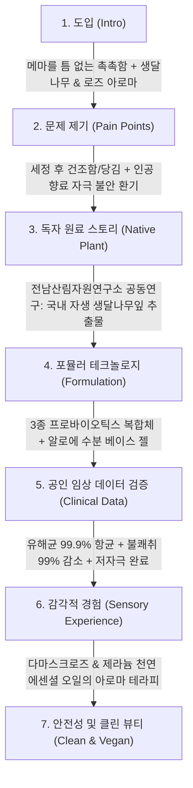

# 아로마티카 컴포트 모이스처 여성청결제 로즈&제라늄 상세페이지 분석 보고서
> **(여성청결제 본품 중심 · 원료 · 포뮬러 · 임상 기능 · 카피라이팅 분석)**

> **분석 대상 URL**: [올리브영 아로마티카 로즈&제라늄 상품 페이지](https://www.oliveyoung.co.kr/store/goods/getGoodsDetail.do?goodsNo=A000000258680)  
> **올리브영 상품 번호**: `A000000258680`  
> **분석 일자**: 2026-08-30  
> **데이터 파일**: [`intimate/data/oliveyoung_aromatica_rose.json`](file:///c:/Users/이봄이/Downloads/icb10proj2/intimate/data/oliveyoung_aromatica_rose.json)  
> **분석 기준**: 인플루언서 협업 및 부가 증정품 요소를 전면 배제하고, **오직 '여성청결제 본품(200ml 젤 워시)'의 식물성 원료, 마이크로바이옴 포뮬러, 공인 임상 데이터, 카피라이팅**에 집중하여 분석

---

## 1. 기본 정보

| 항목 | 상세 내용 |
| :--- | :--- |
| **제품명** | 아로마티카 컴포트 모이스처 여성청결제 로즈&제라늄 (Comfort Moisture Feminine Wash Rose & Geranium) |
| **브랜드** | 아로마티카 (AROMATICA) |
| **정상가 (소비자가)** | 22,000원 ~ 23,000원 |
| **할인가 (판매가)** | **16,500원 ~ 18,400원 (약 20~25% 할인)** |
| **본품 용량** | 200ml (대용량 젤 워시) |
| **제형 특성** | 수분감이 풍부하고 마찰 자극 없이 미끄러지는 **고농축 수분 젤(Moisture Gel) 텍스처** |
| **향료 정보** | 인공 합성향료 0% / **다마스크장미꽃오일(60ppm) + 센티드제라늄꽃오일(1,170ppm) 100% 천연 에센셜 오일 블렌딩** |
| **핵심 포지셔닝** | 세정 후 건조함을 막아주는 **"보습 진정 & 마이크로바이옴 장벽 케어 젤"** |
| **기획 가치 제안** | 200ml 본품 단품 및 리필 파우치(100ml) 연계로 플라스틱 사용량 절감과 장기 사용 경제성 동시 제안 |

---

## 2. 최상단 메인 키메시지 (여성청결제 본품 기준)

> ### **"메마를 틈 없이 촉촉하게, 장벽까지 지키는 마이크로바이옴 모이스처 젤 케어"**
>
> *(서브 카피: **"국내 자생 생달나무의 청량한 진정과 로즈&제라늄 아로마의 편안한 밸런싱"**)*

### 🔍 메인 카피의 기능적 구조 분석
1. **'보습(Moisture)'의 전면 배치**: 기존 여성청결제가 '항균/세정'에만 치우쳐 세정 후 당김이나 건조함을 유발했던 페인포인트를 역공략하여 **'메마를 틈 없는 촉촉함'**을 제1가치로 내세움.
2. **장벽 & 마이크로바이옴 확장**: 단순 세정제가 아닌 **'피부 장벽 강화제'**로 카테고리를 격상.
3. **독자 원료(생달나무) + 아로마테라피**: 천연 에센셜 오일 조향을 통한 감각적 힐링을 헤드라인에 융합.

---

## 3. 도입부 후킹 포인트 (Y존 신체적 결핍 및 고민 자극)

아로마티카 로즈&제라늄은 단순한 냄새/분비물 고민을 넘어 **"세정 후 찾아오는 메마름과 당김, 잦은 세정으로 인한 피부 장벽 손상"**을 정밀하게 타격합니다.

| 후킹 단계 | 자극하는 고객의 결핍 및 불안 포인트 | 상세페이지 내 메시지 소구 방식 |
| :--- | :--- | :--- |
| **1. 세정 후 건조함 및 당김** | **"씻고 나면 오히려 건조하고 가려운 느낌이 드시나요?"** | 일반적인 거품 세정 후 피부 보호막이 씻겨 나가며 발생하는 '세정 후 건조 가려움'을 지적하여 **수분 젤 포뮬러의 필요성**을 환기. |
| **2. 인공 향료에 대한 거부감** | **"불쾌한 냄새를 가리기 위한 강한 인공 향은 Y존에 부담"** | 인공 향료의 점막 자극 위험성을 짚으며, 전문 아로마테라피스트가 조향한 **100% 천연 에센셜 오일의 안전성과 탈취력**을 대안으로 제시. |
| **3. Y존 미세 생태계 붕괴** | **"스트레스, 생리, 피로로 무너지는 Y존 밸런스"** | 유해균은 늘고 유익균은 줄어드는 불균형 상태를 지적하며, **3중 프로바이오틱스 발효 복합체**를 통한 근본적 생태계 정상화 강조. |
| **4. 성분 유래에 대한 의구심** | **"외래 식물 성분보다 믿을 수 있는 우리 땅의 원료는 없을까?"** | 전남산림자원연구소와 공동 연구한 **국내 자생 '생달나무'**의 청량 진정 스토리로 원료적 차별화 및 신뢰도 선점. |

---

## 4. 메시지 전개 순서 (논리적 스토리라인 흐름)

상세페이지는 **[문제 제기: 세정 후 건조함] → [독자적 원료 솔루션: 생달나무잎] → [마이크로바이옴 포뮬러] → [정량적 임상 증명: 99.9% 항균 & 99% 소취] → [수분 젤 텍스처 & 천연 조향] → [클린 비건 인증]** 순서로 전개됩니다.



### 단계별 상세 전개 내용
1. **1단계: 모이스처 젤 아이덴티티 선언**
   - 로즈&제라늄의 매혹적인 그린 플로럴 비주얼과 함께 "장벽까지 지키는 수분 젤 여성청결제" 슬로건 제시.
2. **2단계: 세정 후 건조/민감 문제 제기**
   - 잦은 세정으로 무너지기 쉬운 외음부 유수분 밸런스와 pH 산도 불균형의 원인 분석.
3. **3단계: 국산 자생 식물 '생달나무' R&D 스토리**
   - 전남산림자원연구소와의 산학 공동 연구를 통해 발굴한 생달나무 속 **유칼립톨(Eucalyptol)과 캄파(Camphor)** 성분의 청량 진정 메커니즘 공개.
4. **4단계: 3중 마이크로바이옴 & 수분 젤 포뮬러**
   - 락토바실러스/비피다 3종 발효 용해물과 알로에베라 베이스로 끈적임 없이 피부에 밀착하는 수분막 형성.
5. **5단계: 객관적 효능 수치 입증**
   - **유해균 99.9% 항균력** 및 **불쾌취 99% 탈취 임상 데이터** 제시.
6. **6단계: 천연 에센셜 오일 아로마테라피**
   - 인공 향료 없이 다마스크 로즈와 제라늄 정유로 구현한 고급스러운 그린 플로럴 잔향 묘사.
7. **7단계: 피부 저자극 및 비건 인증**
   - 피부 일차 자극 테스트 완료, 약산성 pH 밸런스, 100% 비건 포뮬러 성적서 노출.

---

## 5. 핵심 성분 및 기술 소구 방식

아로마티카는 **"국내 자생 식물 R&D + 아로마테라피 정유 기술 + 3중 마이크로바이옴"**의 3대 축을 유기적으로 결합하여 고급스러운 기능성을 완성합니다.

```
┌────────────────────────────────────────────────────────────────────────┐
│               아로마티카 로즈&제라늄 3대 핵심 테크놀로지 축              │
├───────────────────┬───────────────────┬────────────────────────────────┤
│ 1. 자생 생달나무잎  │ 2. 천연 에센셜 오일│ 3. 3중 프로바이오틱스 젤       │
│   · 산림연구원 R&D  │   · 다마스크장미 오일│   · 락토/비피다 발효 복합체    │
│   · 유칼립톨&캄파   │   · 센티드제라늄 오일│   · 유해균 99.9% 항균          │
│   · 청량한 진정 수분│   · 불쾌취 99% 소취  │   · 수분 손실 방지 젤 제형     │
└───────────────────┴───────────────────┴────────────────────────────────┘
```

| 구분 | 핵심 원료 및 배합 기술 | 소구 포인트 및 공인 시험 데이터 |
| :--- | :--- | :--- |
| **독자 특화 원료** | **국내 자생<br>생달나무잎 추출물** | - **전남산림자원연구소 공동 R&D** 자생 식물 소재화.<br>- 잎과 줄기에 풍부한 유칼립톨·캄파 성분으로 찝찝하고 붉어진 부위를 즉각적으로 청량하게 진정. |
| **천연 아로마 조향** | **다마스크로즈(60ppm)<br>+ 센티드제라늄(1,170ppm)** | - 인공 합성 향료 0% / 100% 천연 에센셜 오일 블렌딩.<br>- 냄새를 억지로 덮지 않고 은은하고 우아한 그린 플로럴 향으로 기분까지 릴랙싱. |
| **마이크로바이옴** | **3중 발효 복합체<br>(락토/비피다 용해물)** | - 락토바실러스발효용해물 + 비피다발효용해물 + 락토바실러스발효물.<br>- 세정 시 Y존 유익균 환경을 지켜주어 무너진 장벽 방어력 강화. |
| **표적 항균력** | **유해균 99.9% 항균력** | - 칸디다균, 대장균 등 외음부 주요 유해균 99.9% 감소 임상 입증. |
| **탈취/소취 효과** | **불쾌취 99% 감소** | - 분비물 및 생리혈 냄새의 원인 물질 99% 제거 시험 완료. |
| **보습 젤 포뮬러** | **알로에베라 베이스<br>고농축 수분 젤** | - 거품 세정제 특유의 탈지력(유분 과다 제거)을 보완하여, 세정 중/후에도 수분감을 유지하는 젤 텍스처. |
| **안전성 처방** | **약산성 pH<br>+ 피부 저자극 완료** | - Y존 건강 산도(pH 4.5~5.5) 유지.<br>- 피부 일차 자극 시험 저자극 판정 및 100% 비건 포뮬러. |

---

## 6. 이탈 방지 장치 (본품 중심의 가치 제안)

| 이탈 방지 장치 | 상세 구현 내용 | 소비자 심리적 효과 |
| :--- | :--- | :--- |
| **1. 200ml 대용량 가치 제안** | - 일반 여성청결제(150ml) 대비 **33% 더 큰 200ml 대용량**.<br>- 1만 원대 중후반 가격에 넉넉한 용량으로 가심비 충족. | "오래 쓸 수 있는 넉넉한 프리미엄 워시" 인식 형성. |
| **2. 지속가능한 리필 시스템** | - 본품 200ml 외에 리필팩(100ml) 옵션을 제공하여 플라스틱 절감과 경제적 재구매 동기 부여. | 친환경 가치소비 성향의 스마트 소비자 락인(Lock-in). |
| **3. 공공 연구기관(산림청/연구원) 신뢰** | - '전남산림자원연구소'와의 공식 공동 연구 개발 타이틀. | 단순 화장품 브랜드를 넘어선 국가 공인 R&D급 기술 신뢰성 부여. |
| **4. 클린 뷰티 & 100% 비건 인증** | - 동물 실험 배제, 유해 화학 성분 배제, 재활용 용기 적용. | 성분과 환경에 민감한 2030 여성층의 완벽한 심리적 안도감. |

---

## 7. 기획 인사이트: 경쟁사 대비 아로마티카 로즈&제라늄의 차별화 포인트

### 📊 기존 분석 4사 vs 아로마티카 로즈&제라늄 핵심 비교

| 비교 항목 | 아로마티카 (퓨어앤소프트) | 좋은느낌 (바이옴) | 메디온 (포밍워시) | 이너생각 (휩드워시) | **아로마티카 (로즈&제라늄)** |
| :--- | :--- | :--- | :--- | :--- | :--- |
| **핵심 제형** | 액상 폼 (무향) | 버블 폼 | 버블 폼 (쿨링 옵션) | 에어로졸 휩드 크림 | **고농축 수분 젤 (Gel)** |
| **제1 핵심 가치** | 무향료 저자극 | 유익균 락토 추가 | 독자 락토리메디 | 벌사상자 가려움 완화 | **생달나무 + 보습 장벽 젤** |
| **향료 전략** | 100% 무향 | 미세 향 | 기본/쿨링 향 | 알러젠 프리 가데니아 | **100% 천연 에센셜 정유** |
| **항균/소취** | 99% 항균 | 임상 수치 미약 | 항균/소취 수치 | 99.9% 항균 / 89.3% 소취 | **99.9% 항균 / 99% 소취** |
| **차별화 무기** | 민들레 디콕션 공법 | 대기업 유익균 네이밍 | 화해 1위 & 가성비 | 논문 인용 & 환불보장제 | **산림연구원 R&D 생달나무** |

---

### 💡 우리가 벤치마킹 및 차별화할 혁신 포인트

```
┌────────────────────────────────────────────────────────────────────────┐
│             아로마티카 로즈&제라늄 벤치마킹 및 우리 제품 혁신 방향        │
├───────────────────────────────────┬────────────────────────────────────┤
│   아로마티카 로즈&제라늄의 강점   │        우리 제품의 차별화 도약 방안 │
├───────────────────────────────────┼────────────────────────────────────┤
│ 1. 세정 후 건조함 막는 '수분 젤'  │ 젤의 보습감 + 폼의 간편함 결합 제형│
│ 2. 산림연구원 자생 '생달나무' R&D │ 우리 고유 특허 자생 식물 원료 발굴 │
│ 3. 고급 천연 에센셜 오일 조향     │ 질염 유발균 항균 아로마 블렌딩 입증│
│ 4. 200ml 대용량 + 리필팩 에코     │ 에코 리필 파우치 + 스마트 정량 펌프│
└───────────────────────────────────┴────────────────────────────────────┘
```

1. **'거품' 일색 시장에서 '수분 젤' 제형의 보습 차별화 벤치마킹**:
   - 현재 시장의 80% 이상이 버블 폼에 집중되어 있어 "씻고 나면 건조하다"는 잠재 불만이 존재함.
   - ➜ 우리는 **"고농축 젤에서 물이 닿으면 미세 버블로 변하는 트랜스포밍 젤-투-폼(Gel-to-Foam)"** 제형을 개발하여 보습력과 세정 편의성을 동시에 잡는 것을 제안.
2. **'공공/국책 연구기관 협업 스토리'의 신뢰성 차별화**:
   - 단순 해외 원료 수입이 아닌 **"국내 자생 식물(생달나무 등) 국책 연구기관 공동 R&D"** 프레임은 독점성과 안전성 측면에서 압도적인 프리미엄을 줌.
   - ➜ 우리 제품 역시 **국내 자생 약용 식물(예: 제주 진달래, 토종 익모초 등)의 특허 추출물**을 메인 원료로 내세워 K-더마 인티메이트 스토리 구축.
3. **단순 기분 좋은 향을 넘어선 '항균 아로마 테라피'**:
   - 아로마티카의 천연 정유 조향에서 한 단계 더 나아가, **"칸디다균과 냄새 원인균을 직접 억제하는 효능이 검증된 천연 에센셜 오일 배합비"**를 임상으로 증명하여 감성과 기능성을 모두 완벽히 충족.

---

## 8. 연계 데이터 파일 안내

| 구분 | 파일 경로 | 내용 요약 |
| :--- | :--- | :--- |
| **정형 데이터 JSON** | [`intimate/data/oliveyoung_aromatica_rose.json`](file:///c:/Users/이봄이/Downloads/icb10proj2/intimate/data/oliveyoung_aromatica_rose.json) | 아로마티카 로즈&제라늄 본품 가격, 용량, 성분, 임상 데이터 |
| **분석 보고서 (본 문서)** | [`intimate/report/aromatica_rose_analysis.md`](file:///c:/Users/이봄이/Downloads/icb10proj2/intimate/report/aromatica_rose_analysis.md) | 여성청결제 본품 중심 정밀 분석 마크다운 보고서 |

---
*보고서 생성 완료: 2026-08-30 | 분석 도구: Web Scraping & Formulation Insight Analysis*
