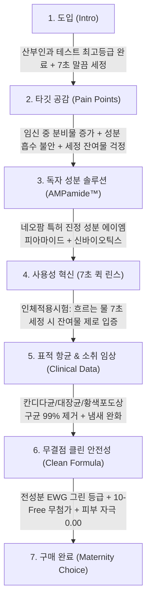

# 아토팜 매터니티 케어 마일드 앤 수딩 여성청결제 상세페이지 분석 보고서
> **(여성청결제 본품 중심 · 원료 · 포뮬러 · 임상 기능 · 카피라이팅 분석)**

> **분석 대상 URL**: [올리브영 아토팜 매터니티 케어 상품 페이지](https://www.oliveyoung.co.kr/store/goods/getGoodsDetail.do?goodsNo=A000000228172)  
> **올리브영 상품 번호**: `A000000228172`  
> **분석 일자**: 2026-08-30  
> **데이터 파일**: [`intimate/data/oliveyoung_atopalm.json`](file:///c:/Users/이봄이/Downloads/icb10proj2/intimate/data/oliveyoung_atopalm.json)  
> **분석 기준**: 인플루언서 협업 및 부가 사은품 요소를 전면 배제하고, **오직 '여성청결제 본품(150ml 폼 워시)'의 네오팜 독자 성분(AMPamide™), 산부인과 테스트, 7초 퀵 린스 임상, 임산부 타깃 카피라이팅**에 집중하여 분석

---

## 1. 기본 정보

| 항목 | 상세 내용 |
| :--- | :--- |
| **제품명** | 아토팜 매터니티 케어 마일드 앤 수딩 여성청결제 (ATOPALM Maternity Care Mild & Soothing Feminine Wash) |
| **브랜드** | 아토팜 (ATOPALM / 제조·판매: (주)네오팜) |
| **정상가 (소비자가)** | 21,000원 ~ 24,000원 |
| **할인가 (판매가)** | **14,900원 ~ 18,900원 (약 20~30% 할인)** |
| **본품 용량** | 150ml |
| **제형 특성** | 펌핑 즉시 부드럽게 감싸는 **소프트 마이크로 버블 폼(Micro Bubble Foam)** 제형 |
| **향료 유무** | **100% 무향 (Fragrance-Free)** — 인공 향료 및 알러젠 유발 성분 전면 배제 |
| **핵심 포지셔닝** | 임산부 및 초민감성 여성을 위한 **"산부인과 테스트 완료 7초 안심 헹굼 청결제"** |
| **기획 구성 혜택** | 150ml 본품 단품 및 1+1 더블 기획 세트 (임신·출산기 장기 사용 고객 대상 가성비 제공) |

---

## 2. 최상단 메인 키메시지 (여성청결제 본품 기준)

> ### **"산부인과 테스트 완료! 임산부도 안심하는 7초 말끔 세정 약산성 버블 청결제"**
>
> *(서브 카피: **"네오팜 독자 진정 특허 AMPamide™와 유해균 3종 99% 케어로 지키는 가장 순한 밸런스"**)*

### 🔍 메인 카피의 기능적 구조 분석
1. **의학적 공신력 선점('산부인과 테스트 완료')**: 가장 까다로운 안전성 기준을 요구하는 임산부 고객에게 '산부인과 적합성 테스트' 타이틀을 최상단에 배치하여 신뢰도 즉시 획득.
2. **혁신적 사용성 키워드('7초 말끔 세정')**: "세정 잔여물이 점막에 남아 트러블을 유발하지 않을까?"라는 심리적 불안을 '7초 퀵 린스'라는 구체적 시간 수치로 해소.
3. **독자 장벽/진정 기술 명시('AMPamide™')**: 민감 피부 장벽 1등 기업 네오팜의 독자 성분을 내세워 기술적 차별성 각인.

---

## 3. 도입부 후킹 포인트 (임산부 및 민감성 Y존 고민/불안 자극)

아토팜은 **임신 중 호르몬 변화로 급증하는 분비물, 질 내 산도 붕괴, 태아에게 미칠지 모르는 화학 성분 공포**를 정밀하게 타격합니다.

| 후킹 단계 | 자극하는 고객의 결핍 및 불안 포인트 | 상세페이지 내 메시지 소구 방식 |
| :--- | :--- | :--- |
| **1. 임신 중 호르몬 변화 & 분비물 급증** | **"임신 후 부쩍 늘어난 분비물과 불쾌한 냄새"** | 임산부의 자연스러운 신체 변화를 공감하며, 태아에게 무해하면서도 확실하게 냄새를 잡아주는 전용 케어 필요성 환기. |
| **2. 화학 성분의 태아 영향 공포** | **"내가 쓰는 세정제 성분이 뱃속 아이에게 흡수되지 않을까?"** | 경피 흡수율이 높은 외음부 특성을 짚으며, **전성분 EWG 그린 등급 + 10-Free 처방**으로 무결점 안심 소구. |
| **3. 세정 잔여물로 인한 가려움/트러블** | **"물로 헹궈도 끈적하게 남아 가려움을 유발하는 세정 잔여물"** | 잔여물이 Y존 트러블을 유발한다는 점을 지적하고, **"7초 퀵 린스(인체적용시험)"**로 잔여물 0% 증명. |
| **4. 세정 시 피부 장벽 손상** | **"호르몬 변화로 극도로 건조해지고 민감해진 외음부"** | **네오팜 독자 특허 성분(AMPamide™)**과 신바이오틱스로 장벽 방어력 강화 제안. |

---

## 4. 메시지 전개 순서 (논리적 스토리라인 흐름)

상세페이지는 **[산부인과 안전성 선언] → [임산부/민감성 문제 공감] → [독자 진정 성분(AMPamide™)] → [7초 퀵 린스 임상] → [유해균 3종 99% 항균] → [EWG 그린 & 10-Free]** 순서로 매우 치밀하게 전개됩니다.



### 단계별 상세 전개 내용
1. **1단계: 최고 등급 안전성 아이덴티티 제시**
   - '산부인과 피부 사용 적합성 테스트 아주 좋음 등급'과 'EWG 그린' 비주얼로 의학적 안전성 선점.
2. **2단계: 임산부 및 극민감성 여성의 페인포인트 진단**
   - 호르몬 불균형으로 잦아진 분비물, 가려움, 성분 흡수에 대한 심리적 두려움 공감.
3. **3단계: 네오팜 독자 장벽·진정 성분 공개**
   - 자극받은 피부 장벽을 진정시키는 **에이엠피아마이드(AMPamide™)**와 유익균 밸런스를 돕는 **신바이오틱스** 배합 기전 설명.
4. **4단계: 7초 퀵 린스(Quick Rinse) 인체적용시험 공개**
   - 폼 제형이 물에 닿아 단 7초 만에 씻겨 내려가 점막 잔류를 원천 차단함을 임상 데이터로 증명.
5. **5단계: 유해균 3종 항균 및 소취 데이터 입증**
   - **칸디다균, 대장균, 황색포도상구균 99% 제거** 및 분비물 냄새 케어 수치 제시.
6. **6단계: 10-Free 클린 포뮬러 및 무향 처방 확약**
   - 인공 향료, 색소, 파라벤 등 10가지 유해 성분 배제 및 피부 자극 0.00 무자극 성적서 노출.

---

## 5. 핵심 성분 및 기술 소구 방식

아토팜은 네오팜의 피부과학 R&D를 기반으로 **"독자 특허 성분 + 7초 퀵 린스 기술 + 유해균 3종 항균"**의 3대 축을 구축하여 임산부 카테고리를 장악합니다.

```
┌────────────────────────────────────────────────────────────────────────┐
│             아토팜 매터니티 케어 여성청결제 3대 핵심 테크놀로지 축        │
├───────────────────┬───────────────────┬────────────────────────────────┤
│ 1. 특허 성분 AMPamide │ 2. 7초 퀵 린스 기술 │ 3. 유해균 3종 99% 항균         │
│   · 네오팜 독자 진정  │   · 인체적용시험 완료 │   · 칸디다균 99% 제거          │
│   · 피부 장벽 방어력  │   · 잔여물 점막 잔류 0│   · 대장균 99% 제거            │
│   · 신바이오틱스 밸런스│   · 마찰 없는 미세 버블│   · 황색포도상구균 99% 제거    │
└───────────────────┴───────────────────┴────────────────────────────────┘
```

| 구분 | 핵심 원료 및 배합 기술 | 소구 포인트 및 공인 시험 데이터 |
| :--- | :--- | :--- |
| **독자 특허 진정 성분** | **에이엠피아마이드<br>(AMPamide™)** | - **네오팜 독자 개발 진정 특허 성분**.<br>- 외부 자극과 호르몬 변화로 예민해진 피부 장벽을 탄탄하게 복구하고 진정 효과 선사. |
| **마이크로바이옴** | **신바이오틱스 포뮬러<br>(Synbiotics Complex)** | - 프로바이오틱스 + 프리바이오틱스 유익균 배합으로 Y존 본연의 산도와 유익균 생태계 보호. |
| **세정 잔여물 혁신** | **7초 퀵 린스<br>(Quick Rinse) 인체적용시험** | - 흐르는 물에 **단 7초만 헹궈도 세정 잔여물이 남지 않음**을 임상으로 증명.<br>- 점막 부위 세정제 잔류로 인한 2차 트러블 완벽 예방. |
| **표적 병원균 항균력** | **유해균 3종 99% 제거** | - **칸디다균, 대장균, 황색포도상구균 99% 항균** 공인 시험 완료. |
| **산부인과 안전성** | **산부인과 테스트 완료** | - 산부인과 피부 사용 적합성 평가 최고 등급인 **'아주 좋음'** 획득. |
| **클린 & 세이프티** | **전성분 EWG 그린<br>+ 10-Free 무향** | - 인공 향료, 색소, 파라벤 등 10가지 유해 우려 성분 배제.<br>- 피부 자극 지수 0.00 (무자극 판정). |

---

## 6. 이탈 방지 장치 (임산부/민감성 타깃 가치 제안)

| 이탈 방지 장치 | 상세 내용 | 소비자 심리적 효과 |
| :--- | :--- | :--- |
| **1. 산부인과 최고 등급 인증 마크** | - 산부인과 전문의 테스트 '아주 좋음' 공인 마크 상세페이지 상단 노출. | 임신부의 극도로 예민한 성분 불안감을 단번에 종식시킴. |
| **2. '7초 퀵 린스' 직관적 시간 제안** | - "7초 만에 잔여물 없이 헹궈진다"는 명확한 물리적 행동 가이드. | 샤워 시간이 부담스러운 만삭 임산부 및 빠른 세정을 원하는 고객의 구매 확신 유도. |
| **3. 대한민국 대표 민감스킨케어 '아토팜' 인지도** | - 영유아·민감피부 1등 브랜드 네오팜의 기술력과 제조 신뢰도. | 검증되지 않은 신생 브랜드 대비 압도적인 선택 명분 제공. |
| **4. 1+1 더블 기획 세트 혜택** | - 임신 초기부터 출산 후 산후조리기까지 장기 사용하는 고객을 위한 경제적 번들. | 장바구니 객단가 상승 및 재구매 락인. |

---

## 7. 기획 인사이트: 임산부/민감성 타깃 관점의 벤치마킹 포인트

### 💡 아토팜 매터니티 케어의 독보적 강점
1. **'7초 퀵 린스'라는 페인포인트의 재발견**:
   - 경쟁사들이 "거품이 얼마나 부드러운가"를 다툴 때, 아토팜은 **"거품이 얼마나 잔여물 없이 빨리 씻겨 내려가는가"**를 임상으로 수치화(7초)하여 점막 잔류 불안을 완벽히 해결함.
2. **'산부인과 테스트 최고 등급'의 프리미엄 안전성**:
   - 일반 피부과 테스트(0.00)를 넘어, 인티메이트 카테고리의 끝판왕인 **산부인과 사용 적합성 테스트**를 획득하여 임산부뿐만 아니라 극민감성 일반 여성까지 흡수.
3. **독자 특허 성분(AMPamide™)의 장벽 포지셔닝**:
   - 단순 식물 추출물이 아닌, **피부 장벽 전문 기업 네오팜의 독자 세라마이드/진정 성분**을 내세워 기술적 신뢰도 구축.

---

### 🚀 우리 제품만의 차별화 혁신 전략

```
┌────────────────────────────────────────────────────────────────────────┐
│             아토팜 벤치마킹 및 우리 제품의 프리미엄 도약 방안            │
├───────────────────────────────────┬────────────────────────────────────┤
│           아토팜의 강점 및 한계   │        우리 제품의 차별화 혁신 방안 │
├───────────────────────────────────┼────────────────────────────────────┤
│ 1. 7초 퀵 린스(잔여물 제로)       │ 5초 초미세 이지 워시 + 수분막 래핑  │
│ 2. 산부인과 테스트 완료           │ 산부인과 테스트 + 안자극 대체 결합 │
│ 3. 임산부 중심의 좁은 타깃팅      │ 임산부 + 갱년기/가임기 전생애주기 더마│
│ 4. 무향 중심의 다소 건조한 톤앤매너│ 무향 퓨어 라인 + 천연 릴랙싱 테라피│
└───────────────────────────────────┴────────────────────────────────────┘
```

1. **'퀵 린스(Quick Rinse) 잔여물 제로' 임상의 필수 도입**:
   - 씻고 나서도 미끈거리거나 잔여물이 남는 느낌은 여성청결제 사용자의 대표적인 불만임.
   - ➜ 우리 제품 역시 **"초스피드 말끔 헹굼(Quick Rinse) & 점막 잔류 0% 임상"**을 핵심 USP로 벤치마킹하여 카피라이팅에 적용.
2. **'산부인과 테스트 + 안자극 대체 테스트'의 더블 인증**:
   - 아토팜의 산부인과 인증과 일리윤의 안자극 대체 테스트를 모두 결합하여, **"산부인과 전문의 검증 + 눈가 점막 수준의 안심 무자극"**이라는 국내 최고 수준의 안전성 포트폴리오 완성.
3. **임산부를 넘어선 '전 생애주기 Y존 장벽 케어'로 확장**:
   - 아토팜이 '매터니티(임산부)'에 갇혀 있다면, 우리는 **"초경 시작 청소년부터 임신·출산기 여성, 호르몬 감소로 건조한 갱년기 여성까지 아우르는 Y존 장벽 리페어"**로 타깃 확장.

---

## 8. 연계 데이터 파일 안내

| 구분 | 파일 경로 | 내용 요약 |
| :--- | :--- | :--- |
| **정형 데이터 JSON** | [`intimate/data/oliveyoung_atopalm.json`](file:///c:/Users/이봄이/Downloads/icb10proj2/intimate/data/oliveyoung_atopalm.json) | 아토팜 매터니티 케어 본품 가격, 용량, 성분, 7초 퀵 린스 및 항균 데이터 |
| **분석 보고서 (본 문서)** | [`intimate/report/atopalm_analysis.md`](file:///c:/Users/이봄이/Downloads/icb10proj2/intimate/report/atopalm_analysis.md) | 여성청결제 본품 중심 정밀 분석 마크다운 보고서 |

---
*보고서 생성 완료: 2026-08-30 | 분석 도구: Web Scraping & Maternity Cleanser Formulation Analysis*
