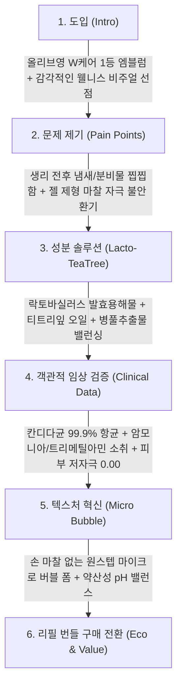

# 바솔(BASOL) 이너 밸런싱 포밍 워시 상세페이지 분석 보고서
> **(여성청결제 본품 중심 · 락토 티트리 포뮬러 · W케어 베스트셀러 · 올리브영 카피라이팅 분석)**

> **분석 대상 URL**: [올리브영 바솔 포밍워시 기획 상품 페이지](https://www.oliveyoung.co.kr/store/goods/getGoodsDetail.do?goodsNo=A000000204867)  
> **올리브영 상품 번호**: `A000000204867`  
> **분석 일자**: 2026-08-30  
> **데이터 파일**: [`intimate/data/oliveyoung_basol.json`](file:///c:/Users/이봄이/Downloads/icb10proj2/intimate/data/oliveyoung_basol.json)  
> **이미지 디렉토리**: [`intimate/images/basol/`](file:///c:/Users/이봄이/Downloads/icb10proj2/intimate/images/basol/)  
> **분석 기준**: 인플루언서 협업 및 티슈 등 부가 사은품 요소를 전면 배제하고, **오직 '여성청결제 본품(150ml 버블 폼 및 리필)'의 락토바실러스 발효물, 티트리 진정, 칸디다 항균 99.9%, W케어 웰니스 카피라이팅**에 집중하여 분석

---

## 1. 기본 정보

| 항목 | 상세 내용 |
| :--- | :--- |
| **제품명** | 바솔 이너 밸런싱 포밍 워시 (BASOL Inner Balancing Foaming Wash) |
| **브랜드** | 바솔 (BASOL / (주)이너테라피) |
| **정상가 (소비자가)** | 22,000원 (단품 150ml) / 36,000원 (본품 150ml + 리필 150ml 기획) |
| **할인가 (판매가)** | **15,900원 ~ 17,900원 (단품) / 23,900원 ~ 24,000원 (기획 세트, 약 33% 할인)** |
| **본품 용량** | **150ml (소프트 버블 폼 본품)** / 150ml 리필 파우치 |
| **제형 특성** | 손으로 비빌 필요 없이 펌핑 즉시 나오는 **폭신한 마이크로 버블 폼(Micro Bubble Foam)** 제형 |
| **향료 및 원료 특성** | **자연 유래 티트리잎 오일** 함유로 인위적이지 않고 상쾌하고 깨끗한 쿨링 잔향 선사 |
| **올리브영 기획 혜택** | **[본품 150ml + 150ml 리필 파우치]** 실속 더블 기획 세트 |

---

## 2. 최상단 메인 키메시지 (여성청결제 본품 기준)

> ### **"올리브영 W케어 베스트셀러! 락토바실러스와 티트리로 완성하는 데일리 Y존 약산성 밸런스"**
>
> *(서브 카피: **"칸디다균 99.9% 항균과 풍성한 버블 폼으로 매일 자극 없이 산뜻하고 개운하게"**)*

### 🔍 메인 카피의 기능적 구조 분석
1. **W케어 카테고리 1등 위상 선점**: 올리브영이 전략적으로 육성하는 'W케어(웰니스 페미닌 케어)' 카테고리 대표 제품임을 전면에 배치하여 트렌디한 2030 여성층의 신뢰 획득.
2. **'유산균(락토) + 티트리'의 직관적 시너지 제시**: 유익균 생태계를 지키는 락토바실러스와 냄새/염증을 케어하는 티트리의 조합을 한 문장으로 압축.
3. **'마이크로 버블 폼'의 편안한 사용감 강조**: 젤 타입의 물리적 마찰이 부담스러운 민감 피부를 겨냥해 즉시 분사되는 거품의 편리성 소구.

---

## 3. 도입부 후킹 포인트 (Y존 찝찝함, 냄새, 세정 마찰 자극 타깃)

바솔은 **"생리 전후 불쾌취, 분비물로 인한 찝찝함, 젤 클렌저를 손으로 비빌 때 생기는 외음부 마찰 자극"**을 핵심 고민으로 제시합니다.

| 후킹 단계 | 자극하는 고객의 결핍 및 불안 포인트 | 상세페이지 내 메시지 소구 방식 |
| :--- | :--- | :--- |
| **1. 씻어도 남는 찝찝함과 냄새** | **"생리 전후, 운동 후 땀과 분비물로 신경 쓰이는 불쾌취"** | 자연 유래 **티트리 오일과 탈취 테스트 성적서**를 제시하여 냄새 스트레스 즉각 해결. |
| **2. 외음부 피부 마찰 자극 공포** | **"민감한 부위를 손으로 문질러 거품 낼 때 느껴지는 따가움"** | 펌핑 즉시 생성되는 **초미세 폭신 버블 폼**으로 손 마찰을 0(Zero)으로 줄여주는 안심 사용감 소구. |
| **3. 질 내 유익균 감소 불안** | **"세정할 때마다 좋은 유익균까지 다 씻겨 나갈까 봐 걱정"** | **락토바실러스 발효용해물**을 공급하여 씻는 순간에도 미생물 생태계 유지. |

---

## 4. 메시지 전개 순서 (논리적 스토리라인 흐름)

상세페이지는 **[올리브영 W케어 1등 선점] → [찝찝함/냄새 문제 제기] → [락토바실러스 & 티트리 포뮬러] → [칸디다 99.9% 항균 & 소취 임상] → [무자극 버블 폼 시연] → [리필 기획 가치 제안]** 순서로 전개됩니다.



### 단계별 상세 전개 내용
1. **1단계: 감각적인 W케어 웰니스 비주얼**
   - 따뜻하고 미니멀한 파스텔 톤앤매너로 "건강하고 당당한 여성 웰니스 루틴" 정의.
2. **2단계: 일상 속 Y존 불쾌감 공감**
   - 꽉 끼는 레깅스, 운동 후 땀, 생리 기간의 냄새와 찝찝함을 직접적으로 공략.
3. **3단계: 락토바실러스 & 티트리 배합 공개**
   - 질 건강을 위한 **유산균 발효물**과 진정/소취에 탁월한 **호주산 티트리 오일, 병풀(Cica)** 공개.
4. **4단계: 3대 공인 시험 데이터 증명**
   - **칸디다균 99.9% 항균 시험**, **2대 악취 가스 소취 데이터**, **녹색소비자연대 유해 성분 불검출 안전성** 노출.
5. **5단계: 미세 버블 폼의 부드러움 시각화**
   - 촘촘하고 탄력 있는 거품이 점막을 부드럽게 감싸 마찰 없이 씻겨 나가는 과정 시연.
6. **6단계: 150ml 본품 + 150ml 리필 기획 세트 제안**
   - 플라스틱 사용을 줄이는 친환경 리필 파우치와 30% 이상 할인된 실속 구성으로 결제 유도.

---

## 5. 핵심 성분 및 기술 소구 방식

바솔은 **"락토바실러스 발효물 + 티트리 & 병풀 진정 + 칸디다 99.9% 항균 + 마이크로 버블"**의 4대 축을 바탕으로 2030 트렌디 웰니스 층을 완벽히 흡수합니다.

```
┌────────────────────────────────────────────────────────────────────────┐
│               바솔 이너 밸런싱 포밍 워시 4대 핵심 포뮬러 축               │
├───────────────────┬───────────────────┬────────────────────────────────┤
│ 1. 락토바실러스 발효물│ 2. 티트리 & 병풀 진정│ 3. 칸디다 99.9% & 무자극 0.00  │
│   · Y존 마이크로바이옴│   · 천연 티트리잎 오일│   · 칸디다균 99.9% 살균        │
│   · 약산성 산도 유지  │   · 병풀추출물(Cica) │   · 암모니아/트리메틸아민 소취 │
│   · 피부 장벽 보호    │   · 상쾌하고 깨끗한 향│   · 피부 자극 지수 0.00        │
└───────────────────┴───────────────────┴────────────────────────────────┘
```

| 구분 | 핵심 원료 및 배합 기술 | 소구 포인트 및 공인 시험 데이터 |
| :--- | :--- | :--- |
| **마이크로바이옴** | **락토바실러스 발효용해물** | - 유익균 발효 성분을 함유하여 세정 시 Y존 본연의 미생물 생태계와 pH 약산성 보호. |
| **천연 진정/소취** | **티트리잎 오일 & 병풀(Cica)** | - 냄새와 염증의 원인이 되는 세균 증식을 막아주고 자극받은 외음부를 빠르게 진정. |
| **표적 항균력** | **칸디다균 99.9% 항균** | - 여성 질염 유발 대표 진균인 칸디다균(Candida albicans) 99.9% 제거 시험 완료. |
| **2대 가스 소취** | **암모니아 & 트리메틸아민 소취** | - 생리혈 및 분비물 냄새 유발 가스를 깔끔하게 정화하여 하루 종일 산뜻함 유지. |
| **마찰 프리 제형** | **소프트 마이크로 버블 폼** | - 펌핑 즉시 분사되는 풍성한 거품으로 연약한 점막 마찰을 최소화하여 저자극 세정. |
| **클린 & 세이프티** | **EWG 그린 & 녹색소비자연대 검증** | - 유해 화학 성분 전면 배제, 피부 자극 지수 0.00 비자극 판정. |

---

## 6. 이탈 방지 장치 (올리브영 W케어 대표 브랜드 관점의 가치 제안)

| 이탈 방지 장치 | 상세 구현 내용 | 소비자 심리적 효과 |
| :--- | :--- | :--- |
| **1. [본품 150ml + 리필 150ml] 더블 기획** | - 본품 용기를 재사용할 수 있는 리필 파우치 증정으로 총 300ml 용량을 2만 원대 초반에 공급. | "리필까지 줘서 오래 쓸 수 있는 똑똑한 소비"라는 심리적 만족감. |
| **2. 올리브영 W케어 1등 어워즈 엠블럼** | - 2030 여성들의 실구매 후기로 검증된 1등 타이틀 노출. | 브랜드 선택 실패에 대한 불안 완전 해소. |
| **3. 감각적이고 세련된 미니멀 패키지** | - 욕실에 두어도 튀지 않고 깔끔한 화이트/민트 톤의 웰니스 디자인. | 부끄러운 위생용품이 아닌 당당한 라이프스타일 뷰티템으로 인식. |
| **4. 2가지 라인업 (이너밸런싱 vs 마일드캄)** | - 상쾌한 밸런싱(티트리)과 초민감 무향 진정(마일드캄) 중 피부 상태별 맞춤 선택 가능. | 고객의 취향별 이탈 방지. |

---

## 7. 기획 인사이트: 경쟁사 대비 바솔의 차별화 포인트 및 벤치마킹 요소

### 📊 올리브영 핵심 폼 타입 경쟁사 vs 바솔 비교

| 비교 항목 | 메디온 (포밍워시) | 디어스킨 (락토폼) | 일리윤 (더마폼) | **바솔 (이너밸런싱 폼)** |
| :--- | :--- | :--- | :--- | :--- |
| **브랜드 이미지** | D2C 치료/임상 전문 | 생리대 기반 클린 | 아모레 대기업 더마 | **올리브영 2030 W케어 웰니스** |
| **향기 및 청량감** | 무향/은은한 향 | 100% 무향 | 100% 무향 | **자연 티트리 에센셜의 산뜻한 향** |
| **핵심 성분 조합** | 락토리메디 (특허) | 유산균 + 어성초 | 녹차 락토스킨 | **락토바실러스 + 티트리 + 병풀** |
| **패키지/리필 전략** | 1+1 본품 번들 | 단품 위주 | 300ml 단품 | **150ml 본품 + 150ml 리필 기획** |
| **타깃 소구 감성** | 질염/분비물 해결 | 온 가족 무향 안심 | 극민감 진정 | **운동/생리/일상 속 쿨링 밸런스** |

---

### 💡 우리가 벤치마킹 및 차별화할 혁신 포인트

```
┌────────────────────────────────────────────────────────────────────────┐
│               바솔 벤치마킹 및 우리 제품의 프리미엄 도약 방안             │
├───────────────────────────────────┬────────────────────────────────────┤
│           바솔의 강점 및 한계     │        우리 제품의 차별화 혁신 방안 │
├───────────────────────────────────┼────────────────────────────────────┤
│ 1. 유산균 + 티트리 산뜻한 조합    │ 유산균 엑소좀 + 티트리 엑기스 블렌딩│
│ 2. 본품 + 리필 파우치 에코 기획   │ '본품 + 친환경 대용량 리필' 구성 도입│
│ 3. 2030 올리브영 W케어 감성 브랜딩│ 하이엔드 웰니스 & 럭셔리 인티메이트 │
│ 4. 일반적인 락토바실러스 용해물   │ 질 유래 특허 유산균 생체 복합체   │
└───────────────────────────────────┴────────────────────────────────────┘
```

1. **'유산균 + 천연 티트리 진정'의 킬러 조합 벤치마킹**:
   - 무향 제품 일색의 시장에서 바솔은 **천연 티트리 오일의 은은한 청량감과 냄새 제거력**으로 차별화에 성공함.
   - ➜ 우리 제품 역시 **"무향 퓨어 라인"**과 함께 **"천연 티트리/시카 쿨링 밸런싱 라인"**을 투트랙으로 구성하여 청량감을 원하는 고객 흡수.
2. **'본품 + 리필(Eco-friendly Refill)' 패키지 공식 도입**:
   - 150ml 단품 구매 시 빠른 소진으로 인한 재구매 번거로움을 **리필 파우치 기획 세트**로 해결한 바솔의 전략을 그대로 차용하여 객단가와 만족도 극대화.
3. **'W케어 웰니스 라이프스타일' 톤앤매너 계승**:
   - 질염 치료 프레임의 거부감을 줄이고 **"운동 후, 생리 전후 매일 나를 아끼는 기분 좋은 클렌징 루틴"**이라는 긍정적이고 감각적인 톤앤매너 구축.

---

## 8. 연계 데이터 파일 안내

| 구분 | 파일 경로 | 내용 요약 |
| :--- | :--- | :--- |
| **정형 데이터 JSON** | [`intimate/data/oliveyoung_basol.json`](file:///c:/Users/이봄이/Downloads/icb10proj2/intimate/data/oliveyoung_basol.json) | 바솔 이너 밸런싱 포밍워시 가격, 용량, 성분, 항균/탈취/저자극 데이터 |
| **분석 보고서 (본 문서)** | [`intimate/report/basol_analysis.md`](file:///c:/Users/이봄이/Downloads/icb10proj2/intimate/report/basol_analysis.md) | 올리브영 W케어 및 락토-티트리 포뮬러 중심 정밀 분석 마크다운 보고서 |

---
*보고서 생성 완료: 2026-08-30 | 분석 도구: Web Scraping & Basol Formulation Analysis*
