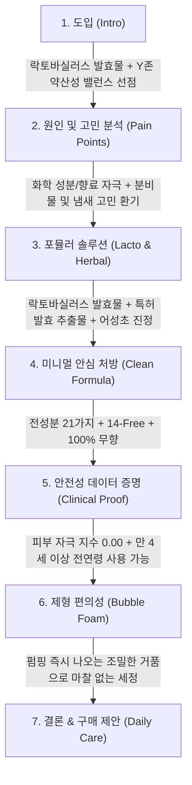

# 디어스킨 락토 페미닌 워시 상세페이지 분석 보고서
> **(여성청결제 본품 중심 · 성분 · 기능 · 포뮬러 · 임상 분석)**

> **분석 대상 URL**: [올리브영 디어스킨 상품 페이지](https://www.oliveyoung.co.kr/store/goods/getGoodsDetail.do?goodsNo=A000000214402)  
> **상품 번호**: `A000000214402`  
> **분석 일자**: 2026-08-30  
> **데이터 파일**: [`intimate/data/oliveyoung_dearskin.json`](file:///c:/Users/이봄이/Downloads/icb10proj2/intimate/data/oliveyoung_dearskin.json)  
> **분석 기준**: 기획세트에 포함된 '청결티슈' 및 인플루언서 요소를 완전히 배제하고, **오직 '여성청결제 본품(150ml 폼 워시)'의 성분, 처방 기술, 피부 안전성, 카피라이팅**에 집중하여 분석

---

## 1. 기본 정보

| 항목 | 상세 내용 |
| :--- | :--- |
| **제품명** | 디어스킨 락토 페미닌 워시 (Dear Skin Lacto Feminine Wash) |
| **브랜드** | 디어스킨 (DEAR SKIN / 제조·판매: 깨끗한나라) |
| **정상가 (소비자가)** | 12,900원 |
| **할인가 (판매가)** | **9,900원 ~ 10,900원 (약 20~23% 할인)** |
| **본품 용량** | 150ml |
| **제형 특성** | 펌핑 즉시 조밀하게 토출되는 **저자극 버블 폼(Bubble Foam)** 제형 |
| **향료 유무** | **100% 무향 (Fragrance-Free)** — 인공 향료 및 알러젠 유발 성분 전면 배제 |
| **타깃 연령층** | 만 4세 이상 어린이부터 가임기 여성, 갱년기 성인까지 **온 가족 안심 사용** |
| **본품 가격 가치** | 1만 원 안팎의 합리적인 가격대로 진입 장벽이 매우 낮은 **매스티지(Masstige) 데일리 포지셔닝** |

---

## 2. 최상단 메인 키메시지 (여성청결제 본품 기준)

> ### **"유산균 발효물로 완성하는 약산성 저자극 Y존 케어, 디어스킨 락토 페미닌 워시"**
>
> *(서브 카피: **"자극 없이 순한 무향 버블 폼으로 매일 편안하게 지키는 Y존 밸런스"**)*

### 🔍 메인 카피의 핵심 가치 구조 분석
1. **성분 직결 네이밍('락토')**: 브랜드명에 '락토(Lacto)'를 배치하여 유산균 마이크로바이옴 케어 기능을 즉각적으로 연상시킴.
2. **무향 & 약산성 안심 소구**: 인공 향료나 과도한 자극을 두려워하는 민감성 고객에게 '무향 + 약산성'이라는 본질적 안전성을 선제시.
3. **버블 폼 제형 편의성**: 별도 거품을 낼 필요 없이 펌핑 즉시 마찰 없이 세정할 수 있는 사용성을 강조.

---

## 3. 도입부 후킹 포인트 (Y존 신체적 결핍 및 고민 자극)

디어스킨은 화려한 마케팅 대신 **민감 부위의 물리적/화학적 자극에 대한 불안과 일상적 냄새/분비물 고민**을 직접적으로 건드립니다.

| 후킹 단계 | 자극하는 고객의 결핍 및 불안 포인트 | 상세페이지 내 메시지 소구 방식 |
| :--- | :--- | :--- |
| **1. 화학적 자극 및 향료 불안** | **"향료나 유해 성분이 예민한 Y존을 더 자극하지 않을까?"** | 인공 향료와 불필요한 첨가물이 민감한 점막을 자극할 수 있다는 우려를 건드려, **"21가지 미니멀 성분 + 100% 무향"**으로 안심 유도. |
| **2. 물리적 마찰 자극 우려** | **"문지르는 마찰 자극조차 부담스러운 날"** | 젤이나 액상 타입 세정제의 거품을 내는 과정에서 발생하는 피부 마찰 자극을 지적하며, **"원터치 풍성 버블 폼"**의 부드러움을 부각. |
| **3. pH 불균형 및 분비물/냄새** | **"생리 전후 찝찝함과 밸런스 붕괴로 인한 불쾌한 냄새"** | 무너진 pH 환경이 유해균 번식과 냄새를 유발한다는 점을 지적하고, **"약산성 pH + 유익균 유래 성분"**으로 근본적 환경 개선을 제안. |
| **4. 연령별 안전성 결핍** | **"어린 자녀부터 성인까지 믿고 쓸 수 있는 순한 제품이 필요할 때"** | 만 4세 이상 유아동도 쓸 수 있을 만큼 순하다는 점을 어필하여 가족 단위 구매 고객의 안전성 장벽을 해소. |

---

## 4. 메시지 전개 순서 (논리적 스토리라인 흐름)

상세페이지는 **[피부 친화적 약산성 당위성] → [유익균(락토) 솔루션] → [21가지 미니멀 성분 및 무향 증명] → [피부 자극 0.00 공인 시험] → [버블 폼 사용감]** 순서로 전개됩니다.



### 단계별 상세 전개 내용
1. **1단계: 본품 핵심 아이덴티티 제시**
   - 약산성 pH 포뮬러와 락토바실러스 발효 성분을 결합하여 "건강한 Y존 밸런스를 지키는 데일리 워시" 정의.
2. **2단계: 민감 부위 자극 원인 진단**
   - 알칼리성 세정제 사용과 인공 향료가 유발하는 자극 및 불쾌한 냄새의 메커니즘 설명.
3. **3단계: 락토 & 식물 유래 진정 솔루션**
   - 유익균 환경을 돕는 **락토바실러스 발효물**과 외부 자극을 다스리는 **어성초 추출물**의 배합 효능 제시.
4. **4단계: 클린 & 미니멀 처방 검증**
   - 불필요한 성분을 덜어낸 **21가지 전성분**과 **14가지 우려 성분 무첨가** 성적서 제시.
5. **5단계: 객관적 저자극 수치 증명**
   - 공인 인체적용시험을 통한 **피부 자극 지수 0.00 (무자극)** 결과 및 시험 리포트 노출.
6. **6단계: 풍성한 버블 폼 텍스처 경험**
   - 거품을 따로 낼 필요 없이 마찰을 줄여주는 펌프형 미세 거품의 사용 편의성과 산뜻한 세정력 강조.

---

## 5. 핵심 성분 및 기술 소구 방식

디어스킨 락토 페미닌 워시는 복잡하고 과장된 컨셉트 원료 대신, **"검증된 유익균 발효 성분 + 식물 진정 + 미니멀 처방"**의 3박자로 실용적인 신뢰를 구축합니다.

```
┌────────────────────────────────────────────────────────────────────────┐
│               디어스킨 락토 페미닌 워시 3대 핵심 포뮬러 축               │
├───────────────────┬───────────────────┬────────────────────────────────┤
│ 1. 락토 마이크로바이옴 │ 2. 어성초 진정 케어 │ 3. 미니멀 무향 & 무자극 0.00   │
│   · 락토바실러스 발효 │   · 예민 부위 진정 │   · 전성분 단 21가지           │
│   · 특허 발효 추출물  │   · 수분 진정 보습 │   · 피부 자극 지수 0.00        │
│   · 약산성 pH 밸런스  │   · 분비물 냄새 케어│   · 인공 향료 0% 완전 무향     │
└───────────────────┴───────────────────┴────────────────────────────────┘
```

| 구분 | 유효 성분 및 배합 기술 | 소구 포인트 및 공인 시험 데이터 |
| :--- | :--- | :--- |
| **마이크로바이옴 케어** | **락토바실러스 발효물<br>+ 특허 발효 추출물** | - Y존 본연의 유익균 생태계를 보호하고 유해 환경으로부터 방어벽 형성.<br>- 세정 후에도 건조하거나 당기지 않는 유수분 밸런스 유지. |
| **피부 진정 포뮬러** | **어성초(약모밀) 추출물** | - 잦은 마찰이나 생리 전후로 붉어지고 예민해진 외음부 피부를 순하게 진정.<br>- 자연 유래 식물성 진정 수분 공급. |
| **안전 산도 유지** | **약산성 pH 포뮬러** | - 건강한 외음부의 약산성 환경(pH 4.5~5.5)과 유사한 산도로 조절하여 산도 붕괴 방지. |
| **저자극 인체적용시험** | **피부 자극 지수 0.00** | - 공인 피부임상기관 저자극 테스트 완료.<br>- 민감성 피부 대상 비자극 판정으로 안심 사용 보장. |
| **클린 & 미니멀 처방** | **21가지 전성분<br>+ 14-Free 배제** | - 파라벤, 설페이트계 계면활성제, 인공색소 등 14가지 우려 성분 배제.<br>- 전성분을 21가지로 최소화하여 성분 간 충돌 및 알레르기 유발 가능성 차단. |
| **안심 무향(Fragrance-Free)** | **100% 인공 향료 배제** | - 인공 향료 알레르기 위험 제로.<br>- 냄새를 강한 향으로 덮는(마스킹) 방식이 아닌, 근본적인 세정과 분비물 제거를 통한 소취. |

---

## 6. 이탈 방지 장치 (본품 중심의 가치 제안)

| 이탈 방지 장치 | 상세 내용 | 소비자 심리적 효과 |
| :--- | :--- | :--- |
| **1. 압도적 가격 접근성 (1만 원대 미만)** | - 정상가 12,900원 → **행사가 9,900원 선**.<br>- 2~3만 원대 고가 프리미엄 청결제 대비 절반 이하의 가격. | "부담 없이 매일 팍팍 쓸 수 있는 가성비 데일리템" 인식 형성 (구매 결정 허들 최소화). |
| **2. 검증된 제조사 신뢰도 (깨끗한나라)** | - 생리대, 위생용품 전문 대기업 '깨끗한나라'의 자체 페미닌 케어 브랜드. | 신생 중소 브랜드 대비 제조 공정 및 품질 관리에 대한 기본적 신뢰 확보. |
| **3. 온 가족 전연령 사용성 (만 4세 이상)** | - 어린이부터 성인까지 함께 쓸 수 있는 패밀리 처방. | 단독 사용자뿐만 아니라 딸을 둔 주부층의 장바구니 유입 유도. |
| **4. 펌프형 버블 용기의 실용성** | - 거품망이나 손으로 거품을 낼 필요 없는 원터치 포밍 펌프. | 귀차니즘 소비자의 일상 편의성 만족 및 재구매 지속성 강화. |

---

## 7. 기획 인사이트: 디어스킨의 포지셔닝과 우리 제품의 차별화 포인트

### 💡 디어스킨 본품의 강점과 빈틈 분석
- **강점**: 
  1. **합리적인 가격(9천~1만 원대)**과 대기업 제조사 신뢰도.
  2. **'완전 무향 + 전성분 21개'**의 극단적 미니멀 처방으로 성분 안전성 확보.
- **한계점(빈틈)**:
  1. **정량적 효능 데이터(칸디다균 99.9% 항균, 소취율 %, 보습 개선율 등)의 부족**: 단순히 "저자극 0.00"과 "약산성"만 강조할 뿐, 타 브랜드 대비 강력한 효능 증명 수치가 상세페이지에 다소 빈약함.
  2. **브랜드 프리미엄 이미지 부재**: 가성비 위생용품 이미지가 강하여 감성적/전문적 더마 코스메틱 포지셔닝에는 한계.

---

### 🚀 우리 제품만의 차별화 혁신 전략

```
┌────────────────────────────────────────────────────────────────────────┐
│               디어스킨 대비 우리 제품의 차별화 전략 비교                │
├───────────────────────────────────┬────────────────────────────────────┤
│         디어스킨의 강점 및 한계   │        우리 제품의 차별화 혁신 방안 │
├───────────────────────────────────┼────────────────────────────────────┤
│ 1. 1만 원대 저가 데일리 워시      │ 프리미엄 고기능성 Y존 더마 솔루션   │
│ 2. 단순 '순함(0.00)' 위주 소구    │ '칸디다균 99.9% + 소취 90%+' 정량화│
│ 3. 전성분 21가지 미니멀           │ 특허 진정 성분 + 엑소좀/마이크로바이옴│
│ 4. 무향 중심의 밋밋한 사용감      │ 무향 라인 + 천연 아로마 테라피 이원화│
└───────────────────────────────────┴────────────────────────────────────┘
```

1. **'순함'을 넘어선 '명확한 효능 수치'의 결합**:
   - 디어스킨이 "자극 없는 순한 세정"에 머물러 있다면, 우리는 **"무자극 0.00이면서도 칸디다균 99.9% 항균 & 악취 원인균 90% 이상 소취"**라는 양립하기 어려운 강력한 정량 데이터를 제시하여 설득력 극대화.
2. **독자적 엑소좀 / 락토 특허 성분의 프리미엄화**:
   - 일반적인 락토바실러스 발효물을 넘어, **질 유래 특허 유산균 배양액 또는 피부 진정 엑소좀 기술**을 명명하여 독보적인 기술 장벽 구축.
3. **듀얼 라인업 전략 (무향 안심 vs 천연 에센셜 테라피)**:
   - 디어스킨의 무향 강점을 흡수하면서도, 냄새 케어와 힐링을 원하는 고객을 위해 **알러젠 프리 천연 정유(라벤더, 티트리, 네롤리 등) 라인**을 함께 제안하여 고객 선택권 확장.

---

## 8. 연계 데이터 파일 안내

| 구분 | 파일 경로 | 내용 요약 |
| :--- | :--- | :--- |
| **정형 데이터 JSON** | [`intimate/data/oliveyoung_dearskin.json`](file:///c:/Users/이봄이/Downloads/icb10proj2/intimate/data/oliveyoung_dearskin.json) | 디어스킨 락토 페미닌 워시 본품 가격, 용량, 성분, 임상 데이터 |
| **분석 보고서 (본 문서)** | [`intimate/report/dearskin_analysis.md`](file:///c:/Users/이봄이/Downloads/icb10proj2/intimate/report/dearskin_analysis.md) | 여성청결제 본품 중심 정밀 분석 마크다운 보고서 |

---
*보고서 생성 완료: 2026-08-30 | 분석 도구: 웹 스크래핑 & 검색 기반 상세페이지 정밀 분석*
