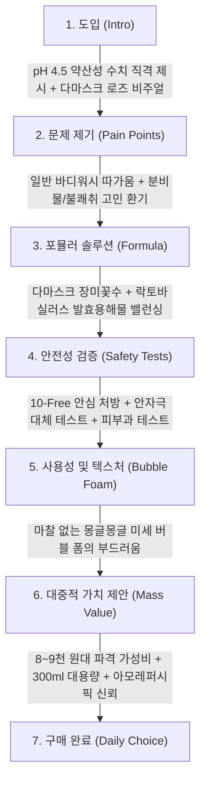

# 해피바스 pH4.5 약산성 여성청결제 로즈 상세페이지 분석 보고서
> **(여성청결제 본품 중심 · 원료 · 포뮬러 · 임상 기능 · 카피라이팅 분석)**

> **분석 대상 URL**: [올리브영 해피바스 상품 페이지](https://www.oliveyoung.co.kr/store/goods/getGoodsDetail.do?goodsNo=A000000154324)  
> **올리브영 상품 번호**: `A000000154324`  
> **분석 일자**: 2026-08-30  
> **데이터 파일**: [`intimate/data/oliveyoung_happybath_rose.json`](file:///c:/Users/이봄이/Downloads/icb10proj2/intimate/data/oliveyoung_happybath_rose.json)  
> **분석 기준**: 인플루언서 협업 및 부가 사은품 요소를 전면 배제하고, **오직 '여성청결제 본품(300ml/250g 폼 워시)'의 다마스크 장미수, pH 4.5 약산성 포뮬러, 10-Free 처방, 카피라이팅**에 집중하여 분석

---

## 1. 기본 정보

| 항목 | 상세 내용 |
| :--- | :--- |
| **제품명** | 해피바스 pH4.5 약산성 여성청결제 로즈 (HAPPY BATH pH4.5 Feminine Wash Rose) |
| **브랜드** | 해피바스 (HAPPY BATH / 제조·판매: 아모레퍼시픽) |
| **정상가 (소비자가)** | 12,000원 ~ 13,000원 |
| **할인가 (판매가)** | **8,900원 ~ 9,900원 (약 25~30% 할인)** |
| **본품 용량** | **300ml (또는 250g 폼 워시 본품)** |
| **제형 특성** | 펌핑 즉시 부드럽고 풍성하게 토출되는 **저자극 버블 폼(Bubble Foam)** 제형 |
| **향료 정보** | **다마스크 장미꽃수** 함유로 인위적이지 않고 은은하게 피어나는 **소프트 로즈 플로럴 향** |
| **핵심 포지셔닝** | Y존 이상적 산도에 맞춘 **"pH 4.5 약산성 데일리 대중 청결제"** |
| **본품 가격 경쟁력** | 1만 원 미만의 극가성비로 대한민국 1등 매스 바디케어 브랜드의 **접근성 최강 데일리 워시** |

---

## 2. 최상단 메인 키메시지 (여성청결제 본품 기준)

> ### **"Y존 최적 산도 pH 4.5에 맞춘 다마스크 로즈 약산성 저자극 버블 청결제"**
>
> *(서브 카피: **"10-Free 안심 처방과 안자극 대체 테스트 완료로 매일 순하고 향기롭게"**)*

### 🔍 메인 카피의 기능적 구조 분석
1. **수치화된 산도 명시('pH 4.5')**: 단순히 "약산성"이라고 표기하는 경쟁사와 달리 제품명과 헤드라인에 **'pH 4.5'라는 정확한 이상적 산도 수치**를 선명하게 각인시킴.
2. **대표 식물수('다마스크 로즈') 강조**: 생기 부여와 기분 좋은 잔향을 주는 다마스크 장미꽃수를 내세워 매일 쓰고 싶은 산뜻함 연출.
3. **더마 안전성(10-Free & 안자극 대체 테스트)**: 아모레퍼시픽의 엄격한 클린 처방을 헤드라인에 융합하여 가성비 제품임에도 안전성 확신 제공.

---

## 3. 도입부 후킹 포인트 (Y존 신체적 결핍 및 고민 자극)

해피바스는 대중적 매스 브랜드 특성에 맞춰 **일상에서 가장 흔히 겪는 냄새, 분비물, 바디워시 사용으로 인한 따가움**을 쉽고 직관적인 언어로 공략합니다.

| 후킹 단계 | 자극하는 고객의 결핍 및 불안 포인트 | 상세페이지 내 메시지 소구 방식 |
| :--- | :--- | :--- |
| **1. 일반 바디워시의 따가움 & 자극** | **"바디워시로 씻을 때 느껴지는 알싸한 자극과 따가움"** | 알칼리성 바디워시가 민감한 Y존 산도를 파괴한다는 점을 짚으며, **"pH 4.5 맞춤 약산성 청결제"**로의 전환을 유도. |
| **2. 생리 전후 분비물 & 불쾌취** | **"신경 쓰이는 불쾌한 냄새와 찝찝함"** | 향으로 억지로 가리는 것이 아닌, **마일드 세정 + 다마스크 로즈꽃수의 은은한 생기**로 산뜻하게 해결. |
| **3. 거품 내기 번거로움 & 마찰 자극** | **"손으로 거품 내는 마찰조차 자극스러운 예민한 날"** | 펌핑 즉시 몽글몽글 나오는 **"원터치 저자극 버블 폼"**의 부드러움 강조. |
| **4. 성분 안전성에 대한 대중적 불안** | **"매일 쓰는데 유해 성분이 들어있으면 어쩌지?"** | 10가지 유해 성분을 철저히 뺀 **10-Free 처방**과 안자극 대체 테스트로 불안 해소. |

---

## 4. 메시지 전개 순서 (논리적 스토리라인 흐름)

상세페이지는 **[pH 4.5 산도 선점] → [다마스크 로즈 & 유산균 성분] → [10-Free & 안자극 테스트] → [버블 폼 텍스처] → [1만 원 미만 대용량 제안]** 순서로 매우 직관적이고 빠르게 결제를 유도하는 구조입니다.



### 단계별 상세 전개 내용
1. **1단계: pH 4.5 산도 및 로즈 아이덴티티 선언**
   - 핑크빛 로즈 비주얼과 함께 "Y존 최적 산도 pH 4.5 약산성 버블 워시" 정의.
2. **2단계: 일상적 Y존 불편감 해결 제시**
   - 생리 전후, 운동 후, 분비물 냄새 고민을 자극 없이 말끔히 씻어내는 데일리 솔루션 제안.
3. **3단계: 장미꽃수 & 유산균 발효물 배합 공개**
   - 피부를 생기 있고 촉촉하게 가꿔주는 **다마스크 장미꽃수**와 균형을 지키는 **락토바실러스 발효용해물** 소개.
4. **4단계: 아모레퍼시픽 안전성 테스트 증명**
   - 안자극 대체 테스트 완료(점막 자극 최소화), 피부과 테스트 완료, 10-Free 무첨가 성적서 노출.
5. **5단계: 펌프형 버블 폼의 간편함 어필**
   - 조밀한 거품이 바로 나와 자극 없이 빠르게 세정되는 편의성 묘사.
6. **6단계: 1만 원 미만 대용량 구매 명분 확립**
   - 8,900원~9,900원의 압도적 가격과 300ml 대용량으로 장바구니 담기 부담 제로화.

---

## 5. 핵심 성분 및 기술 소구 방식

해피바스는 전문 더마 성분을 어렵게 설명하기보다, **"소비자에게 친숙한 다마스크 로즈 + 약산성 pH 4.5 + 10-Free"**라는 직관적인 키워드로 대중적 신뢰를 확보합니다.

```
┌────────────────────────────────────────────────────────────────────────┐
│               해피바스 pH4.5 로즈 여성청결제 3대 핵심 포뮬러 축          │
├───────────────────┬───────────────────┬────────────────────────────────┤
│ 1. 다마스크 장미꽃수  │ 2. pH 4.5 약산성 처방│ 3. 10-Free & 안자극 대체       │
│   · 은은한 생기 보습  │   · Y존 이상적 산도   │   · 파라벤/PEG 등 10무첨가     │
│   · 불쾌취 마일드 케어│   · 유산균 발효용해물 │   · 점막 자극 최소화 공인 시험 │
│   · 기분 좋은 플로럴  │   · 수분 밸런스 유지  │   · 피부과 테스트 완료         │
└───────────────────┴───────────────────┴────────────────────────────────┘
```

| 구분 | 핵심 원료 및 배합 기술 | 소구 포인트 및 공인 시험 데이터 |
| :--- | :--- | :--- |
| **식물성 플로럴 워터** | **다마스크 장미꽃수<br>(Rosa Damascena)** | - 정제수 비중을 낮추고 장미꽃수를 배합하여 씻은 후에도 건조하지 않은 촉촉한 생기 부여.<br>- 은은하고 자연스러운 로즈 향으로 Y존 불쾌취 완화. |
| **미생물 밸런스** | **락토바실러스 발효용해물** | - 유산균 발효 성분을 함유하여 세정 시 Y존의 유익한 미생물 밸런스를 지켜줌. |
| **이상적 산도 맞춤** | **pH 4.5 약산성 포뮬러** | - 알칼리화되기 쉬운 Y존 환경을 최적의 약산성(pH 4.5)으로 유지. |
| **점막 자극 최소화** | **안자극 대체 테스트 완료** | - 연약한 점막 부위 자극 여부를 검증하는 안자극 대체(HET-CAM) 시험 통과로 따가움 없는 세정 입증. |
| **피부과 안전성** | **피부과 테스트 완료** | - 피부과 전문의 지도하에 안전성 검증. |
| **클린 처방** | **10-Free 안심 배제** | - 동물성원료, 광물성오일, 합성색소, 파라벤, 실리콘오일, PEG 계면활성제 등 10가지 성분 무첨가. |

---

## 6. 이탈 방지 장치 (대중 브랜드 관점의 가치 제안)

| 이탈 방지 장치 | 상세 내용 | 소비자 심리적 효과 |
| :--- | :--- | :--- |
| **1. 8천~9천 원대 극가성비** | - 정상가 12,000원 → **할인가 8,900원~9,900원**.<br>- 올리브영 여성청결제 중 최저가 라인업. | "이 가격이면 고민 없이 일단 장바구니에 담는다"는 즉시 구매 유도. |
| **2. 국민 브랜드 '해피바스' 인지도** | - 아모레퍼시픽의 대한민국 대표 바디케어 브랜드로서의 높은 친숙도. | 낯선 인디 브랜드 대비 거부감 없는 쉬운 진입 장벽. |
| **3. 300ml 대용량 펌프 용기** | - 넉넉한 300ml 용량으로 매일 욕실에 두고 온 가족이 편하게 사용. | 용량 대비 가성비 만족감 극대화. |
| **4. 안자극 대체 테스트 완료 타이틀** | - 저가 제품임에도 점막 안전성 시험을 완료하여 "싸구려가 아닌 믿을 수 있는 대기업 제품" 확신. | 가격이 저렴해서 성분이 안 좋을까 하는 의구심 불식. |

---

## 7. 기획 인사이트: 대중 브랜드(해피바스)의 소구 전략과 우리 제품의 차별화

### 💡 해피바스의 강점과 한계 분석
- **강점**: 
  1. **압도적인 가격(8,900원)과 300ml 대용량**으로 대중적 시장 지배력 확보.
  2. **'pH 4.5'라는 직관적 네이밍**으로 약산성 카테고리 선점.
  3. 저가 매스 제품임에도 **안자극 대체 테스트 & 10-Free** 적용으로 기본기 충실.
- **한계점(빈틈)**:
  1. **정밀 임상 수치(칸디다균 99.9% 항균, 가려움 67.5% 완화 등)의 부재**: 심도 있는 Y존 질환/트러블 고민을 가진 고관여층을 설득하기에는 기능적 임상이 얕음.
  2. **매스 브랜드의 한계**: 고급스럽거나 전문적인 더마 인티메이트 이미지 부족.

---

### 🚀 우리 제품만의 차별화 혁신 전략

```
┌────────────────────────────────────────────────────────────────────────┐
│             해피바스 대비 우리 제품의 프리미엄 차별화 전략 비교          │
├───────────────────────────────────┬────────────────────────────────────┤
│         해피바스의 강점 및 한계   │        우리 제품의 차별화 혁신 방안 │
├───────────────────────────────────┼────────────────────────────────────┤
│ 1. 8~9천 원대 저가 데일리 워시    │ 고기능성 럭셔리 인티메이트 케어    │
│ 2. 단순 다마스크 장미꽃수 함유    │ '항균 임상 검증 천연 에센셜 블렌딩'│
│ 3. 단순 pH 4.5 & 마일드 세정      │ '칸디다균 99.9% + 소취 99% + 보습'│
│ 4. 대중적 마트/바디워시 이미지    │ 병원/약국/더마 전문 인티메이트 포지셔닝│
└───────────────────────────────────┴────────────────────────────────────┘
```

1. **'pH 4.5' 네이밍 벤치마킹 & 업그레이드**:
   - 해피바스처럼 **수치화된 산도(pH 4.5~5.0)를 전면에 내세우되, "세정 후에도 무너지지 않는 산도 유지력"**을 함께 소구하여 기술적 깊이를 더함.
2. **단순 로즈수를 넘어선 '표적 항균 아로마' 차별화**:
   - 해피바스가 단순 장미꽃수로 은은한 향을 냈다면, 우리는 **"다마스크 로즈 오일 + 센티드 제라늄 오일의 칸디다균 및 냄새 원인균 억제 시너지"**를 임상으로 증명하여 프리미엄화.
3. **가성비 시장과의 철저한 이원화 포지셔닝**:
   - 해피바스, 디어스킨 등 8천~1만 원대 매스 시장과 가격 경쟁을 피하고, **"칸디다균 99.9% 항균 + 안자극 대체 테스트 + 100% 환불보장제"**를 결합한 2만 원대 고기능성 프리미엄 시장을 장악.

---

## 8. 연계 데이터 파일 안내

| 구분 | 파일 경로 | 내용 요약 |
| :--- | :--- | :--- |
| **정형 데이터 JSON** | [`intimate/data/oliveyoung_happybath_rose.json`](file:///c:/Users/이봄이/Downloads/icb10proj2/intimate/data/oliveyoung_happybath_rose.json) | 해피바스 pH4.5 로즈 본품 가격, 용량, 성분, 안전성 테스트 데이터 |
| **분석 보고서 (본 문서)** | [`intimate/report/happybath_rose_analysis.md`](file:///c:/Users/이봄이/Downloads/icb10proj2/intimate/report/happybath_rose_analysis.md) | 여성청결제 본품 중심 정밀 분석 마크다운 보고서 |

---
*보고서 생성 완료: 2026-08-30 | 분석 도구: Web Scraping & Mass Brand Formulation Analysis*
