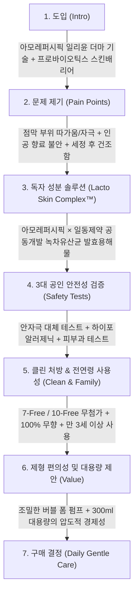

# 일리윤 프로바이오틱스 스킨배리어 약산성 여성청결제 상세페이지 분석 보고서
> **(여성청결제 본품 중심 · 원료 · 포뮬러 · 임상 기능 · 카피라이팅 분석)**

> **분석 대상 URL**: [올리브영 일리윤 상품 페이지](https://www.oliveyoung.co.kr/store/goods/getGoodsDetail.do?goodsNo=A000000198950)  
> **올리브영 상품 번호**: `A000000198950`  
> **분석 일자**: 2026-08-30  
> **데이터 파일**: [`intimate/data/oliveyoung_illiyoon.json`](file:///c:/Users/이봄이/Downloads/icb10proj2/intimate/data/oliveyoung_illiyoon.json)  
> **분석 기준**: 인플루언서 협업 및 부가 사은품 요소를 완전히 배제하고, **오직 '여성청결제 본품(300ml 폼 워시)'의 아모레퍼시픽 더마 기술, 녹차 유산균 독자 성분, 3대 안전성 테스트, 카피라이팅**에 집중하여 분석

---

## 1. 기본 정보

| 항목 | 상세 내용 |
| :--- | :--- |
| **제품명** | 일리윤 프로바이오틱스 스킨배리어 약산성 여성청결제 (ILLIYOON Probiotics Skin Barrier Gentle Cleanser) |
| **브랜드** | 일리윤 (ILLIYOON / 제조·판매: 아모레퍼시픽) |
| **정상가 (소비자가)** | 24,000원 |
| **할인가 (판매가)** | **14,900원 ~ 16,900원 (약 30~38% 할인)** |
| **본품 용량** | **300ml (업계 최대 수준 대용량 폼 워시)** |
| **제형 특성** | 펌핑 즉시 부드럽게 토출되는 **저자극 미세 버블 폼(Bubble Foam)** 제형 |
| **향료 유무** | **100% 무향 (Fragrance-Free)** — 인공 향료 및 알러젠 유발 성분 전면 배제 |
| **타깃 연령층** | 만 3세(37개월) 이상 유아동부터 성인까지 **온 가족 안심 데일리 케어** |
| **본품 용량 가치 제안** | 타사 일반 청결제(150ml) 대비 **2배 용량(300ml)**으로 100ml당 단가 경쟁력이 가장 뛰어난 **대용량 더마 워시** |

---

## 2. 최상단 메인 키메시지 (여성청결제 본품 기준)

> ### **"녹차 유산균 발효용해물로 지키는 Y존 피부 장벽, 일리윤 프로바이오틱스 약산성 여성청결제"**
>
> *(서브 카피: **"안자극 대체 테스트 완료로 점막까지 순하게, 300ml 대용량으로 매일 마일드하게"**)*

### 🔍 메인 카피의 기능적 구조 분석
1. **아모레퍼시픽 독자 유산균 소구**: 흔한 동물성/일반 유산균이 아닌 **'녹차 유래 유산균 발효용해물'**이라는 고유의 헤리티지 원료를 직격 제시.
2. **'스킨 배리어(피부 장벽)' 프레임워크**: 단순 세정을 넘어 민감한 Y존 부위의 **'피부 장벽과 자체 방어력 케어'**로 포지셔닝.
3. **더마 안전성(안자극 대체 테스트) 강조**: 외음부 점막에 닿아도 자극이 없을 만큼 순하다는 점을 공인 시험 명칭으로 즉각 증명.

---

## 3. 도입부 후킹 포인트 (Y존 신체적 결핍 및 고민 자극)

일리윤은 더마 코스메틱 전문 브랜드답게 **민감성 점막 부위의 화학적 자극, 세정 시 따가움, 건조로 인한 장벽 손상**을 핵심 페인포인트로 공략합니다.

| 후킹 단계 | 자극하는 고객의 결핍 및 불안 포인트 | 상세페이지 내 메시지 소구 방식 |
| :--- | :--- | :--- |
| **1. 점막 부위의 민감성 & 따가움** | **"세정할 때마다 느껴지는 미세한 따가움과 자극"** | 외음부는 일반 피부보다 얇고 점막에 가까워 자극에 극도로 취약하다는 점을 환기하며, **안자극 대체 테스트(HET-CAM) 통과**를 해결책으로 제시. |
| **2. 세정 후 장벽 손상 및 건조** | **"씻어내는 것만으로 Y존의 건강한 장벽까지 무너질까 걱정될 때"** | 과도한 탈지력으로 인한 피부 당김을 지적하고, **유산균 장벽 복합체(락토 스킨 콤플렉스™)**로 씻으면서 지키는 장벽 케어 강조. |
| **3. 인공 향료 및 성분 알레르기** | **"불쾌한 냄새를 덮는 인공 향료가 오히려 트러블을 유발하지 않을까?"** | 인공 향료를 일절 첨가하지 않은 **100% 무향 처방**으로 향에 민감한 극민감성 피부를 완벽히 안심시킴. |
| **4. 가족 공용 사용의 경제성 결핍** | **"150ml 소용량은 금방 쓰고, 아이와 함께 쓰기엔 성분이 불안하다"** | **300ml 압도적 대용량 + 만 3세 이상 유아 사용 가능 처방**으로 가성비와 안전성을 동시 해결. |

---

## 4. 메시지 전개 순서 (논리적 스토리라인 흐름)

상세페이지는 **[아모레퍼시픽 더마 신뢰] → [독자 녹차유산균 성분] → [3대 공인 안전성 테스트] → [버블 폼 마일드 세정] → [300ml 대용량 혜택]** 순서로 매우 논리적이고 차분하게 전개됩니다.



### 단계별 상세 전개 내용
1. **1단계: 브랜드 헤리티지 및 메인 슬로건 제시**
   - 아모레퍼시픽의 더마 보습 전문 브랜드 '일리윤'의 신뢰도와 함께 프로바이오틱스 스킨배리어 라인업 소개.
2. **2단계: 점막 부위 세정의 한계 및 자극 원인 진단**
   - 민감한 외음부 환경에 맞지 않는 세정제가 유발하는 자극과 장벽 손상 위험성 지적.
3. **3단계: 녹차 유래 유산균 '락토 스킨 콤플렉스™' 기술 공개**
   - 아모레퍼시픽 연구소와 유산균 전문 제약사(일동제약)가 공동 개발한 녹차유산균 발효용해물의 피부 장벽 강화 기전 설명.
4. **4단계: 3대 피부 안전성 테스트 결과 노출**
   - 안자극 대체 테스트(HET-CAM), 하이포알러제닉 테스트, 피부과 테스트의 3중 검증 성적서 제시.
5. **5단계: 클린 포뮬러 및 무향 처방 확약**
   - 파라벤, 동물성원료, 광물성오일, 합성색소, 향료, PEG 등 유해 우려 성분 배제(7-Free/10-Free).
6. **6단계: 사용 편의성 및 300ml 대용량 가치 전달**
   - 별도 거품 낼 필요 없는 원터치 버블 폼과 온 가족이 넉넉하게 쓸 수 있는 300ml 대용량 가심비 강조.

---

## 5. 핵심 성분 및 기술 소구 방식

일리윤은 제약사(일동제약)와의 R&D 협업 및 아모레퍼시픽의 독자 원료인 **'녹차유산균 발효용해물'**을 핵심 무기로 내세워 기술적 신뢰도를 극대화합니다.

```
┌────────────────────────────────────────────────────────────────────────┐
│             일리윤 프로바이오틱스 스킨배리어 3대 핵심 테크놀로지 축        │
├───────────────────┬───────────────────┬────────────────────────────────┤
│ 1. 락토 스킨 콤플렉스 │ 2. 3대 더마 안전성 테스트│ 3. 300ml 대용량 & 무향 클린 │
│   · 아모레 × 일동제약 │   · 안자극 대체 (HET-CAM) │   · 타사 대비 2배 용량        │
│   · 녹차 유래 유산균  │   · 하이포알러제닉 시험   │   · 인공 향료 0% 완전 무향    │
│   · 피부 장벽 방어력  │   · 피부과 테스트 완료    │   · 7-Free / 만 3세 이상      │
└───────────────────┴───────────────────┴────────────────────────────────┘
```

| 구분 | 핵심 원료 및 배합 기술 | 소구 포인트 및 공인 시험 데이터 |
| :--- | :--- | :--- |
| **독자 특허 복합체** | **락토 스킨 콤플렉스™<br>(Lacto Skin Complex™)** | - **아모레퍼시픽 × 일동제약 공동 개발**.<br>- 제주 유기농 녹차에서 유래한 유산균 발효용해물로 Y존 피부 본연의 방어력을 강화하고 장벽 손상 예방. |
| **점막 자극 안전성** | **안자극 대체 테스트<br>(HET-CAM) 완료** | - 눈가 및 점막 수준의 민감한 부위 자극 여부를 평가하는 공인 시험 통과.<br>- 세정 시 따가움이나 눈시림 없는 극저자극 사용감 보장. |
| **알레르기 안전성** | **하이포알러제닉<br>(Hypo-Allergenic) 테스트** | - 민감성 피부 대상 알레르기 유발 가능성을 최소화한 시험 완료. |
| **피부과 전문 검증** | **피부과 테스트 완료** | - 피부과 전문의 지도하에 인체 피부 일차 자극 및 안전성 확인. |
| **pH 산도 밸런스** | **약산성 pH 포뮬러** | - 건강한 외음부의 약산성 환경(pH 4.5~5.5)을 유지하여 유해균 번식 억제. |
| **클린 & 세이프 처방** | **7-Free / 10-Free<br>+ 100% 무향 처방** | - 동물성원료, 광물성오일, 합성색소, 향료, 트리에탄올아민, 실리콘오일, PEG 등 무첨가.<br>- 인공 향료 알레르기 원천 차단. |

---

## 6. 이탈 방지 장치 (본품 중심의 가치 제안)

| 이탈 방지 장치 | 상세 구현 내용 | 소비자 심리적 효과 |
| :--- | :--- | :--- |
| **1. 300ml 압도적 대용량 가성비** | - 타사 150~200ml 대비 **최대 2배 용량(300ml)**.<br>- 할인가 기준 14,000~16,000원대로 100ml당 5,000원 미만의 최고 가성비. | "매일 쓰는 데일리 세정제로서 용량 대비 가격이 가장 합리적"이라는 실용적 구매 유도. |
| **2. 아모레퍼시픽 대기업 품질 신뢰** | - 국내 최대 뷰티 기업 아모레퍼시픽의 엄격한 품질 관리 및 피부 연구 헤리티지. | 성분 안전성에 민감한 고관여 고객의 품질 불신 원천 해소. |
| **3. 유아동(만 3세 이상) 공용 안심** | - 37개월 이상 유아부터 온 가족이 함께 사용하는 패밀리 세정제. | 다자녀 가정 및 어린 자녀를 둔 3040 주부층의 필수 구매 아이템으로 안착. |
| **4. 안자극 대체 테스트 완료 타이틀** | - 일반 피부 자극 테스트를 넘어선 점막 부위 전용 시험 타이틀. | "점막에 닿아도 절대 따갑지 않다"는 강력한 안전 확신 제공. |

---

## 7. 기획 인사이트: 경쟁사 대비 일리윤의 차별화 포인트 및 우리 제품의 전략

### 📊 주요 경쟁사 vs 일리윤 핵심 비교

| 비교 항목 | 아로마티카 (로즈) | 좋은느낌 (바이옴) | 메디온 (포밍워시) | 이너생각 (휩드워시) | **일리윤 (프로바이오틱스)** |
| :--- | :--- | :--- | :--- | :--- | :--- |
| **본품 용량** | 200ml | 160ml | 150ml | 180ml | **300ml (압도적 1위)** |
| **제형** | 수분 젤 | 버블 폼 | 버블 폼 | 에어로졸 휩 | **마일드 버블 폼** |
| **유산균 기술** | 3종 발효 용해물 | 락토바실러스 | 락토리메디 | 유산균 듀오 | **녹차유래 락토 스킨 콤플렉스™** |
| **향료 전략** | 100% 천연 정유 | 미세 향 | 기본/쿨링 향 | 알러젠 프리 가데니아 | **100% 무향 (Fragrance-Free)** |
| **핵심 안전성 시험** | 피부 저자극 | 비건 / 11-Free | 화해 1위 배지 | 논문 인용 / 4대 인증 | **안자극 대체 테스트 (점막 안전)** |
| **가성비 (100ml당)** | 약 8,500원 | 약 5,500원 | 약 12,000원 | 약 15,000원 | **약 5,000원 (최저 단가)** |

---

### 💡 우리가 벤치마킹 및 차별화할 혁신 포인트

```
┌────────────────────────────────────────────────────────────────────────┐
│               일리윤 벤치마킹 및 우리 제품의 차별화 도약 방안            │
├───────────────────────────────────┬────────────────────────────────────┤
│           일리윤의 강점 및 한계   │        우리 제품의 차별화 혁신 방안 │
├───────────────────────────────────┼────────────────────────────────────┤
│ 1. 300ml 대용량의 높은 가성비    │ 300ml 대용량 펌프 + 친환경 리필 파우치│
│ 2. 녹차유산균 특허 콤플렉스       │ '질 유래 특허 유산균 배양액' 차별화│
│ 3. 안자극 대체 테스트(점막 안전)  │ 안자극 대체 + 칸디다 99.9% 항균 결합│
│ 4. 다소 무난하고 밋밋한 더마 느낌 │ 고기능성 럭셔리 더마 인티메이트 브랜딩│
└───────────────────────────────────┴────────────────────────────────────┘
```

1. **'안자극 대체 테스트(HET-CAM)'의 필수 벤치마킹**:
   - 일반 피부 자극 테스트(0.00)는 모든 경쟁사가 내세우고 있으나, **외음부 점막의 따가움을 해소해 주는 '안자극 대체 테스트'**는 일리윤만의 강력한 무기임.
   - ➜ 우리 제품 역시 **안자극 대체 테스트를 필수로 획득**하여 "점막에 닿아도 눈물 한 방울 자극 없는 초순수 세정"으로 카피라이팅 강화.
2. **'순함'에 '강력한 항균/소취 정량 수치' 결합**:
   - 일리윤의 한계는 순한 장벽 케어에 치중하여, 실제 질염 유발균(칸디다균) 항균 수치나 냄새 소취율(%)이 명시되지 않아 즉각적인 효능을 원하는 고객에게는 다소 밋밋함.
   - ➜ 우리는 **"일리윤급 초저자극 점막 안전성 + 칸디다균 99.9% 항균 & 악취 99% 소취"**를 결합하여 '순하면서도 확실한 효능'으로 포지셔닝.
3. **'질 유래 특허 유산균'으로 원료적 정통성 확보**:
   - 일리윤의 녹차유산균에 맞서, 우리는 **여성 질 건강과 직접적으로 연계된 '질 유래 특허 유산균(L. plantarum / L. rhamnosus 등)' 배양 추출물**을 사용하여 인티메이트 카테고리 본연의 전문성을 극대화.

---

## 8. 연계 데이터 파일 안내

| 구분 | 파일 경로 | 내용 요약 |
| :--- | :--- | :--- |
| **정형 데이터 JSON** | [`intimate/data/oliveyoung_illiyoon.json`](file:///c:/Users/이봄이/Downloads/icb10proj2/intimate/data/oliveyoung_illiyoon.json) | 일리윤 프로바이오틱스 본품 가격, 300ml 대용량, 성분, 3대 테스트 데이터 |
| **분석 보고서 (본 문서)** | [`intimate/report/illiyoon_analysis.md`](file:///c:/Users/이봄이/Downloads/icb10proj2/intimate/report/illiyoon_analysis.md) | 여성청결제 본품 중심 정밀 분석 마크다운 보고서 |

---
*보고서 생성 완료: 2026-08-30 | 분석 도구: Web Scraping & Formulation Insight Analysis*
