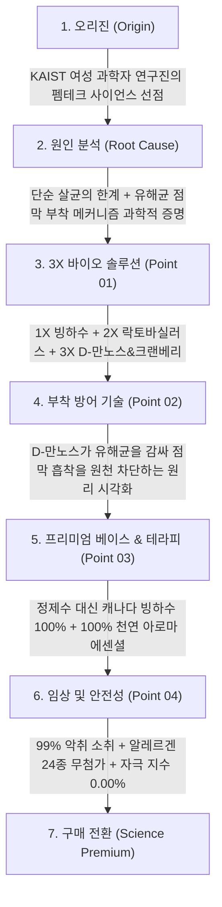

# 이너시아(INERTIA) 더 퓨어 3X 마이크로바이옴 여성청결제 상세페이지 분석 보고서
> **(여성청결제 본품 중심 · KAIST 여성 과학자 R&D · D-만노스 유해균 부착 방어 · 펨테크 사이언스 카피라이팅 분석)**

> **분석 대상 URL**: [올리브영 이너시아 상품 페이지](https://www.oliveyoung.co.kr/store/goods/getGoodsDetail.do?goodsNo=A000000191655)  
> **올리브영 상품 번호**: `A000000191655`  
> **분석 일자**: 2026-08-30  
> **데이터 파일**: [`intimate/data/oliveyoung_inertia.json`](file:///c:/Users/이봄이/Downloads/icb10proj2/intimate/data/oliveyoung_inertia.json)  
> **이미지 디렉토리**: [`intimate/images/inertia/`](file:///c:/Users/이봄이/Downloads/icb10proj2/intimate/images/inertia/)  
> **분석 기준**: 인플루언서 협업 요소를 전면 배제하고, **오직 '여성청결제 본품(150ml 폼 워시)'의 KAIST 연구진 바이오 테크놀로지, 3X 마이크로바이옴(빙하수+유산균+D-만노스), 99% 탈취 임상, 프리미엄 사이언스 카피라이팅**에 집중하여 분석

---

## 1. 기본 정보

| 항목 | 상세 내용 |
| :--- | :--- |
| **제품명** | 이너시아 더 퓨어 3X 마이크로바이옴 여성청결제 (INERTIA The Pure 3X Microbiome Feminine Wash) |
| **브랜드** | 이너시아 (INERTIA / (주)이너시아) |
| **개발 배경** | **KAIST(카이스트) 출신 여성 과학자·공학자 연구진**이 여성의 생체 구조를 분석하여 직접 R&D |
| **정상가 (소비자가)** | 25,900원 |
| **할인가 (판매가)** | **22,900원 (약 12~15% 할인, 고가 프리미엄 펨테크 포지셔닝)** |
| **본품 용량** | **150ml (초미세 포밍 버블 본품)** |
| **제형 특성** | 쫀쫀하고 조밀한 탄력을 지닌 **마이크로 포밍 거품(Micro Foaming Bubble)** 제형 |
| **베이스 워터** | 정제수 대신 미네랄이 풍부한 **캐나다 청정 빙하수(Glacier Water)** 100% 적용 |
| **향료 특성** | 인공 합성 향료 0% → **100% 천연 아로마 에센셜 오일(라벤더 & 시트러스)** 테라피 블렌딩 |

---

## 2. 최상단 메인 키메시지 (여성청결제 본품 기준)

> ### **"KAIST 여성 과학자가 설계한 3X 마이크로바이옴 솔루션, 유해균 부착부터 차단하는 이너시아 더 퓨어 여성청결제"**
>
> *(서브 카피: **"캐나다 빙하수 베이스와 D-만노스 복합 처방으로 매일 완성하는 가장 정밀한 Y존 밸런스"**)*

### 🔍 메인 카피의 기능적 구조 분석
1. **압도적인 R&D 오리진 선점('KAIST 여성 과학자 설계')**: 감성적 마케팅에 의존하는 기존 브랜드와 차별화하여, '여성 공학 박사들의 정밀 바이오 기술'이라는 독보적 권위 부여.
2. **'유해균 부착 방어(Anti-Adhesion)'라는 새로운 패러다임**: 단순히 균을 죽이는 세정(Antibacterial)을 넘어, 유해균이 점막에 달라붙지 못하게 차단하는(Anti-Adhesion) 한 단계 높은 의학적 메커니즘 제시.
3. **'3X 마이크로바이옴'의 명확한 구조화**: 빙하수(진정) + 유산균(생태계) + D-만노스(방어)의 3단계 시너지를 직관적으로 각인.

---

## 3. 도입부 후킹 포인트 (반복되는 Y존 질환, 만성 분비물, 기존 세정제에 대한 불신 자극)

이너시아는 **"씻어도 왜 가려움과 냄새는 반복되는가?"라는 본질적 질문을 던지며 단순 살균 클렌저의 한계와 미생물 생태계 파괴**를 지적합니다.

| 후킹 단계 | 자극하는 고객의 결핍 및 불안 포인트 | 상세페이지 내 메시지 소구 방식 |
| :--- | :--- | :--- |
| **1. 씻어도 반복되는 재발의 굴레** | **"열심히 씻는데도 왜 분비물과 가려움은 계속될까?"** | 기존 강한 항균 세정제가 유익균까지 죽여 질 내 환경을 더 취약하게 만든다는 근본 원인 분석. |
| **2. 유해균의 점막 고착화 문제** | **"씻어내도 점막에 끈질기게 달라붙어 있는 유해균들"** | 세균이 점막에 달라붙는 생물학적 기전을 설명하며 **D-만노스의 부착 차단 기술**을 유일한 해법으로 제시. |
| **3. 정제수 가득한 물 세정제에 대한 회의** | **"성분의 80~90%가 단순 정제수(물)인 제품을 비싸게 사야 할까?"** | 물부터 다른 **캐나다 청정 빙하수 베이스**로 프리미엄의 자격을 증명. |

---

## 4. 메시지 전개 순서 (논리적 스토리라인 흐름)

상세페이지는 **[KAIST 펨테크 오리진] → [만성 재발의 과학적 원인 규명] → [3X 마이크로바이옴 메커니즘] → [D-만노스 유해균 부착 차단] → [캐나다 빙하수 & 천연 아로마] → [99% 탈취 및 24종 무첨가]** 순서로 전개됩니다.



### 단계별 상세 전개 내용
1. **1단계: KAIST 여성 과학자들의 R&D 철학 제시**
   - "여성의 몸을 가장 잘 아는 여성 과학자가 만들었습니다"라는 슬로건과 랩(Lab) 연구 비주얼.
2. **2단계: 유해균이 점막에 달라붙는 생물학적 기전 폭로**
   - 세균성 질염과 방광염을 유발하는 세균들이 점막 수용체에 흡착하는 원리를 일러스트로 설명.
3. **3단계: 3X 마이크로바이옴 포뮬러 공개**
   - **1X 청정 캐나다 빙하수** (풍부한 미네랄 & 활성 수소).
   - **2X 프리&프로바이오틱스** (락토바실러스 발효 용해물).
   - **3X D-만노스 & 크랜베리 복합체** (유해균 표면 차단).
4. **4단계: D-만노스 흡착 차단 메커니즘 시각화**
   - D-만노스가 유해균의 섬모(Fimbriae)에 먼저 결합하여 점막에 붙지 못하고 물과 함께 씻겨 나가게 만드는 과학적 원리 설명.
5. **5단계: 정제수 0% 빙하수와 천연 아로마 테라피**
   - 인공 향료 대신 라벤더와 시트러스 100% 에센셜 오일로 스파급 릴랙싱 선사.
6. **6단계: 99% 탈취 및 알레르겐 24종 불검출 성적서**
   - 피부 자극 지수 0.00% 무자극 성적서 및 24대 알레르기 유발 성분 배제 성적서 노출.

---

## 5. 핵심 성분 및 기술 소구 방식

이너시아는 **"KAIST 바이오 테크 + D-만노스 유해균 부착 방어 + 캐나다 빙하수"**라는 고난도 바이오 메커니즘으로 기존 로드샵 제품들과 차원이 다른 프리미엄 라인을 형성합니다.

```
┌────────────────────────────────────────────────────────────────────────┐
│               이너시아 더 퓨어 여성청결제 3대 핵심 테크놀로지 축          │
├───────────────────┬───────────────────┬────────────────────────────────┤
│ 1. D-만노스 부착 방어│ 2. 캐나다 빙하수 베이스│ 3. 락토 신바이오틱스 밸런스    │
│   · 유해균 점막 흡착 차단│   · 정제수 0% 미네랄  │   · 프리 + 프로바이오틱스      │
│   · 크랜베리 시너지   │   · 풍부한 활성 수소  │   · 외음부 약산성 pH 4.5       │
│   · 99% 탈취력 검증   │   · 깊은 수분 진정 래핑│   · 알레르겐 24종 무첨가       │
└───────────────────┴───────────────────┴────────────────────────────────┘
```

| 구분 | 핵심 원료 및 배합 기술 | 소구 포인트 및 공인 시험 데이터 |
| :--- | :--- | :--- |
| **혁신 부착 차단 기술** | **D-만노스(D-Mannose)<br>& 크랜베리 추출물** | - **바이오 테크 안티-어드히전(Anti-Adhesion) 기술**.<br>- 대장균 등 유해균이 점막 섬모에 달라붙는 것을 원천적으로 낚아채어 물로 씻겨 나가게 유도. |
| **프리미엄 베이스** | **캐나다 청정 빙하수<br>(Glacier Water)** | - 단순 정제수 대신 미네랄과 활성 수소가 가득한 빙하수를 베이스로 사용하여 극강의 진정보습 선사. |
| **마이크로바이옴** | **락토바실러스 신바이오틱스** | - 유익균의 먹이(프리)와 유익균(프로)을 동시에 공급하여 질 내 산도(pH 4.5) 방어막 유지. |
| **공인 탈취 효과** | **99% 악취 소취력 입증** | - 분비물 냄새와 생리혈 악취를 99% 완벽 소취하는 임상 성적서 보유. |
| **100% 천연 아로마** | **라벤더 & 시트러스 에센셜** | - 인공 향료 0%로 알레르기 위험 없이 호텔 스파 수준의 은은하고 고급스러운 릴랙싱 잔향 제공. |
| **무결점 안전성** | **알레르겐 24종 불검출<br>+ 피부 자극 0.00%** | - 식약처 지정 24종 알레르기 유발 성분 불검출 및 인체 첩포 시험 완전 무자극 판정. |

---

## 6. 이탈 방지 장치 (프리미엄 펨테크 관점의 가치 제안)

| 이탈 방지 장치 | 상세 내용 | 소비자 심리적 효과 |
| :--- | :--- | :--- |
| **1. 'KAIST 여성 과학자 개발' 타이틀** | - 한국 최고 공과대학 카이스트 여성 연구진이 직접 설계했다는 공학적 신뢰도. | 2만 원대 높은 가격에도 "전문가가 제대로 만든 제품"이라는 확신 부여. |
| **2. '정제수 대신 캐나다 빙하수' 가치 입증** | - 전성분의 대부분을 차지하는 물의 퀄리티를 최상급으로 끌어올림. | 1만 원대 저가 정제수 제품과의 급 차이를 명확히 체감. |
| **3. 천연 유기농 생리대 '라보셀' 성공 신화** | - 이너시아 대표 생리대로 축적된 수십만 고객의 펨테크 브랜드 충성도. | 세정제 역시 믿고 구매하는 크로스셀링(Cross-selling) 유도. |
| **4. 알레르겐 24종 무첨가 성적서 공개** | - 민감 부위 알레르기 유발 성분을 전면 배제한 공인 성적서 노출. | 성분에 극도로 민감한 하이엔드 고객층 완벽 락인. |

---

## 7. 기획 인사이트: 경쟁사 대비 이너시아의 차별화 포인트 및 벤치마킹 요소

### 📊 올리브영 주요 경쟁사 vs 이너시아 비교

| 비교 항목 | 해피바스 / 쏘피 | 메디온 / 바솔 | 질경이 | **이너시아 (더퓨어 3X)** |
| :--- | :--- | :--- | :--- | :--- |
| **브랜드 오리진** | 대기업 매스 브랜드 | D2C 웰니스 스타트업 | 1세대 전통 기업 | **KAIST 여성 과학자 펨테크** |
| **베이스 워터** | 정제수 | 정제수 | 정제수 | **캐나다 청정 빙하수 100%** |
| **항균 메커니즘** | 단순 화학적 살균 | 유산균 발효 진정 | 조성물 특허 | **D-만노스 유해균 점막 부착 차단** |
| **향기 철학** | 인공향 / 무향 | 티트리 / 무향 | 자연 유래 향 | **100% 천연 에센셜 오일 테라피** |
| **가격 포지셔닝** | 8,900 ~ 12,000원 | 15,000 ~ 18,000원 | 16,900 ~ 19,800원 | **22,900원 (최고가 프리미엄)** |

---

### 💡 우리가 벤치마킹 및 차별화할 혁신 포인트

```
┌────────────────────────────────────────────────────────────────────────┐
│               이너시아 벤치마킹 및 우리 제품의 프리미엄 도약 방안          │
├───────────────────────────────────┬────────────────────────────────────┤
│           이너시아의 강점 및 한계 │        우리 제품의 차별화 혁신 방안 │
├───────────────────────────────────┼────────────────────────────────────┤
│ 1. D-만노스 유해균 부착 차단 기술 │ 'D-만노스 + 락토 엑소좀' 듀얼 메커니즘│
│ 2. 정제수 0% 캐나다 빙하수 베이스 │ '탄산 온천수 or 병풀 바이옴 추출수' │
│ 3. KAIST 과학자 R&D 사이언스 소구 │ 바이오 랩 앤 스파(Lab & Spa) 브랜딩│
│ 4. 2만 원대 고가 프리미엄 단품    │ 단품 프리미엄 + 대용량 리필 가성비  │
└───────────────────────────────────┴────────────────────────────────────┘
```

1. **'D-만노스(D-Mannose) 유해균 부착 방어' 메커니즘 필수 탑재**:
   - 기존의 식상한 "유해균 99% 살균"을 넘어 **"유해균이 외음부 점막에 흡착되지 못하도록 원천 분리 배출하는 D-만노스 바이오 메커니즘"**은 최고 수준의 기술적 USP가 됨.
   - ➜ 우리 제품 상세페이지에 **"D-만노스의 균 부착 차단 일러스트"**를 핵심 기술로 차용.
2. **'정제수 0% 기능성 베이스 워터'로 가격 저항선 돌파**:
   - 이너시아가 '빙하수'로 2만 원대 가격을 정당화했듯, 우리 역시 **"정제수 0% (프랑스 온천수 or 고농축 쑥/병풀 바이옴 추출수)"**를 사용하여 2만 원대 프리미엄의 당위성 확보.
3. **'100% 천연 아로마 테라피'로 감각적 만족도 극대화**:
   - 무향 제품의 건조한 느낌을 탈피하고, 인공 향료의 자극을 없앤 **"전문 조향사의 100% 천연 라벤더/베르가못 릴랙싱 테라피"**를 접목하여 스파 케어 경험 제공.

---

## 8. 연계 데이터 파일 안내

| 구분 | 파일 경로 | 내용 요약 |
| :--- | :--- | :--- |
| **정형 데이터 JSON** | [`intimate/data/oliveyoung_inertia.json`](file:///c:/Users/이봄이/Downloads/icb10proj2/intimate/data/oliveyoung_inertia.json) | 이너시아 더 퓨어 3X 여성청결제 가격, 용량, D-만노스/빙하수 성분, 탈취/안전성 데이터 |
| **분석 보고서 (본 문서)** | [`intimate/report/inertia_analysis.md`](file:///c:/Users/이봄이/Downloads/icb10proj2/intimate/report/inertia_analysis.md) | KAIST 펨테크 R&D 및 D-만노스 바이오 포뮬러 중심 정밀 분석 마크다운 보고서 |

---
*보고서 생성 완료: 2026-08-30 | 분석 도구: Web Scraping & Inertia Formulation Analysis*
