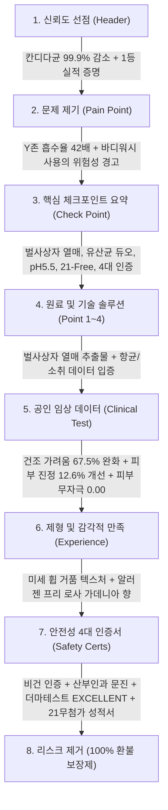

# 이너생각 밸런싱 휩드워시 상세페이지 분석 보고서
> **(제품 본질 · 기능 · 포뮬러 · 임상 중심 분석)**

> **분석 대상 URL**: [이너생각 공식몰 밸런싱 휩드워시 상품 페이지](https://saengak.co.kr/product/%EC%9D%B4%EB%84%88%EC%83%9D%EA%B0%81-%EB%B0%B8%EB%9F%B0%EC%8B%B1-%ED%9C%A9%EB%93%9C%EC%9B%8C%EC%8B%9C-180ml/102/category/1/display/2/?icid=MAIN.product_listmain_1)  
> **분석 일자**: 2026-08-30  
> **데이터 파일**: [`intimate/data/saengak.json`](file:///c:/Users/이봄이/Downloads/icb10proj2/intimate/data/saengak.json)  
> **이미지 파일 디렉토리**: [`intimate/images/saengak/`](file:///c:/Users/이봄이/Downloads/icb10proj2/intimate/images/saengak/)  
> **분석 기준**: 인플루언서 마케팅/협업 요소를 전면 배제하고, **제품의 기능적 소구, 성분 배합 기술, 공인 임상 수치, 품질 보증 시스템** 관점으로 분석

---

## 1. 기본 정보

| 항목 | 상세 내용 |
| :--- | :--- |
| **제품명** | 이너생각 밸런싱 휩드워시 (Inner Saengak Balancing Whipped Wash) |
| **브랜드** | 이너생각 (INNER SAENGAK) |
| **정상가 (소비자가)** | 36,000원 |
| **할인가 (판매가)** | **27,000원 (25% 할인)** / 타임세일 쿠폰 적용 시 **최저 18,000원 (최대 50% 수준)** |
| **용량** | 180ml |
| **제형 특성** | 에어로졸 캔 기반의 고밀도 생크림 휩(Whipped) 미세 거품 제형 |
| **향료 정보** | 알러젠 프리(Allergen-Free) 로사 가데니아 향 (오렌지·베르가못 → 가데니아·재스민 → 머스크·샌달우드) |
| **기획 세트 구성 혜택** | - **단품 (1개)**: 27,000원 (기본 할인)<br>- **[2+1 기획 세트] (3개)**: 정상가 108,000원 → **59,000원** (쿠폰 적용 시 54,000원, 개당 18,000원 꼴) |
| **공식몰 구매 사은 혜택** | - **5만 원 이상 구매 시**: 페미닌 클렌징 티슈 (15매 본품) 증정<br>- **8만 원 이상 구매 시**: 플리츠 파우치 증정 |
| **배송 정책** | 기본 배송비 3,000원 (40,000원 이상 구매 시 무료 배송) |

---

## 2. 최상단 메인 키메시지 (제품 기능/가치 관점)

> ### **"단 1회 사용만으로 칸디다균 99.9% 감소, Y존 고민 ZERO 솔루션 1등 국민 여성청결제"**
>
> *(서브 헤드카피: **"#휘핑 크림처럼 #쫀쫀하고 부드러운 Y존 케어 정착템"**)*

### 🔍 메인 카피의 기능적 구조 분석
1. **즉각적 효능 수치 선제시**: '단 1회 사용' + '99.9% 감소'라는 최고 수준의 정량 데이터를 헤드라인 맨 앞에 배치하여 신뢰도를 즉시 확보함.
2. **타깃 병원체 직격 명시**: 여성들이 가장 민감하게 반응하는 '칸디다균'을 직접적으로 명시하여 질염/분비물 고민에 대한 직관적 해결책으로 포지셔닝.
3. **독자적 제형(휩드워시)의 감각적 연상**: 일반 액상/버블 폼과 차별화되는 '휘핑크림처럼 쫀쫀하고 부드러운' 텍스처를 키워드로 각인.

---

## 3. 도입부 후킹 포인트 (신체적 결핍 및 불안 자극)

이너생각은 인플루언서 픽 대신 **Y존 피부의 생리학적 취약성과 일상 속 신체적 불편감**을 논리적으로 파고들어 후킹을 유도합니다.

| 후킹 단계 | 자극하는 고객의 결핍 및 불안 포인트 | 상세페이지 내 메시지 소구 방식 |
| :--- | :--- | :--- |
| **1. 피부 흡수율 불안** | **"일반 피부보다 흡수율이 42배 높은 Y존"** | 일반 바디 피부와 달리 외음부는 경피 흡수율이 42배 높으므로, 유해 성분이 조금만 있어도 치명적이라는 불안감을 조성하여 **"전용 청결제 사용의 절대적 당위성"**을 부여. |
| **2. 알칼리화 위험 경고** | **"일반 바디워시는 Y존 pH 밸런스를 파괴한다"** | 알칼리성 비누나 일반 바디워시 사용 시 Y존의 산도 균형이 무너져 유익균이 사멸하고 균 감염에 취약해진다는 원인 규명. |
| **3. 일상 속 신체 불편 공감** | **"하루 종일 앉아서 일하다 보니 Y존이 답답하고 불편해요"** | 직장인, 학생 등 현대 여성들이 겪는 통풍 부족, 습기, 찝찝함, 건조에 의한 가려움 등의 실제 일상 고민을 메신저 UI 형태로 시각화하여 강력한 공감대 형성. |
| **4. 냄새 및 분비물 불안** | **"생리 전후 불쾌한 냄새와 분비물 찝찝함"** | 특히 트리메틸아민(생선 비린내 유사 악취)과 분비물로 인한 위생 불안을 직접 건드려 해결 욕구를 자극. |

---

## 4. 메시지 전개 순서 (논리적 스토리라인 흐름)

상세페이지는 **[정량적 성과 증명] → [문제 제기] → [원인 규명] → [독자적 성분/기술 솔루션] → [다각도 임상 검증] → [제형 및 향기 경험] → [무위험 구매 보증]**으로 이어지는 정석적인 고관여 헬스케어 전환 구조를 따릅니다.



### 단계별 상세 전개 내용
1. **1단계: 사회적 실적 및 핵심 효능 증명 (0001.jpg)**  
   - 2026 누적 판매량 20만 개 돌파, 칸디다균 99.9% 감소, 산부인과 문진 테스트 완료, 주요 유통 채널(신세계백화점, 강남 약국, 청담 세인트파크 산후조리원) 입점 신뢰도 선점.
2. **2단계: 신체적 문제 제기 및 전용 청결제 필요성 환기 (E1848E...png)**  
   - Y존 흡수율이 일반 피부의 42배라는 과학적 팩트 제시 → 일반 바디워시 사용 중단 촉구.
3. **3단계: 고객 고민 공감 및 실제 사용자 정성 후기 (#044444.jpg)**  
   - 민감한 날 자극 없음, 냄새 고민 완화, 하루 1회 개운함 등 실제 텍스트 리뷰 배열.
4. **4단계: 제품 특장점 총괄 체크포인트 (0007.jpg)**  
   - 유산균 듀오 보습, 99.9% 항균, pH5.5 미산성, 21가지 유해성분 무첨가, 비건, 독일 더마테스트.
5. **5단계: 핵심 유효 성분 및 메커니즘 심층 규명 (0009.jpg ~ 0010.png)**  
   - **Point 1**: 벌사상자 열매 추출물(Cnidii Monnieri Fructus)의 항알레르기·가려움 완화 논문 근거 제시.
   - **Point 2 & 3**: 1회 사용으로 칸디다균 99.9%, 대장균 99.9% 감소 임상 그래프 제시.
   - **Point 4**: 트리메틸아민(냄새 유발 물질) 89.3% 소취 효과 입증.
6. **6단계: 피부 가려움 및 진정 인체적용시험 결과 (0011.jpg)**  
   - 건조로 인한 가려움증 67.5% 완화 (VAS 측정), 피부 진정 12.6% 개선 수치 증명.
7. **7단계: 제형적 차별성과 안전 4대 인증 원본 공개 (0012.png ~ 0014.jpg)**  
   - 마찰 자극 없는 고밀도 휩드 크림 제형, 한국 비건 인증, 산부인과 문진 보고서, 피부 자극 지수 0.00, 독일 Dermatest Excellent 인증서 원본 배열.
8. **8단계: 안전한 조향 기술 소구 (0015.jpg)**  
   - 인공 합성 향료가 아닌 '알러젠 프리 로사 가데니아(Rosa Gardenia)' 시그니처 향의 탑/미들/베이스 노트 설명.
9. **9단계: 구매 저항 전면 해소 (100% 환불 보장제) (1002520ED9998EBB688.jpg)**  
   - 제품 1/3 이하 사용 시 14일 이내 100% 전액 환불 정책 제시로 결제 장벽 제로화.

---

## 5. 핵심 성분 및 기술 소구 방식

이너생각은 단순한 "자연 유래" 마케팅을 넘어 **학술 논문 인용, 타깃 균주 항균 시험, 가려움증 VAS 척도 개선 데이터**를 결합하여 전문 제약/더마 화장품 수준으로 기술을 소구합니다.

```
┌────────────────────────────────────────────────────────────────────────┐
│               이너생각 밸런싱 휩드워시 핵심 테크놀로지 4대 축            │
├───────────────────┬───────────────────┬────────────────────────────────┤
│ 1. 유효 성분 메커니즘 │ 2. 표적 항균 & 소취│ 3. 저자극 휩 포뮬러 & 약산성   │
│   · 벌사상자 열매   │   · 칸디다균 99.9% │   · 고밀도 생크림 마찰 저감    │
│   · 유산균 핵심 듀오│   · 대장균 99.9%   │   · pH 5.0~5.5 산도 유지       │
│   · 학술 논문 증명  │   · 소취율 89.3%   │   · 자극 지수 0.00 무자극      │
└───────────────────┴───────────────────┴────────────────────────────────┘
```

| 구분 | 유효 성분 및 배합 기술 | 강조 방식 및 공인 임상 데이터 증명 방식 |
| :--- | :--- | :--- |
| **핵심 진정 성분** | **벌사상자 열매 추출물<br>(Cnidium Monnieri)** | - **학술 논문 3편 직접 인용**: Osthol 성분의 항알레르기 억제 효과, 아토피성 만성 가려움증 치료 유효성 논문 캡처본을 상세페이지에 직접 삽입.<br>- 한방 및 식물 유래 진정 성분으로 외음부 자극 진정 소구. |
| **유익균 밸런스** | **유산균 핵심 듀오<br>(락토바실러스 발효물)** | - Y존의 건강한 마이크로바이옴 환경을 조성하는 유산균 발효 성분 배합.<br>- 세정 시 유익균을 보호하고 보습 장벽을 강화하는 더블 케어. |
| **표적 병원균 항균력** | **칸디다균 · 대장균 99.9% 감소** | - **(주)휴먼 피부임상시험센터** 공인 시험 결과 (2024.03 / 2025.03).<br>- 단 1회 세정 후 유해균이 바닥으로 떨어지는 직관적 '하향 꺾은선 그래프' 시각화. |
| **소취 메커니즘** | **트리메틸아민 89.3% 소취** | - **한국표준시험연구원** 공인 탈취 시험 (2024.06.20).<br>- 여성들이 민감해하는 생선 비린내/분비물 악취 원인 물질(트리메틸아민)의 실질적 탈취율 수치화. |
| **가려움 완화 효능** | **건조 가려움증 67.5% 완화** | - **(주)한국인터텍테스팅서비스** 인체적용시험 (만 19~59세 여성 21명 대상).<br>- 4주 사용 후 가려움증 척도(VAS)가 7.97cm → 2.59cm로 대폭 감소함을 막대그래프로 증명. |
| **pH 및 안전성 처방** | **pH 5.0 ~ 5.5 미산성<br>+ 21-Free 처방** | - **KOTITI 시험연구원** 21가지 유해 성분(파라벤 7종, 벤조페논, 페녹시에탄올 등) 불검출 성적서 원본 공개.<br>- Y존 본연의 산도 스펙트럼과 완벽히 일치하는 약산성 유지. |
| **글로벌 저자극 인증** | **독일 Dermatest EXCELLENT<br>+ 피부 자극 0.00** | - 독일 피부과학연구소 민감 피부 대상 최고 등급 획득.<br>- **마리디엠 피부과학연구소** 0.00 비자극 인증 마크. |

---

## 6. 이탈 방지 장치 (순수 가치 제안 및 구매 안전장치)

인플루언서 프로모션에 의존하지 않고, **가격 구조, 용량 대비 단가, 파격적인 품질 보증 정책**을 통해 소비자의 최종 이탈을 차단합니다.

| 이탈 방지 장치 | 구현 방식 및 상세 내용 | 기대 효과 |
| :--- | :--- | :--- |
| **1. 100% 전액 환불 보장제** | - **조건**: 제품 수령 후 14일 이내, 용량의 1/3 이하 사용 시 무조건 환불 처리.<br>- 전용 환불 프로세스 5단계(접수→확인→방문→수거→완료)를 투명하게 고지. | "내 몸에 안 맞으면 어쩌지?"라는 신규 고객의 구매 심리 저항을 완벽히 제거 (Zero Risk). |
| **2. 다구성(2+1) 파격 단가 제안** | - 단품 27,000원 대비, **[2+1 세트] 구매 시 3병 54,000원(병당 18,000원, 50% 할인)**으로 대폭 인하.<br>- "데일리 필수품이므로 다량 구매가 압도적으로 이득"이라는 가격 앵커링 설계. | 객단가 상승(AOV) 및 장기 정착 고객(Lock-in) 유도. |
| **3. 공식몰 단독 금액대별 사은품** | - **5만 원 이상**: 페미닌 티슈 15매 본품 증정 (Y존 케어 라인업 확장 체험)<br>- **8만 원 이상**: 고급 플리츠 파우치 증정 | 장바구니 추가 담기(Up-selling) 유도 및 자사몰 구매 명분 강화. |
| **4. 공신력 높은 전문 기관 입점 증명** | - 올리브영 1위, 신세계백화점, 강남 대형 약국, 신라면세점, **청담 세인트파크 프리미엄 산후조리원** 입점 레퍼런스 노출. | 산후조리원/약국 입점 타이틀로 "가장 민감하고 전문적인 곳에서 쓰는 제품"이라는 품질 확신 제공. |

---

## 7. 기획 인사이트: 우리가 벤치마킹 및 차별화할 핵심 포인트

### 💡 벤치마킹할 강력한 강점 (Benchmarking Points)
1. **학술 논문 기반의 진정 성분(벌사상자) 소구**:
   - 경쟁사들이 흔히 쓰는 쑥, 티트리, 어성초 대신 **'벌사상자 열매(Osthol)'라는 차별화된 한방/식물성 원료를 학술 논문 캡처와 함께 배치**하여 고기능성 이미지를 극대화함.
2. **소취 성분 수치화 (트리메틸아민 89.3%)**:
   - 단순히 "냄새 완화"라고 뭉뚱그리지 않고, 실제 질 분비물 악취의 주원인인 **'트리메틸아민' 소취율을 공인 시험 성적서와 함께 제시**하여 신뢰도를 크게 높임.
3. **'100% 환불 보장제'를 통한 구매 진입 장벽 파괴**:
   - 상세페이지 최하단에 환불 보장제를 명확한 가이드라인과 함께 배치함으로써, 고관여 상품임에도 즉각적인 결제를 유도함.

---

### 🚀 우리 제품만의 차별화 기획 전략 (Differentiation Strategy)

```
┌────────────────────────────────────────────────────────────────────────┐
│               경쟁사(이너생각) 한계 극복 및 차별화 포지셔닝              │
├───────────────────────────────────┬────────────────────────────────────┤
│       이너생각의 한계 및 빈틈     │        우리 제품의 차별화 혁신 방안 │
├───────────────────────────────────┼────────────────────────────────────┤
│ 1. 캔(에어로졸) 타입의 분리배출 부담│ 친환경 펌프형 원터치 미세 휩 용기  │
│ 2. 단순 '세정/항균' 효능 중심 소구 │ '세정 후 보습 장벽 유지력' 정량화 │
│ 3. 알러젠 프리이나 인공 조향 존재  │ 100% 천연 에센셜 오일 / 무향 처방  │
│ 4. 정량 수치 나열 위주의 건조함    │ 실제 감각적 사용감(잔여감 제로) 묘사│
└───────────────────────────────────┴────────────────────────────────────┘
```

1. **용기 사용 편의성 및 친환경성 개선**:
   - 에어로졸 가스 캔 방식은 쫀쫀한 휩 거품 형성에 유리하나, **욕실 내 녹슴 현상, 가스 잔류 위험, 분리수거의 번거로움**이 존재함.
   - ➜ **친환경 비가스(Non-Gas) 특수 미세 거품 펌프 용기**를 적용하여 안전성과 친환경성을 동시에 소구.
2. **'세정 후 건조하지 않은 보습막'에 대한 감각적 검증 강화**:
   - 이너생각은 항균(99.9%)과 가려움 완화에 집중되어 있음.
   - ➜ 우리는 **"세정 직후 수분 손실량 0% / 24시간 보습 지속력"**과 같은 보습 장벽 임상 데이터를 전면에 내세워 "씻어도 건조하지 않은 촉촉한 세정"으로 포지셔닝.
3. **무향료 vs 천연 조향의 극단적 안심 소구**:
   - 알러젠 프리 향료라도 민감한 극건성/극민감성 소비자는 향료 자체를 꺼리는 경향이 있음.
   - ➜ **완전 무향료(Fragrance-Free) 버전** 또는 **천연 에센셜 오일 테라피 라인**으로 이원화하여 성분 민감층 완벽 흡수.

---

## 8. 생성 및 연계 파일 요약

| 구분 | 파일 경로 | 설명 |
| :--- | :--- | :--- |
| **원본 데이터 JSON** | [`intimate/data/saengak.json`](file:///c:/Users/이봄이/Downloads/icb10proj2/intimate/data/saengak.json) | 추출된 가격, 옵션, 임상 수치, 인증 목록 정형 데이터 |
| **상세 이미지 컷** | [`intimate/images/saengak/`](file:///c:/Users/이봄이/Downloads/icb10proj2/intimate/images/saengak/) | 헤더, 체크포인트, 임상 그래프, 4대 인증서, 환불보장제 이미지 |
| **분석 보고서 (본 문서)** | [`intimate/report/saengak_analysis.md`](file:///c:/Users/이봄이/Downloads/icb10proj2/intimate/report/saengak_analysis.md) | 제품 본질 및 임상/포뮬러 중심 정밀 분석 마크다운 보고서 |

---
*보고서 생성 완료: 2026-08-30 | 도구: Python Scraper + Multimodal Vision Analysis*
